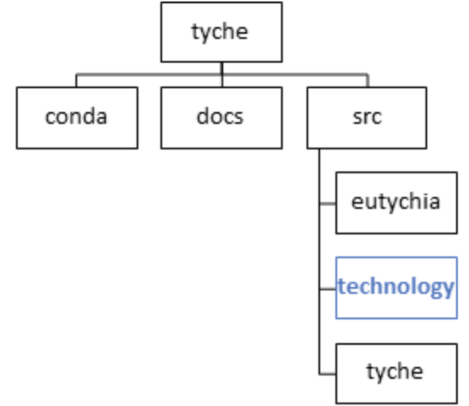

.. _sec-quickstart:

Quick Start Guide
=================
**To begin the quick start guide, it needs to explain what Tyche is, what it does, and why this is of value to the user. Expand this to a full explanation**

The purpose of this quick start guide is to allow a new user to set up their first R&D decision context using Tyche, and to provide some examples of using Tyche for decision support analyses. 

An R&D decision context involves one or more technologies that are subject to various R&D investments with the goal of changing the technology metrics and outcomes.


Introduction and Getting Started
======================================

The following materials walk through:

1.	what the Technology Characterization and Evaluation (Tyche ) tool does and why this is of value to the user; 
2.	setting up the Tyche package for use, including downloading and installing Anaconda (which includes Jupyter for running Tyche and Spyder for creating/editing Python files); 
3.	modifying an existing model to be used to meet your particular needs; 
4.	developing data, including conducting expert elicitations to estimate potential impacts of different R&D investments; 
5.	an overview of the code and data files used; and
6.	building and running Tyche models of your technologies to evaluate the potential impacts of alternative R&D investment strategies.


The Technology Characterization and Evaluation Tool
===================================================

The **Tyche** tool provides a consistent and systematic methodology to evaluate alternative R&D investments in a technology system and determine.  This can help support decision-makers as they consider alternative R&D investment strategies to meet their overall goals.

The Tyche methodology: 

1. begins with a technoeconomic model of a particular technology; 
2. conducts expert elicitation to get quantitative estimates of how much a particular attribute of a component or subsystem within that technology might improve with R&D; 
3. represents these estimates as probability distributions—typically triangular distributions as these are straightforward to develop through expert elicitations—within this model; and then 
4. uses multi-objective stochastic optimization to determine the potential overall improvement in the technology, identify the R&D investments that have the greatest potential impact for improving technology attributes such as cost or environmental impact, and enables analysis of R&D options to meet decision-maker goals.

Set up Tyche package
--------------------

The following installs Anaconda (from which JupyterLab is used to run Tyche models), downloads Tyche and sets up the Tyche environment within Anaconda to run Tyche models.  There are several platforms for using Tyche.  Listed below is the process for downloading the Tyche framework to your personal computer. The Tyche repository is available on github at this [link](https://github.com/NREL/tyche)...   A library of simple Tyche models is available to provide beginning templates for developing more complete models of technologies of interest at: (https://github.com/NREL/tyche/tree/dev/src/technology)

- Download and install `Anaconda <https://anaconda.org/>`_ . Most users will install the Windows version of Anaconda.  Set up an account with a password to download Anaconda to make re-installing easier if there are problems and to access tutorials and other information on Anaconda.  This can also be useful if your Jupyter link breaks.  <<For installing Anaconda for Linux or Mac systems, see below.>> 
- Download Tyche from GitHub at: https://github.com/NREL/tyche/tree/dev 
- Paste the downloaded Tyche Zip.files on your desktop and extract the files.  It is easiest to access these files using Anaconda/Jupyter when they are on your desktop.
- Navigate to the downloaded Tyche repository folder. 
- Create the Tyche environment 
    * Type the following into the Anaconda Shell (under Anaconda in the Windows Start menu). 
    * For windows machines, do the following:
    * In the Windows Start menu (left-most windows icon at the bottom of your screen) open the Anaconda folder and click on the Anaconda prompt.  A window will open showing: ```(base) C:\users\xxx>```   Navigate to where your Tyche folder is, e.g., change directories to the tyche folder:  ```(base) cd:\users\PersonName\tyche```, then install the tyche environment with:      
    * ``conda env create --file conda\win.yml``
    * ``conda activate tyche``
    * ``pip install mip``
    
- For Mac OS use system terminal. 

    * ``conda env create --file conda\mac.yml``
    * ``conda activate tyche``
    * ``pip install mip``

* These steps create a new environment in Anaconda for running Tyche files.  This can be seen by looking at Anaconda navigator (launch Anaconda navigator by clicking the Windows start button and going to the Anaconda folder and clicking on Anaconda Navigator) under “Environment” on the left-most panel.  It will show two names: “Base (root)” and “Tyche”.  The Tyche work will be done within the Tyche environment; in particular, note that the Windows Start menu showing the Anaconda file now includes a Jupyter Notebook (Tyche) icon to launch Jupyter to run Tyche. 
* Run a Tyche Model.  To test the Tyche environment, click the Windows Start menu, go to the Anaconda folder, and click on the Jupyter Notebook (Tyche) program.  This will launch Jupyter Notebook (Tyche) in your default web browser.   
* Build a Tyche Model.  This consists of **xxxxx**; Examples are provided below.  Models follow a particular format as specified in the Tyche documentation Release 0.xx.  The form of these Tyche models enables consistent approaches to evaluating technologies.
* Develop Model Data.  Much model data will be well known and should be entered directly into the respective .csv files as described below.  Other model data is developed through expert elicitations.
* Conduct Expert Elicitations to estimate potential technology cost and performance improvements for selected levels of R&D investment as well as to determine other needed data.
* Input Expert Elicitation data into the Tyche model.

To download and use the Tyche package on a personal computer:

- On Windows only, for users without a Python distribution: First download and install `Anaconda <https://anaconda.org/>`_.
- Download the `source code <https://github.com/NREL/tyche/releases/>`_.
- Navigate to the Tyche repository folder. 
- Create the Tyche environment

On Windows:
::

   conda env create --file conda\win.yml
   conda activate tyche

On Mac:
::

   conda env create --file conda/mac.yml
   conda activate tyche

Note that the conda environment was created with the command:
::

   conda create -n tyche -c conda-forge python=3.7 numpy scipy scikit-learn seaborn=0.10 matplotlib=3.3 quart hypercorn jupyter

- If you receive an HTTPS error, consider retrying the command with the `--insecure` flag added.
- See the `conda documentation <https://docs.conda.io/projects/conda/en/latest/user-guide/tasks/manage-environments.html#creating-an-environment-from-an-environment-yml-file>`_ for additional information on installing and troubleshooting environments.

Directory Structure
-------------------

.. _fig-directorystruct:

	
	Tyche repository directory structure. Users should not alter this structure. New technology models and data can be saved in sub-directories under the technology folder, indicated in blue.

The directory where users should store new technology models (.py files) and the accompanying datasets discussed below is indicated in blue in :numref:`fig-directorystruct`. We recommend that users create sub-directories for each new technology or decision context, to avoid confusing the various input datasets.

The content of the folders and files follows:

- Conda: This folder has four files: “mac.yml”, “nobuilds.yml”, “tiny.yml”, and “win.yml”.  The win.yml and mac.yml files are used to install the Tyche environment and dependencies in Windows and Mac machines, respectively, as described above.  The “nobuilds.yml” and “tiny.yml” files are for use instead of "mac.yml" and "win.yml" in case the more detailed environment specifications cause problems during installation.
- Docs: This folder has a number of RST (reStructured Text markup language) files that describe different aspects of Tyche and its programs.  These files are for internal Tyche developer use only and should not be modified by users outside the development team.
   * src: The Tyche analysis codebase is stored in this directory
   * eutychia: Code for the browser-based graphical user interface (GUI) is stored in this directory
   * technology: This folder has a subfolder for each decision context (set of technologies, plus investment scenarios) that is modeled in Tyche. Also in this directory are the technology model files (.py).

Within each Technology folder there is one Jupyter (.ipynb) analysis notebook file that models the technology and seven input datasets in .csv format, as follow:

- designs. 
- functions.
- indices.
- investments.
- parameters.
- results.
- tranches.
- Each of these .csv files is described in detail below.

Tyche: This folder has 10 python files which form the core of the Tyche model and should not be modified.  These do the following:

- \_\_init\_\_: This is the Python initialization function.   The leading and trailing double underscores mean that this is a special method of the Python interpreter.
-	DecisionGUI:
-	Designs:
-	Distributions:
-	EpsilonConstraints:
-	Evaluator:
-	Investments:
-	IO:
-	Types:
-	Waterfall:


Defining Technologies
---------------------

What is a “technology”?
------------------------------

In the R&D decision contexts represented and analyzed by Tyche, “technology” has a very broad definition. A technology converts input(s) to output(s) using capital equipment with a defined lifetime and incurs fixed and/or variable costs in doing so. A technology may be a manufacturing process, a biorefinery, an agricultural process, a renewable energy technology component such as a silicon wafer or an inverter, a renewable energy technology unit such as a wind turbine or solar panel, a renewable power plant system such as a concentrated solar power plant, and more. Within the R&D decision context, a technology is also subject to one or more research areas in which R&D investments can be made to change the technology and its economic, environmental, and other metrics of interest. Multiple technologies can be modeled and compared within the same decision context, provided the same metrics are calculable for each technology. Within Tyche, a technology is represented both physically and economically using a classic but simple and generalized techno-economic analysis (TEA). The TEA is based on a user defined technology model and accompanying datasets of technological and investment information.

Input Datasets
==============

The following first walks through the various .csv files that support the Tyche model within the folder for each technology, then these are put to use in the last section below to build and run a Tyche model of your technology to evaluate the potential impacts of alternative R&D investment strategies.

Designs Dataset 
------------------------

A *design* is one set of technology data that results from a specific R&D investment scenario. The *designs* dataset collects the technology versions that may result from all R&D investment scenarios being considered in a decision context.

The *designs* dataset contains information for one or more technologies being compared within an R&D investment decision context using Tyche. There will be multiple sets of data for each technology; each set represents the technology data that results from a specific R&D investment scenario.  Multiple R&D investment scenarios are typically used, each generating a different level of technology advancement as determined through expert elicitation. :numref:`tbl-designsdict` provides a data dictionary for the *designs* dataset. It points to the data for the technology subsystems and components in the *parameters* dataset within the technology folder, described below. Additional information on mandatory Variables is provided in :numref:`tbl-designsvars`.

The *designs.csv* file within the technology folder under SRC contains the *designs* dataset.


.. _tbl-designsdict:
.. table:: Data dictionary for the *designs* dataset which defines various technology versions resulting from R&D investments.

  +--------------+------------------------------------------------+-----------------------------------------------------------------------+------------------------------------------------------------------------------+
  | Column Name  | Data Type                                      | Allowed Values                                                        | Description                                                                  |
  +==============+================================================+=======================================================================+==============================================================================+
  | Technology   | String                                         | Any                                                                   | Name of the technology.                                                      |
  +--------------+------------------------------------------------+-----------------------------------------------------------------------+------------------------------------------------------------------------------+
  | Scenario     | String                                         | Any names are allowed. There must be at least two scenarios defined.  | R&D investment scenario that results in this technology design.              |
  +--------------+------------------------------------------------+-----------------------------------------------------------------------+------------------------------------------------------------------------------+
  | Variable     | String                                         | * Input                                                               | Variable types required by technology model and related functions.           |
  |              |                                                | * Input efficiency                                                    |                                                                              |
  |              |                                                | * Input price                                                         |                                                                              |
  |              |                                                | * Output efficiency                                                   |                                                                              |
  |              |                                                | * Output price                                                        |                                                                              |
  |              |                                                | * Lifetime                                                            |                                                                              |
  |              |                                                | * Scale                                                               |                                                                              |
  +--------------+------------------------------------------------+-----------------------------------------------------------------------+------------------------------------------------------------------------------+
  | Index        | String                                         | Any                                                                   | Name of the elements within each Variable.                                   |
  +--------------+------------------------------------------------+-----------------------------------------------------------------------+------------------------------------------------------------------------------+  
  | Value        | * Float                                        | * Set of real numbers                                                 | Value for the R&D investment scenario.                                       |
  |              | * Distribution                                 | * *scipy.stats* distributions                                         | Example: st.triang(1,loc=5,scale=0.1)                                        |
  |              | * Mixture of distributions                     | * Mixture of *scipy.stats* distributions                              |                                                                              |
  +--------------+------------------------------------------------+-----------------------------------------------------------------------+------------------------------------------------------------------------------+  
  | Units        | String                                         | Any                                                                   | User defined units for Variables. Not used by Tyche.                         |                                                                                                  
  +--------------+------------------------------------------------+-----------------------------------------------------------------------+------------------------------------------------------------------------------+
  | Notes        | String                                         | Any                                                                   | Description provided by user. Not used by Tyche.                             |
  +--------------+------------------------------------------------+-----------------------------------------------------------------------+------------------------------------------------------------------------------+

If there are no elements within a Variable for the technology under study, the Variable must still be included in the *designs* dataset: leaving out any of the Variables in this dataset will break the code. The Value for irrelevant Variables may be set to 0 or 1. For instance, a technology such as a solar panel could be modeled without any Inputs, if sunlight is not explicitly being modeled. In this case, the single Index defined for the Input Variable could be simply 0, and the calculations within the technology model .py file can be defined without using this value. Variables and their component Indexes are defined further in :numref:`tbl-designsvars`.


.. _tbl-designsvars:
.. table:: Mandatory values for Variables in the *designs* dataset.

  ==================== ================================================================================================================== ==========================================================================================================================================
  Variable             Description                                                                                                        Index Description                                                                                                                            
  ==================== ================================================================================================================== ==========================================================================================================================================
  Input                Ideal input amounts that do not account for inefficiencies or losses.                                              Names of inputs to the technology.                                                                                                           
  Input efficiency     Input inefficiencies or losses, expressed as a number between 0 and 1.                                             Names of inputs to the technology: every input with an amount must also have an efficiency value, even if the efficiency is 1.               
  Input price          Purchase price for the input(s)                                                                                    Names of inputs to the technology.                                                                                                           
  Output efficiency    Output efficiencies or losses, expressed as a number between 0 and 1.                                              Names of outputs from the technology. Every output must have an efficiency value, even if the efficiency is 1.                               
  Output price         Sale price for the output(s).                                                                                      Names of outputs from the technology. Every output must have a price, even if the price is irrelevant (in which case, set the price to 0).   
  Lifetime             Time that a piece of capital spends in use; time it takes for a piece of capital’s value to depreciate to zero.    Names of the capital components of the technology.                                                                                           
  Scale                Scale at which the technology operates (one value for the technology).                                             No index.                                                                                                                                            
  ==================== ================================================================================================================== ==========================================================================================================================================


Parameters Dataset
------------------------
The *parameters* dataset contains any additional technology-related data, other than that contained in the *designs* dataset, that is required to calculate a technology’s capital cost, fixed cost, production (actual output amount(s)), and metrics.

If the information in the *designs* dataset completely defines the technology and its metrics of interest, then the *parameters* dataset can be left blank except for the column names. Identically to the *designs* dataset, the *parameters* dataset contains multiple sets of data corresponding to different R&D investment scenarios. A data dictionary for the *parameters* dataset is given in :numref:`tbl-paramsdict`.


.. _tbl-paramsdict:
.. table::  Data dictionary for the *parameters* dataset, which, if necessary, provides additional technology-related data other than that in the *designs* dataset.

  ============== ================================================= ==================================================================================================================================================================
  Column Name    Data type                                         Description                                                                                                                                                          
  ============== ================================================= ==================================================================================================================================================================
  Technology     String                                            Name of the technology.                                                                                                                                              
  Scenario       String                                            Name of the R&D investment scenario that resulted in the corresponding parameter values or distributions.                                                            
  Parameter      String                                            Name of the parameter.                                                                                                                                               
  Offset         String                                            Numerical location of the parameter in the parameter vector.                                                                                                                                 
  Value          Float; Distribution; Mixture of distributions     Parameter value for the R&D investment scenario. Example: st.triang(1,loc=5,scale=0.1)   
  Units          String                                            Parameter units. User defined; not used or checked during Tyche calculations.                                                                                        
  Notes          String                                            Any additional information defined by the user. Not used during Tyche calculations.                                                                                  
  ============== ================================================= ==================================================================================================================================================================
  
Including the Offset value in the *parameters* dataset creates a user reference that makes it easier to access parameter values when defining the technology model.


Technology model (Python file)
~~~~~~~~~~~~~~~~~~~~~~~~~~~~~

The technology model is a Python file (.py) which is user defined and contains methods for calculating capital cost, fixed cost, production (the actual output amount), and any metrics of interest, using the content of the *designs* and *parameters* datasets. :numref:`tbl-techmethods` describes methods that must be included in the technology model Python file. The names of the methods are user-defined and must match the contents of the *functions* dataset, discussed below. Additional methods can be included in the technology model, if necessary, but the methods in :numref:`tbl-techmethods` are required. All return values for the required methods, even if only a single value is returned, must be formatted as `Numpy stacks <https://numpy.org/doc/stable/reference/generated/numpy.stack.html>`_. The parameters (inputs) for the methods, listed in :numref:`tbl-techmethods`, are also fixed and cannot be changed. In the case that a method does not require all of the mandatory input parameters, they can simply be left out of the method's calculations.


.. _tbl-techmethods:
.. table:: Methods required within the technology model Python file. Method names are user-defined and should match the contents of the functions dataset. Additional methods can be defined within the technology model as necessary.

  ========================== ====================================================================================================== ==========================================================
  Recommended Method Name    Parameters (method inputs)                                                                             Returns                                                         
  ========================== ====================================================================================================== ==========================================================
  capital_cost               scale, parameter                                                                                       Capital cost(s) for each type of capital in the technology.     
  fixed_cost                 scale, parameter                                                                                       Annual fixed cost(s) of operating the technology.               
  production                 scale, capital, lifetime, fixed, input, parameter                                                      Calculated actual (not ideal) output amount(s).                 
  metrics                    scale, capital, lifetime, fixed, input_raw, input, input_price, output_raw, output, cost, parameter    Calculated technology metric value(s).                          
  ========================== ====================================================================================================== ==========================================================

The production method can access the actual input amount, which is the ideal or raw input amount value multiplied by the input efficiency value (both defined in the *designs* dataset). In contrast, the metrics method can access both the ideal input amount (*input_raw*) and the actual input amount (*input*).

Defining R&D Investments
========================


Tranches Dataset
----------------

A *tranche* is a discrete unit of R&D investment (dollar amount) in a specific research category. Tranches within the same research category are mutually exclusive: one cannot simultaneously invest $1M and $5M in a research category. A *scenario* is a combination of tranches that represents one option for making R&D investments.

The *tranches* dataset defines the allowed set of R&D investments across the research categories that are relevant to the technology under study. Tranches are combined into investment Scenarios – the same Scenarios found in the *designs* and *parameters* datasets. The impact of each Scenario on the technology is highly uncertain and is quantified using expert elicitation. A data dictionary for the *tranches* dataset is given in :numref:`tbl-tranchesdict`.

.. _tbl-tranchesdict:
.. table:: Data dictionary for the *tranches* dataset.

  ============== ================================================= =============================================================================================================================================================================================
  Column Name    Data Type                                         Description                                                                                                                                                                                     
  ============== ================================================= =============================================================================================================================================================================================
  Category       String                                            Names of the R&D categories in which investment can be made to impact the technology or technologies being studied.                                                                             
  Tranche        String                                            Names of the tranches.                                                                                                                                                                          
  Scenario       String                                            Names of the R&D investment scenarios, which combine tranches across R&D categories. The names in this column must correspond to the Scenarios listed in the designs and parameters datasets.  
  Amount         Float; Distribution; Mixture of distributions     The R&D investment amount of the Tranche. The amount may be defined as a scalar, a probability distribution, or a mix of probability distributions.                                             
  Notes          String                                            Additional user-defined information. Not used by Tyche.                                                                                                                                         
  ============== ================================================= =============================================================================================================================================================================================

Investment Dataset
------------------------

An *investment*, similar to a *scenario*, is a combination of tranches that represents a particular R&D strategy.

The *investments* dataset provides a separate way to look at making R&D investments. Combining individual tranches allows users to explore and optimize R&D investment amounts, but it may be the case that there are specific strategies that users wish to explore, without optimizing. In this case, the *investments* dataset is used to define specific combinations of tranches that are of interest. A data dictionary for the *investments* dataset is given in :numref:`tbl-investmentsdict`.

.. _tbl-investmentsdict:
.. table:: Data dictionary for the *investments* dataset.

  ============ ========== =====================================================================================================
  Column Name  Data Type  Description                                                                                            
  ============ ========== =====================================================================================================
  Investment   String     Name of the R&D investment. Distinct from the Scenarios.                                               
  Category     String     Names of the R&D categories being invested in. Within each row, the Category must match the Tranche.   
  Tranche      String     Names of the tranches within the Investment. Within each row, the Tranche must match the Category
  Notes        String     Additional user-defined information. Not used by Tyche.                                                
  ============ ================================================================================================================

Uncertainty in the Input Datasets
=======================================

Tyche provides two general use cases for exploring the relationship between R&D investments and technological changes, both of which rely on expert elicitation to quantify inherent uncertainty. In the first and likely more common use case, a user knows what the R&D investment options are for a technology or set of technologies and is interested in determining what impact these investment options have on the technology(ies) in order to decide how to allocate an R&D budget. In other words, in this use case the user already knows the contents of the *tranches* and *investments* datasets, which are deterministic (fixed), and uses expert elicitation to fill in key values in the *designs* and *parameters* datasets with probability distributions.

In the second use case, a user knows what technological changes must be achieved with R&D investment and is interested in determining the investment amount that will be required to achieve these changes. In this case the user already knows the contents of the *designs* and *parameters* dataset, which are deterministic, and uses expert elicitation to fill in the investment amounts in the *tranches* dataset.

It is critical to note that these use cases are **mutually exclusive**. Tyche cannot be used to evaluate a scenario in which desired technological changes as well as the investment amounts are both uncertain. What this means for the user is that probability distributions, or mixtures of distributions, can be used to specify values either in the *designs* and *parameters* datasets or in the *tranches* dataset, but not both. If distributions are used in all three datasets, the code will break by design.

Defining values as probability distributions and mixtures
---------------------------------------------------------

An uncertain value can be defined within a dataset using any of the built-in distributions of the `scipy.stats <https://docs.scipy.org/doc/scipy/reference/stats.html>`_ package. A list of available distributions is provided at the hyperlink. Uncertain values can also be defined as a weighted average or mixture of probability distributions using the Tyche *mixture* method.

Additional Input Datasets
=========================

Indices Dataset
---------------

The *indices* dataset contains the numerical indexes (location within a list or array) used to access content in the other datasets. :numref:`tbl-indicesdict` describes the columns required for the indices table. Numerical locations for parameters should not be listed in this dataset.


.. _tbl-indicesdict:
.. table:: Data dictionary for the *indices* dataset.


  +--------------+------------+----------------+------------------------------------------------------------------------------------------+
  | Column Name  | Data Type  | Allowed Values | Description                                                                              |
  +--------------+------------+----------------+------------------------------------------------------------------------------------------+
  | Technology   | String     | Any            | Name of the technology                                                                   |
  +--------------+------------+----------------+------------------------------------------------------------------------------------------+  
  | Type         | String     | * Capital      | Names of the Types defined within the designs dataset.                                   |
  |              |            | * Input        |                                                                                          |
  |              |            | * Output       |                                                                                          | 
  |              |            | * Metric       |                                                                                          |
  +--------------+------------+----------------+------------------------------------------------------------------------------------------+  
  | Index        | String     | Any            | Name of the elements within each Type. For instance, names of the Input types.           |
  +--------------+------------+----------------+------------------------------------------------------------------------------------------+  
  | Offset       | Integer    | $\geq$ 0       | Numerical location of the Index within each Type.                                        |
  +--------------+------------+----------------+------------------------------------------------------------------------------------------+  
  | Description  | String     | Any            | Additional user-defined information, such as units. Not used during Tyche calculations.  |
  +--------------+------------+----------------+------------------------------------------------------------------------------------------+  
  | Notes        | String     | Any            | Additional user-defined information. Not used during Tyche calculations.                 |
  +--------------+------------+----------------+------------------------------------------------------------------------------------------+  

All four Types must be listed in the *indices* dataset. If a particular Type is not relevant to the technology under study, it still must be included in this dataset.

Relationship between *indices* and other datasets
-------------------------------------------------

A technology in the Tyche context is quantified using five sets of attribute values and one technology-level attribute value. The five sets of attribute values are Capital, Input, Output, Parameter, and Metric, and the technology-level attribute is Scale. Elements within each of the five sets are defined with an Index which simply names the element (for instance, Electricity might be one of the Index values within the Input set). Elements of Capital have an associated Lifetime. Elements of the Input set have an associated ideal amount (also called Input), an Input efficiency value, and an Input price. Elements of the Output set have only an Output efficiency and an Output price; the ideal output amounts are calculated from the technology model. Elements of the Metric set are named with an Index and are likewise calculated from the technology model. Elements of the Parameter set have only a value.

The *indices* dataset lists the elements of the Capital, Input, Output, and Metric sets, and contains an Offset column giving the numerical location of each element within its set. The *designs* dataset contains values for each element of the Capital, Input, Output, and Metric sets as well as the technology-level Scale value. The *parameters* dataset names and gives values for each element of the Parameter set.

Functions Dataset
-------------------------

The *functions* dataset is used internally by Tyche to locate the technology model file and identify the four required methods listed in :numref:`tbl-techmethods`. :numref:`tbl-functionsdict` provides a data dictionary for the *functions* dataset.


.. _tbl-functionsdict:
.. table:: Data dictionary for the *functions* dataset.

  ============== ============ ================= ==========================================================================================================
  Column Name    Data Type    Allowed Values    Description                                                                                                                                                                                                           
  ============== ============ ================= ==========================================================================================================
  Technology     String       Any               Name of the technology.                                                                                                                                                                                               
  Style          String       numpy             See below for explanation.                                                                                
  Module         String       Any               Filename of the technology model Python file, discussed below. Do not include the file extension.<This name must be the same as the Python file or the system will not run>         
  Capital        String       Any               Name of the method within the technology model Python file that returns the calculated capital cost.      
  Fixed          String       Any               Name of the method within the technology model Python file that returns the calculated fixed cost.        
  Production     String       Any               Name of the method within the technology model Python file that returns the calculated output amount.     
  Metrics        String       Any               Name of the method within the technology model Python file that returns the calculated technology metrics.
  Notes          String       Any               Any information that the user needs to record can go here. Not used during Tyche calculations.            
  ============== ============ ================= ==========================================================================================================

The Style should remain `numpy` in Tyche 1.0. This indicates that inputs and outputs from the methods within the technology model Python file are treated as arrays rather than higher-dimensional (i.e., tensor) structures.  

If only one technology model is used within a decision context, then the *functions* dataset will contain a single row.

Results Dataset
---------------

The *results* dataset lists the Tyche outcomes that are of interest within a decision context, organized into categories defined by the Variable column. This dataset is used internally by Tyche for organizing and labeling results tables for easier user comprehension. A data dictionary for the *results* dataset is given in :numref:`tbl-resultsdict`.

.. _tbl-resultsdict:
.. table:: Data dictionary for the *results* dataset.

  +-------------+------------+----------------+----------------------------------------------------------------------------------------+
  | Column Name | Data Type  | Allowed Values | Description                                                                            |
  +-------------+------------+----------------+----------------------------------------------------------------------------------------+
  | Technology  | String     | Any            | Name of the technology.                                                                |
  +-------------+------------+----------------+----------------------------------------------------------------------------------------+
  | Variable    | String     | * Cost         | Specific technology outcomes calculated by Tyche.                                      |
  |             |            | * Output       |                                                                                        |
  |             |            | * Metric       |                                                                                        |
  +-------------+------------+----------------+----------------------------------------------------------------------------------------+  
  | Index       | String     | Any            | Names of the elements within each Variable.                                            |
  +-------------+------------+----------------+----------------------------------------------------------------------------------------+  
  | Units       | String     | Any            | User-defined units of the Index values. Not used or checked during Tyche calculations. |
  +-------------+------------+----------------+----------------------------------------------------------------------------------------+  
  | Notes       | String     | Any            | Additional information defined by the user. Not used during Tyche calculations.        |
  +-------------+------------+----------------+----------------------------------------------------------------------------------------+  

The Variable “Cost” is a technology-wide lifetime cost, and as such may not be relevant within all decision contexts. To fill in the Index values for the “Output” and “Metric” Variables, see the *designs* dataset.
