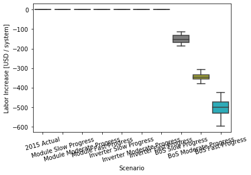
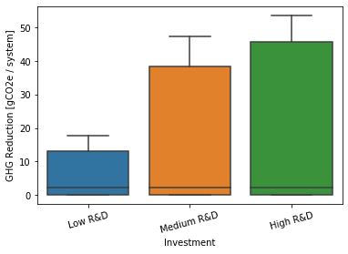
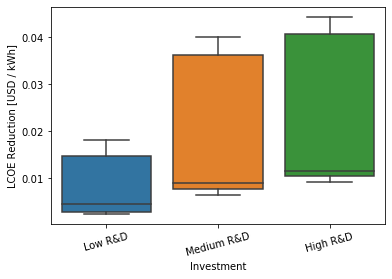
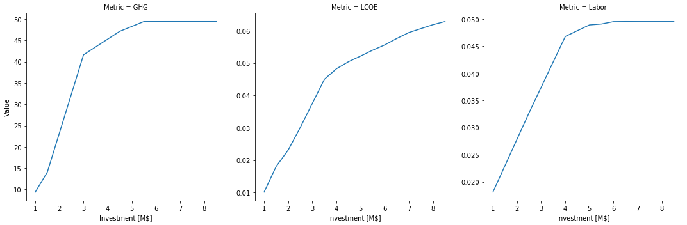
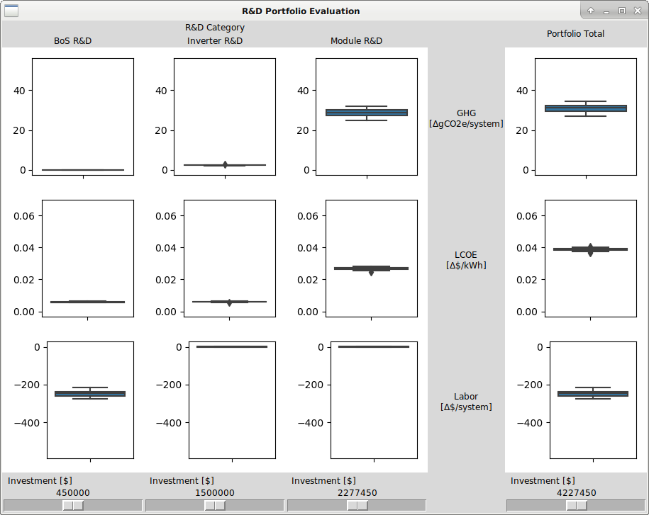

.. _sec-analysisexample:

Analysis Example
================

Multiple Objectives for Residential PV.

Import packages.
----------------

.. code:: python

    import os
    import sys
    sys.path.insert(0, os.path.abspath("../src"))

.. code:: python

    import numpy             as np
    import matplotlib.pyplot as pl
    import pandas            as pd
    import seaborn           as sb
    import tyche             as ty
    
    from copy            import deepcopy
    from IPython.display import Image 

Load data.
----------

The data should be stored in a set of comma-separated value files in a sub-directory of the technology folder, as shown in :numref:`the directory structure diagram (Fig. %s) <fig-directorystruct>`

.. code:: python

    designs = ty.Designs("data/pv_residential_simple")

.. code:: python

    investments = ty.Investments("data/pv_residential_simple")

Compile the production and metric functions for each technology in the dataset.

.. code:: python

    designs.compile()

Examine the data.
-----------------

The ``functions`` table specifies where the Python code for each technology resides.

.. code:: python

    designs.functions

.. raw:: html

    

    
    <table border="1" class="dataframe">
      <thead>
        <tr style="text-align: right;">
          <th></th>
          <th>Style</th>
          <th>Module</th>
          <th>Capital</th>
          <th>Fixed</th>
          <th>Production</th>
          <th>Metrics</th>
          <th>Notes</th>
        </tr>
        <tr>
          <th>Technology</th>
          <th></th>
          <th></th>
          <th></th>
          <th></th>
          <th></th>
          <th></th>
          <th></th>
        </tr>
      </thead>
      <tbody>
        <tr>
          <td>Residential PV</td>
          <td>numpy</td>
          <td>pv_residential_simple</td>
          <td>capital_cost</td>
          <td>fixed_cost</td>
          <td>production</td>
          <td>metrics</td>
          <td></td>
        </tr>
      </tbody>
    </table>
    

Right now, only the style ``numpy`` is supported.

The ``indices`` table defines the subscripts for variables.

.. code:: python

    designs.indices

.. raw:: html

    

    
    <table border="1" class="dataframe">
      <thead>
        <tr style="text-align: right;">
          <th></th>
          <th></th>
          <th></th>
          <th>Offset</th>
          <th>Description</th>
          <th>Notes</th>
        </tr>
        <tr>
          <th>Technology</th>
          <th>Type</th>
          <th>Index</th>
          <th></th>
          <th></th>
          <th></th>
        </tr>
      </thead>
      <tbody>
        <tr>
          <td rowspan="9" valign="top">Residential PV</td>
          <td rowspan="3" valign="top">Capital</td>
          <td>BoS</td>
          <td>2</td>
          <td>balance of system</td>
          <td></td>
        </tr>
        <tr>
          <td>Inverter</td>
          <td>1</td>
          <td>system inverters</td>
          <td></td>
        </tr>
        <tr>
          <td>Module</td>
          <td>0</td>
          <td>system module</td>
          <td></td>
        </tr>
        <tr>
          <td>Fixed</td>
          <td>System</td>
          <td>0</td>
          <td>whole system</td>
          <td></td>
        </tr>
        <tr>
          <td>Input</td>
          <td>NaN</td>
          <td>0</td>
          <td>no inputs</td>
          <td></td>
        </tr>
        <tr>
          <td rowspan="3" valign="top">Metric</td>
          <td>GHG</td>
          <td>2</td>
          <td>reduction in GHGs</td>
          <td></td>
        </tr>
        <tr>
          <td>LCOE</td>
          <td>0</td>
          <td>reduction in levelized cost of energy</td>
          <td></td>
        </tr>
        <tr>
          <td>Labor</td>
          <td>1</td>
          <td>increase in spending on wages</td>
          <td></td>
        </tr>
        <tr>
          <td>Output</td>
          <td>Electricity</td>
          <td>0</td>
          <td>electricity generated</td>
          <td></td>
        </tr>
      </tbody>
    </table>
    

The ``designs`` table contains the cost, input, efficiency, and price data for a scenario.

.. code:: python

    designs.designs

.. raw:: html

    

    
    <table border="1" class="dataframe">
      <thead>
        <tr style="text-align: right;">
          <th></th>
          <th></th>
          <th></th>
          <th></th>
          <th>Value</th>
          <th>Units</th>
          <th>Notes</th>
        </tr>
        <tr>
          <th>Technology</th>
          <th>Scenario</th>
          <th>Variable</th>
          <th>Index</th>
          <th></th>
          <th></th>
          <th></th>
        </tr>
      </thead>
      <tbody>
        <tr>
          <td rowspan="11" valign="top">Residential PV</td>
          <td rowspan="5" valign="top">2015 Actual</td>
          <td>Input</td>
          <td>NaN</td>
          <td>0</td>
          <td>1</td>
          <td>no inputs</td>
        </tr>
        <tr>
          <td>Input efficiency</td>
          <td>NaN</td>
          <td>1</td>
          <td>1</td>
          <td>no inputs</td>
        </tr>
        <tr>
          <td>Input price</td>
          <td>NaN</td>
          <td>0</td>
          <td>1</td>
          <td>no inputs</td>
        </tr>
        <tr>
          <td rowspan="2" valign="top">Lifetime</td>
          <td>BoS</td>
          <td>1</td>
          <td>system-lifetime</td>
          <td>per-lifetime computations</td>
        </tr>
        <tr>
          <td>Inverter</td>
          <td>1</td>
          <td>system-lifetime</td>
          <td>per-lifetime computations</td>
        </tr>
        <tr>
          <td>...</td>
          <td>...</td>
          <td>...</td>
          <td>...</td>
          <td>...</td>
          <td>...</td>
        </tr>
        <tr>
          <td rowspan="5" valign="top">Module Slow Progress</td>
          <td rowspan="2" valign="top">Lifetime</td>
          <td>Inverter</td>
          <td>1</td>
          <td>system-lifetime</td>
          <td>per-lifetime computations</td>
        </tr>
        <tr>
          <td>Module</td>
          <td>1</td>
          <td>system-lifetime</td>
          <td>per-lifetime computations</td>
        </tr>
        <tr>
          <td>Output efficiency</td>
          <td>Electricity</td>
          <td>1</td>
          <td>W/W</td>
          <td>see parameter table for individual efficiencies</td>
        </tr>
        <tr>
          <td>Output price</td>
          <td>Electricity</td>
          <td>0</td>
          <td>$/kWh</td>
          <td>not tracking electricity price</td>
        </tr>
        <tr>
          <td>Scale</td>
          <td>NaN</td>
          <td>1</td>
          <td>system/system</td>
          <td>no scaling</td>
        </tr>
      </tbody>
    </table>
    
90 rows × 3 columns

    

The ``parameters`` table contains additional techno-economic parameters for each technology.

.. code:: python

    designs.parameters

.. raw:: html

    

    
    <table border="1" class="dataframe">
      <thead>
        <tr style="text-align: right;">
          <th></th>
          <th></th>
          <th></th>
          <th>Offset</th>
          <th>Value</th>
          <th>Units</th>
          <th>Notes</th>
        </tr>
        <tr>
          <th>Technology</th>
          <th>Scenario</th>
          <th>Parameter</th>
          <th></th>
          <th></th>
          <th></th>
          <th></th>
        </tr>
      </thead>
      <tbody>
        <tr>
          <td rowspan="11" valign="top">Residential PV</td>
          <td rowspan="5" valign="top">2015 Actual</td>
          <td>Customer Acquisition</td>
          <td>19</td>
          <td>st.triang(0.5, loc=2000, scale=0.2)</td>
          <td>$/system</td>
          <td>BCA</td>
        </tr>
        <tr>
          <td>DC-to-AC Ratio</td>
          <td>15</td>
          <td>st.triang(0.5, loc=1.4, scale=0.00014)</td>
          <td>1</td>
          <td>IDC</td>
        </tr>
        <tr>
          <td>Direct Labor</td>
          <td>17</td>
          <td>st.triang(0.5, loc=2000, scale=0.2)</td>
          <td>$/system</td>
          <td>BLR</td>
        </tr>
        <tr>
          <td>Discount Rate</td>
          <td>0</td>
          <td>0.07</td>
          <td>1/year</td>
          <td>DR</td>
        </tr>
        <tr>
          <td>Hardware Capital</td>
          <td>16</td>
          <td>st.triang(0.5, loc=80, scale=0.008)</td>
          <td>$/m^2</td>
          <td>BCC</td>
        </tr>
        <tr>
          <td>...</td>
          <td>...</td>
          <td>...</td>
          <td>...</td>
          <td>...</td>
          <td>...</td>
        </tr>
        <tr>
          <td rowspan="5" valign="top">Module Slow Progress</td>
          <td>Module Lifetime</td>
          <td>4</td>
          <td>st.triang(0.5, loc=26, scale=1)</td>
          <td>yr</td>
          <td>MLT</td>
        </tr>
        <tr>
          <td>Module O&amp;M Fixed</td>
          <td>7</td>
          <td>st.triang(0.5, loc=19, scale=0.5)</td>
          <td>$/kWyr</td>
          <td>MOM</td>
        </tr>
        <tr>
          <td>Module Soiling Loss</td>
          <td>10</td>
          <td>st.triang(0.5, loc=0.05, scale=10E-06)</td>
          <td>1</td>
          <td>MSL</td>
        </tr>
        <tr>
          <td>Permitting</td>
          <td>18</td>
          <td>st.triang(0.5, loc=600, scale=0.06)</td>
          <td>$/system</td>
          <td>BPR</td>
        </tr>
        <tr>
          <td>System Size</td>
          <td>2</td>
          <td>36</td>
          <td>m^2</td>
          <td>SSZ</td>
        </tr>
      </tbody>
    </table>
    
210 rows × 4 columns

    

The ``results`` table specifies the units of measure for results of computations.

.. code:: python

    designs.results

.. raw:: html

    

    
    <table border="1" class="dataframe">
      <thead>
        <tr style="text-align: right;">
          <th></th>
          <th></th>
          <th></th>
          <th>Units</th>
          <th>Notes</th>
        </tr>
        <tr>
          <th>Technology</th>
          <th>Variable</th>
          <th>Index</th>
          <th></th>
          <th></th>
        </tr>
      </thead>
      <tbody>
        <tr>
          <td rowspan="5" valign="top">Residential PV</td>
          <td>Cost</td>
          <td>Cost</td>
          <td>$/system</td>
          <td></td>
        </tr>
        <tr>
          <td rowspan="3" valign="top">Metric</td>
          <td>GHG</td>
          <td>ΔgCO2e/system</td>
          <td></td>
        </tr>
        <tr>
          <td>LCOE</td>
          <td>Δ$/kWh</td>
          <td></td>
        </tr>
        <tr>
          <td>Labor</td>
          <td>Δ$/system</td>
          <td></td>
        </tr>
        <tr>
          <td>Output</td>
          <td>Electricity</td>
          <td>kWh</td>
          <td></td>
        </tr>
      </tbody>
    </table>
    

The ``tranches`` table specifies multually exclusive possibilities for investments: only one ``Tranch`` may be selected for each ``Category``.

.. code:: python

    investments.tranches

.. raw:: html

    

    
    <table border="1" class="dataframe">
      <thead>
        <tr style="text-align: right;">
          <th></th>
          <th></th>
          <th></th>
          <th>Amount</th>
          <th>Notes</th>
        </tr>
        <tr>
          <th>Category</th>
          <th>Tranche</th>
          <th>Scenario</th>
          <th></th>
          <th></th>
        </tr>
      </thead>
      <tbody>
        <tr>
          <td rowspan="3" valign="top">BoS R&amp;D</td>
          <td>BoS High R&amp;D</td>
          <td>BoS Fast Progress</td>
          <td>900000.0</td>
          <td></td>
        </tr>
        <tr>
          <td>BoS Low R&amp;D</td>
          <td>BoS Slow Progress</td>
          <td>300000.0</td>
          <td></td>
        </tr>
        <tr>
          <td>BoS Medium R&amp;D</td>
          <td>BoS Moderate Progress</td>
          <td>600000.0</td>
          <td></td>
        </tr>
        <tr>
          <td rowspan="3" valign="top">Inverter R&amp;D</td>
          <td>Inverter High R&amp;D</td>
          <td>Inverter Fast Progress</td>
          <td>3000000.0</td>
          <td></td>
        </tr>
        <tr>
          <td>Inverter Low R&amp;D</td>
          <td>Inverter Slow Progress</td>
          <td>1000000.0</td>
          <td></td>
        </tr>
        <tr>
          <td>Inverter Medium R&amp;D</td>
          <td>Inverter Moderate Progress</td>
          <td>2000000.0</td>
          <td></td>
        </tr>
        <tr>
          <td rowspan="3" valign="top">Module R&amp;D</td>
          <td>Module High R&amp;D</td>
          <td>Module Fast Progress</td>
          <td>4500000.0</td>
          <td></td>
        </tr>
        <tr>
          <td>Module Low R&amp;D</td>
          <td>Module Slow Progress</td>
          <td>1500000.0</td>
          <td></td>
        </tr>
        <tr>
          <td>Module Medium R&amp;D</td>
          <td>Module Moderate Progress</td>
          <td>3000000.0</td>
          <td></td>
        </tr>
      </tbody>
    </table>
    

The ``investments`` table bundles a consistent set of tranches (one per category) into an overall investment.

.. code:: python

    investments.investments

.. raw:: html

    

    
    <table border="1" class="dataframe">
      <thead>
        <tr style="text-align: right;">
          <th></th>
          <th></th>
          <th></th>
          <th>Notes</th>
        </tr>
        <tr>
          <th>Investment</th>
          <th>Category</th>
          <th>Tranche</th>
          <th></th>
        </tr>
      </thead>
      <tbody>
        <tr>
          <td rowspan="3" valign="top">High R&amp;D</td>
          <td>BoS R&amp;D</td>
          <td>BoS High R&amp;D</td>
          <td></td>
        </tr>
        <tr>
          <td>Inverter R&amp;D</td>
          <td>Inverter High R&amp;D</td>
          <td></td>
        </tr>
        <tr>
          <td>Module R&amp;D</td>
          <td>Module High R&amp;D</td>
          <td></td>
        </tr>
        <tr>
          <td rowspan="3" valign="top">Low R&amp;D</td>
          <td>BoS R&amp;D</td>
          <td>BoS Low R&amp;D</td>
          <td></td>
        </tr>
        <tr>
          <td>Inverter R&amp;D</td>
          <td>Inverter Low R&amp;D</td>
          <td></td>
        </tr>
        <tr>
          <td>Module R&amp;D</td>
          <td>Module Low R&amp;D</td>
          <td></td>
        </tr>
        <tr>
          <td rowspan="3" valign="top">Medium R&amp;D</td>
          <td>BoS R&amp;D</td>
          <td>BoS Medium R&amp;D</td>
          <td></td>
        </tr>
        <tr>
          <td>Inverter R&amp;D</td>
          <td>Inverter Medium R&amp;D</td>
          <td></td>
        </tr>
        <tr>
          <td>Module R&amp;D</td>
          <td>Module Medium R&amp;D</td>
          <td></td>
        </tr>
      </tbody>
    </table>
    

Evaluate the scenarios in the dataset.
--------------------------------------

.. code:: python

    scenario_results = designs.evaluate_scenarios(sample_count=50)

.. code:: python

    scenario_results.xs(1, level="Sample", drop_level=False)

.. raw:: html

    

    
    <table border="1" class="dataframe">
      <thead>
        <tr style="text-align: right;">
          <th></th>
          <th></th>
          <th></th>
          <th></th>
          <th></th>
          <th>Value</th>
          <th>Units</th>
        </tr>
        <tr>
          <th>Technology</th>
          <th>Scenario</th>
          <th>Sample</th>
          <th>Variable</th>
          <th>Index</th>
          <th></th>
          <th></th>
        </tr>
      </thead>
      <tbody>
        <tr>
          <td rowspan="50" valign="top">Residential PV</td>
          <td rowspan="5" valign="top">2015 Actual</td>
          <td rowspan="5" valign="top">1</td>
          <td>Cost</td>
          <td>Cost</td>
          <td>19541.835826</td>
          <td>$/system</td>
        </tr>
        <tr>
          <td rowspan="3" valign="top">Metric</td>
          <td>GHG</td>
          <td>-0.001761</td>
          <td>ΔgCO2e/system</td>
        </tr>
        <tr>
          <td>LCOE</td>
          <td>-0.000019</td>
          <td>Δ$/kWh</td>
        </tr>
        <tr>
          <td>Labor</td>
          <td>-0.001281</td>
          <td>Δ$/system</td>
        </tr>
        <tr>
          <td>Output</td>
          <td>Electricity</td>
          <td>184107.032791</td>
          <td>kWh</td>
        </tr>
        <tr>
          <td rowspan="5" valign="top">BoS Fast Progress</td>
          <td rowspan="5" valign="top">1</td>
          <td>Cost</td>
          <td>Cost</td>
          <td>17524.525245</td>
          <td>$/system</td>
        </tr>
        <tr>
          <td rowspan="3" valign="top">Metric</td>
          <td>GHG</td>
          <td>-0.004254</td>
          <td>ΔgCO2e/system</td>
        </tr>
        <tr>
          <td>LCOE</td>
          <td>0.010936</td>
          <td>Δ$/kWh</td>
        </tr>
        <tr>
          <td>Labor</td>
          <td>-545.200985</td>
          <td>Δ$/system</td>
        </tr>
        <tr>
          <td>Output</td>
          <td>Electricity</td>
          <td>184101.481909</td>
          <td>kWh</td>
        </tr>
        <tr>
          <td rowspan="5" valign="top">BoS Moderate Progress</td>
          <td rowspan="5" valign="top">1</td>
          <td>Cost</td>
          <td>Cost</td>
          <td>17960.467902</td>
          <td>$/system</td>
        </tr>
        <tr>
          <td rowspan="3" valign="top">Metric</td>
          <td>GHG</td>
          <td>-0.001253</td>
          <td>ΔgCO2e/system</td>
        </tr>
        <tr>
          <td>LCOE</td>
          <td>0.008571</td>
          <td>Δ$/kWh</td>
        </tr>
        <tr>
          <td>Labor</td>
          <td>-331.852654</td>
          <td>Δ$/system</td>
        </tr>
        <tr>
          <td>Output</td>
          <td>Electricity</td>
          <td>184108.162865</td>
          <td>kWh</td>
        </tr>
        <tr>
          <td rowspan="5" valign="top">BoS Slow Progress</td>
          <td rowspan="5" valign="top">1</td>
          <td>Cost</td>
          <td>Cost</td>
          <td>19022.884313</td>
          <td>$/system</td>
        </tr>
        <tr>
          <td rowspan="3" valign="top">Metric</td>
          <td>GHG</td>
          <td>0.000327</td>
          <td>ΔgCO2e/system</td>
        </tr>
        <tr>
          <td>LCOE</td>
          <td>0.002802</td>
          <td>Δ$/kWh</td>
        </tr>
        <tr>
          <td>Labor</td>
          <td>-148.230849</td>
          <td>Δ$/system</td>
        </tr>
        <tr>
          <td>Output</td>
          <td>Electricity</td>
          <td>184111.682213</td>
          <td>kWh</td>
        </tr>
        <tr>
          <td rowspan="5" valign="top">Inverter Fast Progress</td>
          <td rowspan="5" valign="top">1</td>
          <td>Cost</td>
          <td>Cost</td>
          <td>18059.997438</td>
          <td>$/system</td>
        </tr>
        <tr>
          <td rowspan="3" valign="top">Metric</td>
          <td>GHG</td>
          <td>2.601021</td>
          <td>ΔgCO2e/system</td>
        </tr>
        <tr>
          <td>LCOE</td>
          <td>0.011024</td>
          <td>Δ$/kWh</td>
        </tr>
        <tr>
          <td>Labor</td>
          <td>-0.031111</td>
          <td>Δ$/system</td>
        </tr>
        <tr>
          <td>Output</td>
          <td>Electricity</td>
          <td>189903.145647</td>
          <td>kWh</td>
        </tr>
        <tr>
          <td rowspan="5" valign="top">Inverter Moderate Progress</td>
          <td rowspan="5" valign="top">1</td>
          <td>Cost</td>
          <td>Cost</td>
          <td>18713.047656</td>
          <td>$/system</td>
        </tr>
        <tr>
          <td rowspan="3" valign="top">Metric</td>
          <td>GHG</td>
          <td>2.537671</td>
          <td>ΔgCO2e/system</td>
        </tr>
        <tr>
          <td>LCOE</td>
          <td>0.007512</td>
          <td>Δ$/kWh</td>
        </tr>
        <tr>
          <td>Labor</td>
          <td>-0.034240</td>
          <td>Δ$/system</td>
        </tr>
        <tr>
          <td>Output</td>
          <td>Electricity</td>
          <td>189762.072909</td>
          <td>kWh</td>
        </tr>
        <tr>
          <td rowspan="5" valign="top">Inverter Slow Progress</td>
          <td rowspan="5" valign="top">1</td>
          <td>Cost</td>
          <td>Cost</td>
          <td>19224.862899</td>
          <td>$/system</td>
        </tr>
        <tr>
          <td rowspan="3" valign="top">Metric</td>
          <td>GHG</td>
          <td>2.435100</td>
          <td>ΔgCO2e/system</td>
        </tr>
        <tr>
          <td>LCOE</td>
          <td>0.004693</td>
          <td>Δ$/kWh</td>
        </tr>
        <tr>
          <td>Labor</td>
          <td>0.056486</td>
          <td>Δ$/system</td>
        </tr>
        <tr>
          <td>Output</td>
          <td>Electricity</td>
          <td>189533.659025</td>
          <td>kWh</td>
        </tr>
        <tr>
          <td rowspan="5" valign="top">Module Fast Progress</td>
          <td rowspan="5" valign="top">1</td>
          <td>Cost</td>
          <td>Cost</td>
          <td>18935.973204</td>
          <td>$/system</td>
        </tr>
        <tr>
          <td rowspan="3" valign="top">Metric</td>
          <td>GHG</td>
          <td>51.490235</td>
          <td>ΔgCO2e/system</td>
        </tr>
        <tr>
          <td>LCOE</td>
          <td>0.042746</td>
          <td>Δ$/kWh</td>
        </tr>
        <tr>
          <td>Labor</td>
          <td>0.013583</td>
          <td>Δ$/system</td>
        </tr>
        <tr>
          <td>Output</td>
          <td>Electricity</td>
          <td>298774.134685</td>
          <td>kWh</td>
        </tr>
        <tr>
          <td rowspan="5" valign="top">Module Moderate Progress</td>
          <td rowspan="5" valign="top">1</td>
          <td>Cost</td>
          <td>Cost</td>
          <td>18952.058689</td>
          <td>$/system</td>
        </tr>
        <tr>
          <td rowspan="3" valign="top">Metric</td>
          <td>GHG</td>
          <td>41.216046</td>
          <td>ΔgCO2e/system</td>
        </tr>
        <tr>
          <td>LCOE</td>
          <td>0.037432</td>
          <td>Δ$/kWh</td>
        </tr>
        <tr>
          <td>Labor</td>
          <td>0.029792</td>
          <td>Δ$/system</td>
        </tr>
        <tr>
          <td>Output</td>
          <td>Electricity</td>
          <td>275894.626758</td>
          <td>kWh</td>
        </tr>
        <tr>
          <td rowspan="5" valign="top">Module Slow Progress</td>
          <td rowspan="5" valign="top">1</td>
          <td>Cost</td>
          <td>Cost</td>
          <td>19656.198525</td>
          <td>$/system</td>
        </tr>
        <tr>
          <td rowspan="3" valign="top">Metric</td>
          <td>GHG</td>
          <td>14.794693</td>
          <td>ΔgCO2e/system</td>
        </tr>
        <tr>
          <td>LCOE</td>
          <td>0.015567</td>
          <td>Δ$/kWh</td>
        </tr>
        <tr>
          <td>Labor</td>
          <td>-0.007250</td>
          <td>Δ$/system</td>
        </tr>
        <tr>
          <td>Output</td>
          <td>Electricity</td>
          <td>217057.134731</td>
          <td>kWh</td>
        </tr>
      </tbody>
    </table>
    

Save results.
~~~~~~~~~~~~~

.. code:: python

    scenario_results.to_csv("output/pv_residential_simple/example-scenario.csv")

Plot GHG metric.
~~~~~~~~~~~~~~~~

.. code:: python

    g = sb.boxplot(
        x="Scenario",
        y="Value",
        data=scenario_results.xs(
            ["Metric", "GHG"],
            level=["Variable", "Index"]
        ).reset_index()[["Scenario", "Value"]],
        order=[
            "2015 Actual"              ,
            "Module Slow Progress"      ,
            "Module Moderate Progress"  ,
            "Module Fast Progress"      ,
            "Inverter Slow Progress"    ,
            "Inverter Moderate Progress",
            "Inverter Fast Progress"    ,
            "BoS Slow Progress"         ,
            "BoS Moderate Progress"     ,
            "BoS Fast Progress"         ,
        ]
    )
    g.set(ylabel="GHG Reduction [gCO2e / system]")
    g.set_xticklabels(g.get_xticklabels(), rotation=30);

Plot LCOE metric.
~~~~~~~~~~~~~~~~~

.. code:: python

    g = sb.boxplot(
        x="Scenario",
        y="Value",
        data=scenario_results.xs(
            ["Metric", "LCOE"],
            level=["Variable", "Index"]
        ).reset_index()[["Scenario", "Value"]],
        order=[
            "2015 Actual"              ,
            "Module Slow Progress"      ,
            "Module Moderate Progress"  ,
            "Module Fast Progress"      ,
            "Inverter Slow Progress"    ,
            "Inverter Moderate Progress",
            "Inverter Fast Progress"    ,
            "BoS Slow Progress"         ,
            "BoS Moderate Progress"     ,
            "BoS Fast Progress"         ,
        ]
    )
    g.set(ylabel="LCOE Reduction [USD / kWh]")
    g.set_xticklabels(g.get_xticklabels(), rotation=30);

.. image:: images/output_37_0.png

Plot labor metric.
~~~~~~~~~~~~~~~~~~

.. code:: python

    g = sb.boxplot(
        x="Scenario",
        y="Value",
        data=scenario_results.xs(
            ["Metric", "Labor"],
            level=["Variable", "Index"]
        ).reset_index()[["Scenario", "Value"]],
        order=[
            "2015 Actual"              ,
            "Module Slow Progress"      ,
            "Module Moderate Progress"  ,
            "Module Fast Progress"      ,
            "Inverter Slow Progress"    ,
            "Inverter Moderate Progress",
            "Inverter Fast Progress"    ,
            "BoS Slow Progress"         ,
            "BoS Moderate Progress"     ,
            "BoS Fast Progress"         ,
        ]
    )
    g.set(ylabel="Labor Increase [USD / system]")
    g.set_xticklabels(g.get_xticklabels(), rotation=15);

Evaluate the investments in the dataset.
----------------------------------------

.. code:: python

    investment_results = investments.evaluate_investments(designs, sample_count=50)

Costs of investments.
~~~~~~~~~~~~~~~~~~~~~

.. code:: python

    investment_results.amounts

.. raw:: html

    

    
    <table border="1" class="dataframe">
      <thead>
        <tr style="text-align: right;">
          <th></th>
          <th>Amount</th>
        </tr>
        <tr>
          <th>Investment</th>
          <th></th>
        </tr>
      </thead>
      <tbody>
        <tr>
          <td>High R&amp;D</td>
          <td>8400000.0</td>
        </tr>
        <tr>
          <td>Low R&amp;D</td>
          <td>2800000.0</td>
        </tr>
        <tr>
          <td>Medium R&amp;D</td>
          <td>5600000.0</td>
        </tr>
      </tbody>
    </table>
    

Benefits of investments.
~~~~~~~~~~~~~~~~~~~~~~~~

.. code:: python

    investment_results.metrics.xs(1, level="Sample", drop_level=False)

.. raw:: html

    

    
    <table border="1" class="dataframe">
      <thead>
        <tr style="text-align: right;">
          <th></th>
          <th></th>
          <th></th>
          <th></th>
          <th></th>
          <th></th>
          <th></th>
          <th>Value</th>
          <th>Units</th>
        </tr>
        <tr>
          <th>Investment</th>
          <th>Category</th>
          <th>Tranche</th>
          <th>Scenario</th>
          <th>Sample</th>
          <th>Technology</th>
          <th>Index</th>
          <th></th>
          <th></th>
        </tr>
      </thead>
      <tbody>
        <tr>
          <td rowspan="3" valign="top">High R&amp;D</td>
          <td rowspan="3" valign="top">BoS R&amp;D</td>
          <td rowspan="3" valign="top">BoS High R&amp;D</td>
          <td rowspan="3" valign="top">BoS Fast Progress</td>
          <td rowspan="3" valign="top">1</td>
          <td rowspan="3" valign="top">Residential PV</td>
          <td>GHG</td>
          <td>0.001646</td>
          <td>ΔgCO2e/system</td>
        </tr>
        <tr>
          <td>LCOE</td>
          <td>0.009871</td>
          <td>Δ$/kWh</td>
        </tr>
        <tr>
          <td>Labor</td>
          <td>-484.675917</td>
          <td>Δ$/system</td>
        </tr>
        <tr>
          <td rowspan="3" valign="top">Medium R&amp;D</td>
          <td rowspan="3" valign="top">BoS R&amp;D</td>
          <td rowspan="3" valign="top">BoS Medium R&amp;D</td>
          <td rowspan="3" valign="top">BoS Moderate Progress</td>
          <td rowspan="3" valign="top">1</td>
          <td rowspan="3" valign="top">Residential PV</td>
          <td>GHG</td>
          <td>-0.005431</td>
          <td>ΔgCO2e/system</td>
        </tr>
        <tr>
          <td>LCOE</td>
          <td>0.009181</td>
          <td>Δ$/kWh</td>
        </tr>
        <tr>
          <td>Labor</td>
          <td>-350.111301</td>
          <td>Δ$/system</td>
        </tr>
        <tr>
          <td rowspan="3" valign="top">Low R&amp;D</td>
          <td rowspan="3" valign="top">BoS R&amp;D</td>
          <td rowspan="3" valign="top">BoS Low R&amp;D</td>
          <td rowspan="3" valign="top">BoS Slow Progress</td>
          <td rowspan="3" valign="top">1</td>
          <td rowspan="3" valign="top">Residential PV</td>
          <td>GHG</td>
          <td>-0.000623</td>
          <td>ΔgCO2e/system</td>
        </tr>
        <tr>
          <td>LCOE</td>
          <td>0.002863</td>
          <td>Δ$/kWh</td>
        </tr>
        <tr>
          <td>Labor</td>
          <td>-165.967402</td>
          <td>Δ$/system</td>
        </tr>
        <tr>
          <td rowspan="3" valign="top">High R&amp;D</td>
          <td rowspan="3" valign="top">Inverter R&amp;D</td>
          <td rowspan="3" valign="top">Inverter High R&amp;D</td>
          <td rowspan="3" valign="top">Inverter Fast Progress</td>
          <td rowspan="3" valign="top">1</td>
          <td rowspan="3" valign="top">Residential PV</td>
          <td>GHG</td>
          <td>2.366737</td>
          <td>ΔgCO2e/system</td>
        </tr>
        <tr>
          <td>LCOE</td>
          <td>0.011084</td>
          <td>Δ$/kWh</td>
        </tr>
        <tr>
          <td>Labor</td>
          <td>0.034014</td>
          <td>Δ$/system</td>
        </tr>
        <tr>
          <td rowspan="3" valign="top">Medium R&amp;D</td>
          <td rowspan="3" valign="top">Inverter R&amp;D</td>
          <td rowspan="3" valign="top">Inverter Medium R&amp;D</td>
          <td rowspan="3" valign="top">Inverter Moderate Progress</td>
          <td rowspan="3" valign="top">1</td>
          <td rowspan="3" valign="top">Residential PV</td>
          <td>GHG</td>
          <td>2.385654</td>
          <td>ΔgCO2e/system</td>
        </tr>
        <tr>
          <td>LCOE</td>
          <td>0.007551</td>
          <td>Δ$/kWh</td>
        </tr>
        <tr>
          <td>Labor</td>
          <td>0.016533</td>
          <td>Δ$/system</td>
        </tr>
        <tr>
          <td rowspan="3" valign="top">Low R&amp;D</td>
          <td rowspan="3" valign="top">Inverter R&amp;D</td>
          <td rowspan="3" valign="top">Inverter Low R&amp;D</td>
          <td rowspan="3" valign="top">Inverter Slow Progress</td>
          <td rowspan="3" valign="top">1</td>
          <td rowspan="3" valign="top">Residential PV</td>
          <td>GHG</td>
          <td>2.562178</td>
          <td>ΔgCO2e/system</td>
        </tr>
        <tr>
          <td>LCOE</td>
          <td>0.004598</td>
          <td>Δ$/kWh</td>
        </tr>
        <tr>
          <td>Labor</td>
          <td>0.081408</td>
          <td>Δ$/system</td>
        </tr>
        <tr>
          <td rowspan="3" valign="top">High R&amp;D</td>
          <td rowspan="3" valign="top">Module R&amp;D</td>
          <td rowspan="3" valign="top">Module High R&amp;D</td>
          <td rowspan="3" valign="top">Module Fast Progress</td>
          <td rowspan="3" valign="top">1</td>
          <td rowspan="3" valign="top">Residential PV</td>
          <td>GHG</td>
          <td>50.680545</td>
          <td>ΔgCO2e/system</td>
        </tr>
        <tr>
          <td>LCOE</td>
          <td>0.043544</td>
          <td>Δ$/kWh</td>
        </tr>
        <tr>
          <td>Labor</td>
          <td>-0.014162</td>
          <td>Δ$/system</td>
        </tr>
        <tr>
          <td rowspan="3" valign="top">Medium R&amp;D</td>
          <td rowspan="3" valign="top">Module R&amp;D</td>
          <td rowspan="3" valign="top">Module Medium R&amp;D</td>
          <td rowspan="3" valign="top">Module Moderate Progress</td>
          <td rowspan="3" valign="top">1</td>
          <td rowspan="3" valign="top">Residential PV</td>
          <td>GHG</td>
          <td>41.065128</td>
          <td>ΔgCO2e/system</td>
        </tr>
        <tr>
          <td>LCOE</td>
          <td>0.037053</td>
          <td>Δ$/kWh</td>
        </tr>
        <tr>
          <td>Labor</td>
          <td>-0.010921</td>
          <td>Δ$/system</td>
        </tr>
        <tr>
          <td rowspan="3" valign="top">Low R&amp;D</td>
          <td rowspan="3" valign="top">Module R&amp;D</td>
          <td rowspan="3" valign="top">Module Low R&amp;D</td>
          <td rowspan="3" valign="top">Module Slow Progress</td>
          <td rowspan="3" valign="top">1</td>
          <td rowspan="3" valign="top">Residential PV</td>
          <td>GHG</td>
          <td>12.916316</td>
          <td>ΔgCO2e/system</td>
        </tr>
        <tr>
          <td>LCOE</td>
          <td>0.013848</td>
          <td>Δ$/kWh</td>
        </tr>
        <tr>
          <td>Labor</td>
          <td>0.057653</td>
          <td>Δ$/system</td>
        </tr>
      </tbody>
    </table>
    

.. code:: python

    investment_results.summary.xs(1, level="Sample", drop_level=False)

.. raw:: html

    

    
    <table border="1" class="dataframe">
      <thead>
        <tr style="text-align: right;">
          <th></th>
          <th></th>
          <th></th>
          <th>Value</th>
          <th>Units</th>
        </tr>
        <tr>
          <th>Investment</th>
          <th>Sample</th>
          <th>Index</th>
          <th></th>
          <th></th>
        </tr>
      </thead>
      <tbody>
        <tr>
          <td rowspan="3" valign="top">High R&amp;D</td>
          <td rowspan="3" valign="top">1</td>
          <td>GHG</td>
          <td>53.048928</td>
          <td>ΔgCO2e/system</td>
        </tr>
        <tr>
          <td>LCOE</td>
          <td>0.064500</td>
          <td>Δ$/kWh</td>
        </tr>
        <tr>
          <td>Labor</td>
          <td>-484.656066</td>
          <td>Δ$/system</td>
        </tr>
        <tr>
          <td rowspan="3" valign="top">Medium R&amp;D</td>
          <td rowspan="3" valign="top">1</td>
          <td>GHG</td>
          <td>43.445350</td>
          <td>ΔgCO2e/system</td>
        </tr>
        <tr>
          <td>LCOE</td>
          <td>0.053785</td>
          <td>Δ$/kWh</td>
        </tr>
        <tr>
          <td>Labor</td>
          <td>-350.105690</td>
          <td>Δ$/system</td>
        </tr>
        <tr>
          <td rowspan="3" valign="top">Low R&amp;D</td>
          <td rowspan="3" valign="top">1</td>
          <td>GHG</td>
          <td>15.477872</td>
          <td>ΔgCO2e/system</td>
        </tr>
        <tr>
          <td>LCOE</td>
          <td>0.021309</td>
          <td>Δ$/kWh</td>
        </tr>
        <tr>
          <td>Labor</td>
          <td>-165.828341</td>
          <td>Δ$/system</td>
        </tr>
      </tbody>
    </table>
    

Save results.
~~~~~~~~~~~~~

.. code:: python

    investment_results.amounts.to_csv("output/pv_residential_simple/example-investment-amounts.csv")

.. code:: python

    investment_results.metrics.to_csv("output/pv_residential_simple/example-investment-metrics.csv")

Plot GHG metric.
~~~~~~~~~~~~~~~~

.. code:: python

    g = sb.boxplot(
        x="Investment",
        y="Value",
        data=investment_results.metrics.xs(
            "GHG",
            level="Index"
        ).reset_index()[["Investment", "Value"]],
        order=[
            "Low R&D"   ,
            "Medium R&D",
            "High R&D"  ,
        ]
    )
    g.set(ylabel="GHG Reduction [gCO2e / system]")
    g.set_xticklabels(g.get_xticklabels(), rotation=15);

Plot LCOE metric.
~~~~~~~~~~~~~~~~~

.. code:: python

    g = sb.boxplot(
        x="Investment",
        y="Value",
        data=investment_results.metrics.xs(
            "LCOE",
            level="Index"
        ).reset_index()[["Investment", "Value"]],
        order=[
            "Low R&D"   ,
            "Medium R&D",
            "High R&D"  ,
        ]
    )
    g.set(ylabel="LCOE Reduction [USD / kWh]")
    g.set_xticklabels(g.get_xticklabels(), rotation=15);

Plot labor metric.
~~~~~~~~~~~~~~~~~~

.. code:: python

    g = sb.boxplot(
        x="Investment",
        y="Value",
        data=investment_results.metrics.xs(
            "Labor",
            level="Index"
        ).reset_index()[["Investment", "Value"]],
        order=[
            "Low R&D"   ,
            "Medium R&D",
            "High R&D"  ,
        ]
    )
    g.set(ylabel="Labor Increase [USD / system]")
    g.set_xticklabels(g.get_xticklabels(), rotation=15);

Multi-objective decision analysis.
----------------------------------

Compute costs and metrics for tranches.
~~~~~~~~~~~~~~~~~~~~~~~~~~~~~~~~~~~~~~~

Tranches are atomic units for building investment portfolios. Evaluate
all of the tranches, so we can assemble them into investments
(portfolios).

.. code:: python

    tranche_results = investments.evaluate_tranches(designs, sample_count=50)

Display the cost of each tranche.

.. code:: python

    tranche_results.amounts

.. raw:: html

    

    
    <table border="1" class="dataframe">
      <thead>
        <tr style="text-align: right;">
          <th></th>
          <th></th>
          <th>Amount</th>
        </tr>
        <tr>
          <th>Category</th>
          <th>Tranche</th>
          <th></th>
        </tr>
      </thead>
      <tbody>
        <tr>
          <td rowspan="3" valign="top">BoS R&amp;D</td>
          <td>BoS High R&amp;D</td>
          <td>900000.0</td>
        </tr>
        <tr>
          <td>BoS Low R&amp;D</td>
          <td>300000.0</td>
        </tr>
        <tr>
          <td>BoS Medium R&amp;D</td>
          <td>600000.0</td>
        </tr>
        <tr>
          <td rowspan="3" valign="top">Inverter R&amp;D</td>
          <td>Inverter High R&amp;D</td>
          <td>3000000.0</td>
        </tr>
        <tr>
          <td>Inverter Low R&amp;D</td>
          <td>1000000.0</td>
        </tr>
        <tr>
          <td>Inverter Medium R&amp;D</td>
          <td>2000000.0</td>
        </tr>
        <tr>
          <td rowspan="3" valign="top">Module R&amp;D</td>
          <td>Module High R&amp;D</td>
          <td>4500000.0</td>
        </tr>
        <tr>
          <td>Module Low R&amp;D</td>
          <td>1500000.0</td>
        </tr>
        <tr>
          <td>Module Medium R&amp;D</td>
          <td>3000000.0</td>
        </tr>
      </tbody>
    </table>
    

Display the metrics for each tranche.

.. code:: python

    tranche_results.summary

.. raw:: html

    

    
    <table border="1" class="dataframe">
      <thead>
        <tr style="text-align: right;">
          <th></th>
          <th></th>
          <th></th>
          <th></th>
          <th>Value</th>
          <th>Units</th>
        </tr>
        <tr>
          <th>Category</th>
          <th>Tranche</th>
          <th>Sample</th>
          <th>Index</th>
          <th></th>
          <th></th>
        </tr>
      </thead>
      <tbody>
        <tr>
          <td rowspan="5" valign="top">BoS R&amp;D</td>
          <td rowspan="5" valign="top">BoS High R&amp;D</td>
          <td rowspan="3" valign="top">1</td>
          <td>GHG</td>
          <td>-0.004062</td>
          <td>ΔgCO2e/system</td>
        </tr>
        <tr>
          <td>LCOE</td>
          <td>0.009967</td>
          <td>Δ$/kWh</td>
        </tr>
        <tr>
          <td>Labor</td>
          <td>-490.859314</td>
          <td>Δ$/system</td>
        </tr>
        <tr>
          <td rowspan="2" valign="top">2</td>
          <td>GHG</td>
          <td>0.001960</td>
          <td>ΔgCO2e/system</td>
        </tr>
        <tr>
          <td>LCOE</td>
          <td>0.010154</td>
          <td>Δ$/kWh</td>
        </tr>
        <tr>
          <td>...</td>
          <td>...</td>
          <td>...</td>
          <td>...</td>
          <td>...</td>
          <td>...</td>
        </tr>
        <tr>
          <td rowspan="5" valign="top">Module R&amp;D</td>
          <td rowspan="5" valign="top">Module Low R&amp;D</td>
          <td rowspan="2" valign="top">49</td>
          <td>LCOE</td>
          <td>0.016198</td>
          <td>Δ$/kWh</td>
        </tr>
        <tr>
          <td>Labor</td>
          <td>0.039788</td>
          <td>Δ$/system</td>
        </tr>
        <tr>
          <td rowspan="3" valign="top">50</td>
          <td>GHG</td>
          <td>13.654483</td>
          <td>ΔgCO2e/system</td>
        </tr>
        <tr>
          <td>LCOE</td>
          <td>0.014910</td>
          <td>Δ$/kWh</td>
        </tr>
        <tr>
          <td>Labor</td>
          <td>-0.015539</td>
          <td>Δ$/system</td>
        </tr>
      </tbody>
    </table>
    
1350 rows × 2 columns

    

Save the results.

.. code:: python

    tranche_results.amounts.to_csv("output/pv_residential_simple/example-tranche-amounts.csv")
    tranche_results.summary.to_csv("output/pv_residential_simple/example-tranche-summary.csv")

Fit a response surface to the results.
~~~~~~~~~~~~~~~~~~~~~~~~~~~~~~~~~~~~~~

The response surface interpolates between the discrete set of cases
provided in the expert elicitation. This allows us to study funding
levels intermediate between those scenarios.

.. code:: python

    evaluator = ty.Evaluator(investments.tranches, tranche_results.summary)

Here are the categories of investment and the maximum amount that could
be invested in each:

.. code:: python

    evaluator.max_amount

.. raw:: html

    

    
    <table border="1" class="dataframe">
      <thead>
        <tr style="text-align: right;">
          <th></th>
          <th>Amount</th>
        </tr>
        <tr>
          <th>Category</th>
          <th></th>
        </tr>
      </thead>
      <tbody>
        <tr>
          <td>BoS R&amp;D</td>
          <td>900000.0</td>
        </tr>
        <tr>
          <td>Inverter R&amp;D</td>
          <td>3000000.0</td>
        </tr>
        <tr>
          <td>Module R&amp;D</td>
          <td>4500000.0</td>
        </tr>
      </tbody>
    </table>
    

Here are the metrics and their units of measure:

.. code:: python

    evaluator.units

.. raw:: html

    

    
    <table border="1" class="dataframe">
      <thead>
        <tr style="text-align: right;">
          <th></th>
          <th>Units</th>
        </tr>
        <tr>
          <th>Index</th>
          <th></th>
        </tr>
      </thead>
      <tbody>
        <tr>
          <td>GHG</td>
          <td>ΔgCO2e/system</td>
        </tr>
        <tr>
          <td>LCOE</td>
          <td>Δ$/kWh</td>
        </tr>
        <tr>
          <td>Labor</td>
          <td>Δ$/system</td>
        </tr>
      </tbody>
    </table>
    

Example interpolation.
^^^^^^^^^^^^^^^^^^^^^^

Let’s evaluate the case where each category is invested in at half of
its maximum amount.

.. code:: python

    example_investments = evaluator.max_amount / 2
    example_investments

.. raw:: html

    

    
    <table border="1" class="dataframe">
      <thead>
        <tr style="text-align: right;">
          <th></th>
          <th>Amount</th>
        </tr>
        <tr>
          <th>Category</th>
          <th></th>
        </tr>
      </thead>
      <tbody>
        <tr>
          <td>BoS R&amp;D</td>
          <td>450000.0</td>
        </tr>
        <tr>
          <td>Inverter R&amp;D</td>
          <td>1500000.0</td>
        </tr>
        <tr>
          <td>Module R&amp;D</td>
          <td>2250000.0</td>
        </tr>
      </tbody>
    </table>
    

.. code:: python

    evaluator.evaluate(example_investments)

.. parsed-literal::

    Category    Index  Sample
    BoS R&D     GHG    1         -0.0010586097518157094
                       2          7.493162517135921e-05
                       3           0.001253893601450784
                       4           -0.00398626797827717
                       5          -0.005572343870333896
                                          ...          
    Module R&D  Labor  46          0.014371009324918305
                       47          0.011128728287076228
                       48         0.0039832773605894545
                       49          0.006026680267950724
                       50          0.028844695933457842
    Name: Value, Length: 450, dtype: object

Let’s evaluate the mean instead of outputing the whole distribution.

.. code:: python

    evaluator.evaluate_statistic(example_investments, np.mean)

.. parsed-literal::

    Index
    GHG       30.156830
    LCOE       0.038160
    Labor   -246.843027
    Name: Value, dtype: float64

Here is the standard deviation:

.. code:: python

    evaluator.evaluate_statistic(example_investments, np.std)

.. parsed-literal::

    Index
    GHG       1.410956
    LCOE      0.000850
    Labor    16.070395
    Name: Value, dtype: float64

A risk-averse decision maker might be interested in the 10% percentile:

.. code:: python

    evaluator.evaluate_statistic(example_investments, lambda x: np.quantile(x, 0.1))

.. parsed-literal::

    Index
    GHG       28.573627
    LCOE       0.037140
    Labor   -268.059699
    Name: Value, dtype: float64

ε-Constraint multiobjective optimization
~~~~~~~~~~~~~~~~~~~~~~~~~~~~~~~~~~~~~~~~

.. code:: python

    optimizer = ty.EpsilonConstraintOptimizer(evaluator)

In order to meaningfully map the decision space, we need to know the
maximum values for each of the metrics.

.. code:: python

    metric_max = optimizer.max_metrics()
    metric_max

.. parsed-literal::

    GHG      49.429976
    LCOE      0.062818
    Labor     0.049555
    Name: Value, dtype: float64

Example optimization.
^^^^^^^^^^^^^^^^^^^^^

Limit spending to $3M.

.. code:: python

    investment_max = 3e6

Require that the GHG reduction be at least 40 gCO2e/system and that the
Labor wages not decrease.

.. code:: python

    metric_min = pd.Series([40, 0], name = "Value", index = ["GHG", "Labor"])
    metric_min

.. parsed-literal::

    GHG      40
    Labor     0
    Name: Value, dtype: int64

Compute the ε-constrained maximum for the LCOE.

.. code:: python

    optimum = optimizer.maximize(
        "LCOE"                       ,
        total_amount = investment_max,
        min_metric   = metric_min    ,
        statistic    = np.mean       ,
    )
    optimum.exit_message

.. parsed-literal::

    'Optimization terminated successfully.'

Here are the optimal spending levels:

.. code:: python

    np.round(optimum.amounts)

.. parsed-literal::

    Category
    BoS R&D               0.0
    Inverter R&D          0.0
    Module R&D      3000000.0
    Name: Amount, dtype: float64

Here are the three metrics at that optimum:

.. code:: python

    optimum.metrics

.. parsed-literal::

    Index
    GHG      41.627691
    LCOE      0.037566
    Labor     0.028691
    Name: Value, dtype: float64

*Thus, by putting all of the investment into Module R&D, we can expected
to achieve a mean 3.75 ¢/kWh reduction in LCOE under the GHG and Labor
constraints.*

It turns out that there is no solution for these constraints if we
evaluate the 10th percentile of the metrics, for a risk-averse decision
maker.

.. code:: python

    optimum = optimizer.maximize(
        "LCOE"                       ,
        total_amount = investment_max,
        min_metric   = metric_min    ,
        statistic    = lambda x: np.quantile(x, 0.1),
    )
    optimum.exit_message

.. parsed-literal::

    'Iteration limit exceeded'

Let’s try again, but with a less stringent set of constraints, only
constraining GHG somewhat but not Labor at all.

.. code:: python

    optimum = optimizer.maximize(
        "LCOE"                                                         ,
        total_amount = investment_max                                  ,
        min_metric   = pd.Series([30], name = "Value", index = ["GHG"]),
        statistic    = lambda x: np.quantile(x, 0.1)                   ,
    )
    optimum.exit_message

.. parsed-literal::

    'Optimization terminated successfully.'

.. code:: python

    np.round(optimum.amounts)

.. parsed-literal::

    Category
    BoS R&D               0.0
    Inverter R&D          0.0
    Module R&D      3000000.0
    Name: Amount, dtype: float64

.. code:: python

    optimum.metrics

.. parsed-literal::

    Index
    GHG      39.046988
    LCOE      0.036463
    Labor    -0.019725
    Name: Value, dtype: float64

Pareto surfaces.
~~~~~~~~~~~~~~~~

Metrics constrained by total investment.
^^^^^^^^^^^^^^^^^^^^^^^^^^^^^^^^^^^^^^^^

.. code:: python

    pareto_amounts = None
    for investment_max in np.arange(1e6, 9e6, 0.5e6):
        metrics = optimizer.max_metrics(total_amount = investment_max)
        pareto_amounts = pd.DataFrame(
            [metrics.values]                                         ,
            columns = metrics.index.values                           ,
            index   = pd.Index([investment_max / 1e6], name = "Investment [M$]"),
        ).append(pareto_amounts)
    pareto_amounts

.. raw:: html

    

    
    <table border="1" class="dataframe">
      <thead>
        <tr style="text-align: right;">
          <th></th>
          <th>GHG</th>
          <th>LCOE</th>
          <th>Labor</th>
        </tr>
        <tr>
          <th>Investment [M$]</th>
          <th></th>
          <th></th>
          <th></th>
        </tr>
      </thead>
      <tbody>
        <tr>
          <td>8.5</td>
          <td>49.429976</td>
          <td>0.062818</td>
          <td>0.049555</td>
        </tr>
        <tr>
          <td>8.0</td>
          <td>49.429976</td>
          <td>0.061848</td>
          <td>0.049555</td>
        </tr>
        <tr>
          <td>7.5</td>
          <td>49.429976</td>
          <td>0.060635</td>
          <td>0.049555</td>
        </tr>
        <tr>
          <td>7.0</td>
          <td>49.429976</td>
          <td>0.059423</td>
          <td>0.049555</td>
        </tr>
        <tr>
          <td>6.5</td>
          <td>49.429976</td>
          <td>0.057592</td>
          <td>0.049560</td>
        </tr>
        <tr>
          <td>6.0</td>
          <td>49.426992</td>
          <td>0.055608</td>
          <td>0.049545</td>
        </tr>
        <tr>
          <td>5.5</td>
          <td>49.424007</td>
          <td>0.053976</td>
          <td>0.049104</td>
        </tr>
        <tr>
          <td>5.0</td>
          <td>48.278589</td>
          <td>0.052171</td>
          <td>0.048930</td>
        </tr>
        <tr>
          <td>4.5</td>
          <td>47.133172</td>
          <td>0.050431</td>
          <td>0.047878</td>
        </tr>
        <tr>
          <td>4.0</td>
          <td>45.298011</td>
          <td>0.048243</td>
          <td>0.046810</td>
        </tr>
        <tr>
          <td>3.5</td>
          <td>43.462851</td>
          <td>0.045006</td>
          <td>0.042130</td>
        </tr>
        <tr>
          <td>3.0</td>
          <td>41.627691</td>
          <td>0.037569</td>
          <td>0.037450</td>
        </tr>
        <tr>
          <td>2.5</td>
          <td>32.453455</td>
          <td>0.030129</td>
          <td>0.032769</td>
        </tr>
        <tr>
          <td>2.0</td>
          <td>23.279219</td>
          <td>0.023166</td>
          <td>0.027886</td>
        </tr>
        <tr>
          <td>1.5</td>
          <td>14.104983</td>
          <td>0.018081</td>
          <td>0.023003</td>
        </tr>
        <tr>
          <td>1.0</td>
          <td>9.403322</td>
          <td>0.010170</td>
          <td>0.018119</td>
        </tr>
      </tbody>
    </table>
    

.. code:: python

    sb.relplot(
        x         = "Investment [M$]",
        y         = "Value"          ,
        col       = "Metric"         ,
        kind      = "line"           ,
        facet_kws = {'sharey': False},
        data      = pareto_amounts.reset_index().melt(id_vars = "Investment [M$]", var_name = "Metric", value_name = "Value")
    )

.. parsed-literal::

    <seaborn.axisgrid.FacetGrid at 0x7f9da11752b0>

*We see that the LCOE metric saturates more slowly than the GHG and
Labor ones.*

GHG vs LCOE, constrained by total investment.
^^^^^^^^^^^^^^^^^^^^^^^^^^^^^^^^^^^^^^^^^^^^^

.. code:: python

    investment_max = 3
    pareto_ghg_lcoe = None
    for lcoe_min in 0.95 * np.arange(0.5, 0.9, 0.05) * pareto_amounts.loc[investment_max, "LCOE"]:
        optimum = optimizer.maximize(
            "GHG",
            max_amount   = pd.Series([0.9e6, 3.0e6, 1.0e6], name = "Amount", index = ["BoS R&D", "Inverter R&D", "Module R&D"]),
            total_amount = investment_max * 1e6                                 ,
            min_metric   = pd.Series([lcoe_min], name = "Value", index = ["LCOE"]),
        )
        pareto_ghg_lcoe = pd.DataFrame(
            [[investment_max, lcoe_min, optimum.metrics["LCOE"], optimum.metrics["GHG"], optimum.exit_message]],
            columns = ["Investment [M$]", "LCOE (min)", "LCOE", "GHG", "Result"]                               ,
        ).append(pareto_ghg_lcoe)
    pareto_ghg_lcoe = pareto_ghg_lcoe.set_index(["Investment [M$]", "LCOE (min)"])
    pareto_ghg_lcoe

.. raw:: html

    

    
    <table border="1" class="dataframe">
      <thead>
        <tr style="text-align: right;">
          <th></th>
          <th></th>
          <th>LCOE</th>
          <th>GHG</th>
          <th>Result</th>
        </tr>
        <tr>
          <th>Investment [M$]</th>
          <th>LCOE (min)</th>
          <th></th>
          <th></th>
          <th></th>
        </tr>
      </thead>
      <tbody>
        <tr>
          <td rowspan="8" valign="top">3</td>
          <td>0.030337</td>
          <td>0.025037</td>
          <td>11.691901</td>
          <td>Positive directional derivative for linesearch</td>
        </tr>
        <tr>
          <td>0.028553</td>
          <td>0.025037</td>
          <td>11.691901</td>
          <td>Positive directional derivative for linesearch</td>
        </tr>
        <tr>
          <td>0.026768</td>
          <td>0.025037</td>
          <td>11.691901</td>
          <td>Positive directional derivative for linesearch</td>
        </tr>
        <tr>
          <td>0.024983</td>
          <td>0.024983</td>
          <td>11.692188</td>
          <td>Optimization terminated successfully.</td>
        </tr>
        <tr>
          <td>0.023199</td>
          <td>0.023199</td>
          <td>11.693916</td>
          <td>Optimization terminated successfully.</td>
        </tr>
        <tr>
          <td>0.021414</td>
          <td>0.021414</td>
          <td>11.694230</td>
          <td>Optimization terminated successfully.</td>
        </tr>
        <tr>
          <td>0.019630</td>
          <td>0.019630</td>
          <td>11.694544</td>
          <td>Optimization terminated successfully.</td>
        </tr>
        <tr>
          <td>0.017845</td>
          <td>0.017845</td>
          <td>11.699478</td>
          <td>Optimization terminated successfully.</td>
        </tr>
      </tbody>
    </table>
    

.. code:: python

    sb.relplot(
        x = "LCOE",
        y = "GHG",
        kind = "scatter",
        data = pareto_ghg_lcoe#[pareto_ghg_lcoe.Result == "Optimization terminated successfully."]
    )

.. parsed-literal::

    <seaborn.axisgrid.FacetGrid at 0x7f9da13ae630>

*The three types of investment are too decoupled to make an interesting
pareto frontier, and we also need a better solver if we want to push to
lower right.*

Run the interactive explorer for the decision space.
----------------------------------------------------

Make sure the the ``tk`` package is installed on your machine. Here is
the Anaconda link: https://anaconda.org/anaconda/tk.

.. code:: python

    w = ty.DecisionWindow(evaluator)
    w.mainloop()

A new window should open that looks like the image below. Moving the
sliders will cause a recomputation of the boxplots.

.. code:: python

    Image("pv_residential_simple_gui.png")

