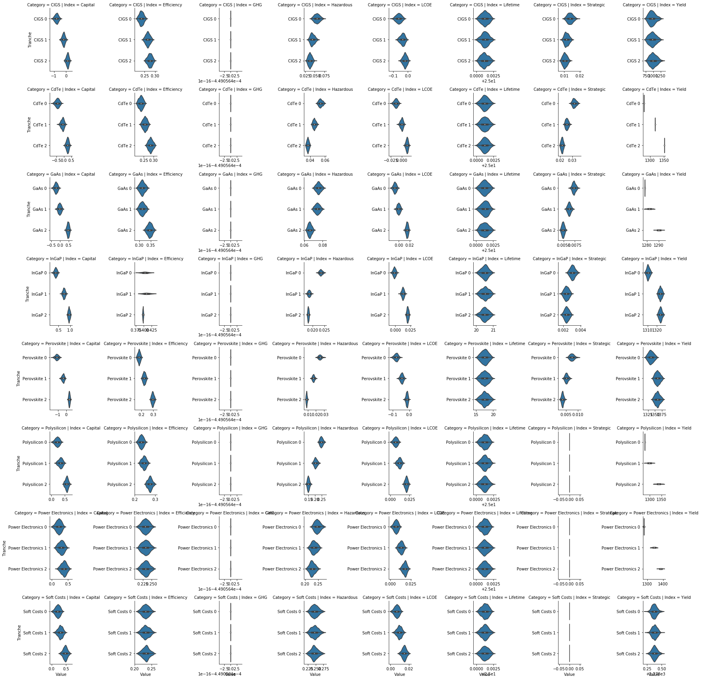
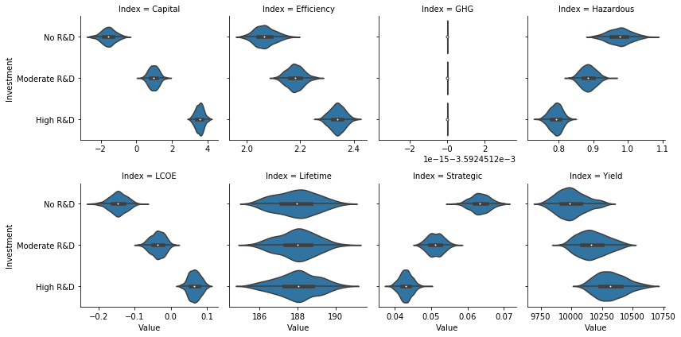

Mock FOA Example
================

Set up.
-------

Import packages.
~~~~~~~~~~~~~~~~

.. code:: ipython3

    import os
    import sys
    sys.path.insert(0, os.path.abspath("../src"))

.. code:: ipython3

    import numpy             as np
    import matplotlib.pyplot as pl
    import pandas            as pd
    import seaborn           as sb
    import tyche             as ty
    
    from copy            import deepcopy
    from IPython.display import Image 

Load data.
----------

The data are stored in a set of tab-separated value files in a folder.

.. code:: ipython3

    designs = ty.Designs("data")

.. code:: ipython3

    investments = ty.Investments("data")

Compile the production and metric functions for each technology in the dataset.

.. code:: ipython3

    designs.compile()

Examine the input data.
-----------------------

The ``functions`` table specifies where the Python code for each technology resides.

.. code:: ipython3

    designs.functions

.. raw:: html

    

    
    <table border="1" class="dataframe">
      <thead>
        <tr style="text-align: right;">
          <th></th>
          <th>Style</th>
          <th>Module</th>
          <th>Capital</th>
          <th>Fixed</th>
          <th>Production</th>
          <th>Metrics</th>
          <th>Notes</th>
        </tr>
        <tr>
          <th>Technology</th>
          <th></th>
          <th></th>
          <th></th>
          <th></th>
          <th></th>
          <th></th>
          <th></th>
        </tr>
      </thead>
      <tbody>
        <tr>
          <th>PV Generic</th>
          <td>numpy</td>
          <td>pv_residential_generic</td>
          <td>capital_cost</td>
          <td>fixed_cost</td>
          <td>production</td>
          <td>metrics</td>
          <td>generic residential PV</td>
        </tr>
      </tbody>
    </table>
    

The ``indices`` table defines the subscripts for variables.

.. code:: ipython3

    designs.indices.drop("Offset", axis = 1)

.. raw:: html

    

    
    <table border="1" class="dataframe">
      <thead>
        <tr style="text-align: right;">
          <th></th>
          <th></th>
          <th></th>
          <th>Description</th>
          <th>Notes</th>
        </tr>
        <tr>
          <th>Technology</th>
          <th>Type</th>
          <th>Index</th>
          <th></th>
          <th></th>
        </tr>
      </thead>
      <tbody>
        <tr>
          <th rowspan="16" valign="top">PV Generic</th>
          <th rowspan="3" valign="top">Capital</th>
          <th>BoS</th>
          <td>balance of system</td>
          <td></td>
        </tr>
        <tr>
          <th>Inverter</th>
          <td>system inverters</td>
          <td></td>
        </tr>
        <tr>
          <th>Module</th>
          <td>system module</td>
          <td></td>
        </tr>
        <tr>
          <th>Fixed</th>
          <th>System</th>
          <td>whole system</td>
          <td></td>
        </tr>
        <tr>
          <th>Input</th>
          <th>Strategic</th>
          <td>strategic materials</td>
          <td></td>
        </tr>
        <tr>
          <th rowspan="8" valign="top">Metric</th>
          <th>Capital</th>
          <td>capital cost</td>
          <td></td>
        </tr>
        <tr>
          <th>Efficiency</th>
          <td>module efficiency</td>
          <td></td>
        </tr>
        <tr>
          <th>GHG</th>
          <td>greenouse gas offset</td>
          <td></td>
        </tr>
        <tr>
          <th>Hazardous</th>
          <td>hazardous waste produced</td>
          <td></td>
        </tr>
        <tr>
          <th>LCOE</th>
          <td>levelized cost of energy</td>
          <td></td>
        </tr>
        <tr>
          <th>Lifetime</th>
          <td>module lifetime</td>
          <td></td>
        </tr>
        <tr>
          <th>Strategic</th>
          <td>strategic metal used</td>
          <td></td>
        </tr>
        <tr>
          <th>Yield</th>
          <td>specific yield</td>
          <td></td>
        </tr>
        <tr>
          <th rowspan="3" valign="top">Output</th>
          <th>Electricity</th>
          <td>electricity generated</td>
          <td></td>
        </tr>
        <tr>
          <th>GHG</th>
          <td>greenhouse gas offset</td>
          <td></td>
        </tr>
        <tr>
          <th>Hazardous</th>
          <td>hazardous waste produced</td>
          <td></td>
        </tr>
      </tbody>
    </table>
    

The ``designs`` table contains the cost, input, efficiency, and price data for a scenario.

.. code:: ipython3

    designs.designs.xs("Reference", level = "Scenario", drop_level = False)

.. raw:: html

    

    
    <table border="1" class="dataframe">
      <thead>
        <tr style="text-align: right;">
          <th></th>
          <th></th>
          <th></th>
          <th></th>
          <th>Value</th>
          <th>Units</th>
          <th>Notes</th>
        </tr>
        <tr>
          <th>Technology</th>
          <th>Scenario</th>
          <th>Variable</th>
          <th>Index</th>
          <th></th>
          <th></th>
          <th></th>
        </tr>
      </thead>
      <tbody>
        <tr>
          <th rowspan="13" valign="top">PV Generic</th>
          <th rowspan="13" valign="top">Reference</th>
          <th>Input</th>
          <th>Strategic</th>
          <td>0</td>
          <td>g/system</td>
          <td>zero by default</td>
        </tr>
        <tr>
          <th>Input efficiency</th>
          <th>Strategic</th>
          <td>1</td>
          <td>%/100</td>
          <td>no scaling</td>
        </tr>
        <tr>
          <th>Input price</th>
          <th>Stategic</th>
          <td>0</td>
          <td>$/g</td>
          <td>zero by default</td>
        </tr>
        <tr>
          <th rowspan="3" valign="top">Lifetime</th>
          <th>BoS</th>
          <td>1</td>
          <td>system-lifetime</td>
          <td>per-lifetime computations</td>
        </tr>
        <tr>
          <th>Inverter</th>
          <td>1</td>
          <td>system-lifetime</td>
          <td>per-lifetime computations</td>
        </tr>
        <tr>
          <th>Module</th>
          <td>1</td>
          <td>system-lifetime</td>
          <td>per-lifetime computations</td>
        </tr>
        <tr>
          <th rowspan="3" valign="top">Output efficiency</th>
          <th>Electricity</th>
          <td>1</td>
          <td>%/100</td>
          <td>see parameter table for individual efficiencies</td>
        </tr>
        <tr>
          <th>GHG</th>
          <td>1</td>
          <td>%/100</td>
          <td>see parameter table for individual efficiencies</td>
        </tr>
        <tr>
          <th>Hazardous</th>
          <td>1</td>
          <td>%/100</td>
          <td>see parameter table for individual efficiencies</td>
        </tr>
        <tr>
          <th rowspan="3" valign="top">Output price</th>
          <th>Electricity</th>
          <td>0</td>
          <td>$/kWh</td>
          <td>not tracking electricity price</td>
        </tr>
        <tr>
          <th>GHG</th>
          <td>0</td>
          <td>$/gCO2e</td>
          <td>not tracking hazardous waste</td>
        </tr>
        <tr>
          <th>Hazardous</th>
          <td>0</td>
          <td>$/g</td>
          <td>not tracking hazardous waste</td>
        </tr>
        <tr>
          <th>Scale</th>
          <th>NaN</th>
          <td>1</td>
          <td>system/system</td>
          <td>no scaling</td>
        </tr>
      </tbody>
    </table>
    

The ``parameters`` table contains additional techno-economic parameters for each technology.

.. code:: ipython3

    designs.parameters.drop("Offset", axis = 1).xs("Reference", level = "Scenario", drop_level = False)

.. raw:: html

    

    
    <table border="1" class="dataframe">
      <thead>
        <tr style="text-align: right;">
          <th></th>
          <th></th>
          <th></th>
          <th>Value</th>
          <th>Units</th>
          <th>Notes</th>
        </tr>
        <tr>
          <th>Technology</th>
          <th>Scenario</th>
          <th>Parameter</th>
          <th></th>
          <th></th>
          <th></th>
        </tr>
      </thead>
      <tbody>
        <tr>
          <th rowspan="24" valign="top">PV Generic</th>
          <th rowspan="24" valign="top">Reference</th>
          <th>Benchmark LCOC</th>
          <td>2.51977</td>
          <td>$/Wdc</td>
          <td></td>
        </tr>
        <tr>
          <th>Benchmark LCOE</th>
          <td>0.086773</td>
          <td>$/kWh</td>
          <td></td>
        </tr>
        <tr>
          <th>Customer Acquisition</th>
          <td>2000</td>
          <td>$/system</td>
          <td>BCA</td>
        </tr>
        <tr>
          <th>Direct Labor</th>
          <td>2000</td>
          <td>$/system</td>
          <td>BLR</td>
        </tr>
        <tr>
          <th>Discount Rate</th>
          <td>0.07</td>
          <td>1/year</td>
          <td>DR</td>
        </tr>
        <tr>
          <th>Greenhouse Gas Offset</th>
          <td>0.4490564e-3</td>
          <td>gCO2e/kWh</td>
          <td></td>
        </tr>
        <tr>
          <th>Hardware Capital</th>
          <td>80</td>
          <td>$/m^2</td>
          <td>BCC</td>
        </tr>
        <tr>
          <th>Hazardous Waste Content</th>
          <td>1830</td>
          <td>g/m^2</td>
          <td></td>
        </tr>
        <tr>
          <th>Insolation</th>
          <td>1000</td>
          <td>W/m^2</td>
          <td>INS</td>
        </tr>
        <tr>
          <th>Installer Overhead &amp; Profit</th>
          <td>0.35</td>
          <td>1</td>
          <td>BOH</td>
        </tr>
        <tr>
          <th>Inverter Capital</th>
          <td>0.3</td>
          <td>$/W</td>
          <td>ICC</td>
        </tr>
        <tr>
          <th>Inverter Efficiency</th>
          <td>0.9</td>
          <td>%/100</td>
          <td>IEF</td>
        </tr>
        <tr>
          <th>Inverter Lifetime</th>
          <td>16</td>
          <td>yr</td>
          <td>ILT</td>
        </tr>
        <tr>
          <th>Inverter Replacement</th>
          <td>0.5</td>
          <td>%/100</td>
          <td>IRC</td>
        </tr>
        <tr>
          <th>Location Capacity Factor</th>
          <td>0.2</td>
          <td>%/100</td>
          <td>MCF</td>
        </tr>
        <tr>
          <th>Module Aperture</th>
          <td>0.9</td>
          <td>%/100</td>
          <td>MAP</td>
        </tr>
        <tr>
          <th>Module Capital</th>
          <td>110</td>
          <td>$/m^2</td>
          <td>MCC</td>
        </tr>
        <tr>
          <th>Module Degradation</th>
          <td>0.0075</td>
          <td>1/yr</td>
          <td>MDR</td>
        </tr>
        <tr>
          <th>Module Efficiency</th>
          <td>0.208</td>
          <td>%/100</td>
          <td>MEF</td>
        </tr>
        <tr>
          <th>Module Lifetime</th>
          <td>25</td>
          <td>yr</td>
          <td>MLT</td>
        </tr>
        <tr>
          <th>Module O&amp;M Fixed</th>
          <td>20</td>
          <td>$/kW/yr</td>
          <td>MOM</td>
        </tr>
        <tr>
          <th>Module Soiling Loss</th>
          <td>0.05</td>
          <td>%/100</td>
          <td>MSL</td>
        </tr>
        <tr>
          <th>Permitting</th>
          <td>600</td>
          <td>$/system</td>
          <td>BPR</td>
        </tr>
        <tr>
          <th>System Size</th>
          <td>36</td>
          <td>m^2</td>
          <td>SSZ</td>
        </tr>
      </tbody>
    </table>
    

The ``results`` table specifies the units of measure for results of computations.

.. code:: ipython3

    designs.results

.. raw:: html

    

    
    <table border="1" class="dataframe">
      <thead>
        <tr style="text-align: right;">
          <th></th>
          <th></th>
          <th></th>
          <th>Units</th>
          <th>Notes</th>
        </tr>
        <tr>
          <th>Technology</th>
          <th>Variable</th>
          <th>Index</th>
          <th></th>
          <th></th>
        </tr>
      </thead>
      <tbody>
        <tr>
          <th rowspan="12" valign="top">PV Generic</th>
          <th>Cost</th>
          <th>Cost</th>
          <td>$/system</td>
          <td></td>
        </tr>
        <tr>
          <th rowspan="8" valign="top">Metric</th>
          <th>Capital</th>
          <td>Δ$/Wdc</td>
          <td></td>
        </tr>
        <tr>
          <th>Efficiency</th>
          <td>%/100</td>
          <td></td>
        </tr>
        <tr>
          <th>GHG</th>
          <td>ΔgCO2e/system</td>
          <td></td>
        </tr>
        <tr>
          <th>Hazardous</th>
          <td>g/kWh</td>
          <td></td>
        </tr>
        <tr>
          <th>LCOE</th>
          <td>Δ$/kWh</td>
          <td></td>
        </tr>
        <tr>
          <th>Lifetime</th>
          <td>yr</td>
          <td></td>
        </tr>
        <tr>
          <th>Strategic</th>
          <td>g/kWh</td>
          <td></td>
        </tr>
        <tr>
          <th>Yield</th>
          <td>hr/yr</td>
          <td></td>
        </tr>
        <tr>
          <th rowspan="3" valign="top">Output</th>
          <th>Electricity</th>
          <td>kWh/system</td>
          <td></td>
        </tr>
        <tr>
          <th>GHG</th>
          <td>ΔgCO2e/system</td>
          <td></td>
        </tr>
        <tr>
          <th>Hazardous</th>
          <td>g/system</td>
          <td></td>
        </tr>
      </tbody>
    </table>
    

The ``tranches`` table specifies multually exclusive possibilities for investments: only one ``Tranch`` may be selected for each ``Category``.

.. code:: ipython3

    investments.tranches

.. raw:: html

    

    
    <table border="1" class="dataframe">
      <thead>
        <tr style="text-align: right;">
          <th></th>
          <th></th>
          <th></th>
          <th>Amount</th>
          <th>Notes</th>
        </tr>
        <tr>
          <th>Category</th>
          <th>Tranche</th>
          <th>Scenario</th>
          <th></th>
          <th></th>
        </tr>
      </thead>
      <tbody>
        <tr>
          <th rowspan="3" valign="top">CIGS</th>
          <th>CIGS 0</th>
          <th>CIGS 0</th>
          <td>0.0</td>
          <td></td>
        </tr>
        <tr>
          <th>CIGS 1</th>
          <th>CIGS 1</th>
          <td>1500000.0</td>
          <td></td>
        </tr>
        <tr>
          <th>CIGS 2</th>
          <th>CIGS 2</th>
          <td>3000000.0</td>
          <td></td>
        </tr>
        <tr>
          <th rowspan="3" valign="top">CdTe</th>
          <th>CdTe 0</th>
          <th>CdTe 0</th>
          <td>0.0</td>
          <td></td>
        </tr>
        <tr>
          <th>CdTe 1</th>
          <th>CdTe 1</th>
          <td>3000000.0</td>
          <td></td>
        </tr>
        <tr>
          <th>CdTe 2</th>
          <th>CdTe 2</th>
          <td>6000000.0</td>
          <td></td>
        </tr>
        <tr>
          <th rowspan="3" valign="top">GaAs</th>
          <th>GaAs 0</th>
          <th>GaAs 0</th>
          <td>0.0</td>
          <td></td>
        </tr>
        <tr>
          <th>GaAs 1</th>
          <th>GaAs 1</th>
          <td>5000000.0</td>
          <td></td>
        </tr>
        <tr>
          <th>GaAs 2</th>
          <th>GaAs 2</th>
          <td>7500000.0</td>
          <td></td>
        </tr>
        <tr>
          <th rowspan="3" valign="top">InGaP</th>
          <th>InGaP 0</th>
          <th>InGaP 0</th>
          <td>0.0</td>
          <td></td>
        </tr>
        <tr>
          <th>InGaP 1</th>
          <th>InGaP 1</th>
          <td>3500000.0</td>
          <td></td>
        </tr>
        <tr>
          <th>InGaP 2</th>
          <th>InGaP 2</th>
          <td>9500000.0</td>
          <td></td>
        </tr>
        <tr>
          <th rowspan="3" valign="top">Perovskite</th>
          <th>Perovskite 0</th>
          <th>Perovskite 0</th>
          <td>0.0</td>
          <td></td>
        </tr>
        <tr>
          <th>Perovskite 1</th>
          <th>Perovskite 1</th>
          <td>7500000.0</td>
          <td></td>
        </tr>
        <tr>
          <th>Perovskite 2</th>
          <th>Perovskite 2</th>
          <td>9500000.0</td>
          <td></td>
        </tr>
        <tr>
          <th rowspan="3" valign="top">Polysilicon</th>
          <th>Polysilicon 0</th>
          <th>Polysilicon 0</th>
          <td>0.0</td>
          <td></td>
        </tr>
        <tr>
          <th>Polysilicon 1</th>
          <th>Polysilicon 1</th>
          <td>2500000.0</td>
          <td></td>
        </tr>
        <tr>
          <th>Polysilicon 2</th>
          <th>Polysilicon 2</th>
          <td>4500000.0</td>
          <td></td>
        </tr>
        <tr>
          <th rowspan="3" valign="top">Power Electronics</th>
          <th>Power Electronics 0</th>
          <th>Polysilicon 0</th>
          <td>0.0</td>
          <td></td>
        </tr>
        <tr>
          <th>Power Electronics 1</th>
          <th>Power Electronics 1</th>
          <td>1000000.0</td>
          <td></td>
        </tr>
        <tr>
          <th>Power Electronics 2</th>
          <th>Power Electronics 2</th>
          <td>5000000.0</td>
          <td></td>
        </tr>
        <tr>
          <th rowspan="3" valign="top">Soft Costs</th>
          <th>Soft Costs 0</th>
          <th>Polysilicon 0</th>
          <td>0.0</td>
          <td></td>
        </tr>
        <tr>
          <th>Soft Costs 1</th>
          <th>Soft Costs 1</th>
          <td>1000000.0</td>
          <td></td>
        </tr>
        <tr>
          <th>Soft Costs 2</th>
          <th>Soft Costs 2</th>
          <td>5000000.0</td>
          <td></td>
        </tr>
      </tbody>
    </table>
    

The ``investments`` table bundles a consistent set of tranches (one per category) into an overall investment.

.. code:: ipython3

    investments.investments

.. raw:: html

    

    
    <table border="1" class="dataframe">
      <thead>
        <tr style="text-align: right;">
          <th></th>
          <th></th>
          <th></th>
          <th>Notes</th>
        </tr>
        <tr>
          <th>Investment</th>
          <th>Category</th>
          <th>Tranche</th>
          <th></th>
        </tr>
      </thead>
      <tbody>
        <tr>
          <th rowspan="8" valign="top">High R&amp;D</th>
          <th>CIGS</th>
          <th>CIGS 2</th>
          <td></td>
        </tr>
        <tr>
          <th>CdTe</th>
          <th>CdTe 2</th>
          <td></td>
        </tr>
        <tr>
          <th>GaAs</th>
          <th>GaAs 2</th>
          <td></td>
        </tr>
        <tr>
          <th>InGaP</th>
          <th>InGaP 2</th>
          <td></td>
        </tr>
        <tr>
          <th>Perovskite</th>
          <th>Perovskite 2</th>
          <td></td>
        </tr>
        <tr>
          <th>Polysilicon</th>
          <th>Polysilicon 2</th>
          <td></td>
        </tr>
        <tr>
          <th>Power Electronics</th>
          <th>Power Electronics 2</th>
          <td></td>
        </tr>
        <tr>
          <th>Soft Costs</th>
          <th>Soft Costs 2</th>
          <td></td>
        </tr>
        <tr>
          <th rowspan="8" valign="top">Moderate R&amp;D</th>
          <th>CIGS</th>
          <th>CIGS 1</th>
          <td></td>
        </tr>
        <tr>
          <th>CdTe</th>
          <th>CdTe 1</th>
          <td></td>
        </tr>
        <tr>
          <th>GaAs</th>
          <th>GaAs 1</th>
          <td></td>
        </tr>
        <tr>
          <th>InGaP</th>
          <th>InGaP 1</th>
          <td></td>
        </tr>
        <tr>
          <th>Perovskite</th>
          <th>Perovskite 1</th>
          <td></td>
        </tr>
        <tr>
          <th>Polysilicon</th>
          <th>Polysilicon 1</th>
          <td></td>
        </tr>
        <tr>
          <th>Power Electronics</th>
          <th>Power Electronics 1</th>
          <td></td>
        </tr>
        <tr>
          <th>Soft Costs</th>
          <th>Soft Costs 1</th>
          <td></td>
        </tr>
        <tr>
          <th rowspan="8" valign="top">No R&amp;D</th>
          <th>CIGS</th>
          <th>CIGS 0</th>
          <td></td>
        </tr>
        <tr>
          <th>CdTe</th>
          <th>CdTe 0</th>
          <td></td>
        </tr>
        <tr>
          <th>GaAs</th>
          <th>GaAs 0</th>
          <td></td>
        </tr>
        <tr>
          <th>InGaP</th>
          <th>InGaP 0</th>
          <td></td>
        </tr>
        <tr>
          <th>Perovskite</th>
          <th>Perovskite 0</th>
          <td></td>
        </tr>
        <tr>
          <th>Polysilicon</th>
          <th>Polysilicon 0</th>
          <td></td>
        </tr>
        <tr>
          <th>Power Electronics</th>
          <th>Power Electronics 0</th>
          <td></td>
        </tr>
        <tr>
          <th>Soft Costs</th>
          <th>Soft Costs 0</th>
          <td></td>
        </tr>
      </tbody>
    </table>
    

Evaluate the scenarios in the dataset.
--------------------------------------

.. code:: ipython3

    scenario_results = designs.evaluate_scenarios(sample_count=500)

Format results as a pivot table.

.. code:: ipython3

    scenario_results.xs(
        "PV Generic"
    ).groupby(
        ["Scenario", "Variable", "Index"]
    ).aggregate(
        np.mean
    ).xs(
        "Metric", level = 1
    ).pivot_table(
        index = "Scenario", columns = "Index"
    )

.. raw:: html

    

    
    <table border="1" class="dataframe">
      <thead>
        <tr>
          <th></th>
          <th colspan="8" halign="left">Value</th>
        </tr>
        <tr>
          <th>Index</th>
          <th>Capital</th>
          <th>Efficiency</th>
          <th>GHG</th>
          <th>Hazardous</th>
          <th>LCOE</th>
          <th>Lifetime</th>
          <th>Strategic</th>
          <th>Yield</th>
        </tr>
        <tr>
          <th>Scenario</th>
          <th></th>
          <th></th>
          <th></th>
          <th></th>
          <th></th>
          <th></th>
          <th></th>
          <th></th>
        </tr>
      </thead>
      <tbody>
        <tr>
          <th>CIGS 0</th>
          <td>-7.907634e-01</td>
          <td>0.234751</td>
          <td>-0.000449</td>
          <td>0.055650</td>
          <td>-6.310752e-02</td>
          <td>25.001254</td>
          <td>0.013821</td>
          <td>963.456422</td>
        </tr>
        <tr>
          <th>CIGS 1</th>
          <td>-2.045970e-01</td>
          <td>0.265173</td>
          <td>-0.000449</td>
          <td>0.044107</td>
          <td>-3.741038e-02</td>
          <td>25.001276</td>
          <td>0.011577</td>
          <td>972.175437</td>
        </tr>
        <tr>
          <th>CIGS 2</th>
          <td>1.239083e-01</td>
          <td>0.275171</td>
          <td>-0.000449</td>
          <td>0.037651</td>
          <td>-2.065508e-02</td>
          <td>25.001208</td>
          <td>0.010485</td>
          <td>999.159628</td>
        </tr>
        <tr>
          <th>CdTe 0</th>
          <td>-4.322599e-01</td>
          <td>0.234755</td>
          <td>-0.000449</td>
          <td>0.054048</td>
          <td>-1.350902e-02</td>
          <td>25.001244</td>
          <td>0.031651</td>
          <td>1278.378270</td>
        </tr>
        <tr>
          <th>CdTe 1</th>
          <td>-9.276107e-02</td>
          <td>0.255679</td>
          <td>-0.000449</td>
          <td>0.045755</td>
          <td>-1.880597e-04</td>
          <td>25.001243</td>
          <td>0.025603</td>
          <td>1318.050827</td>
        </tr>
        <tr>
          <th>CdTe 2</th>
          <td>2.452881e-01</td>
          <td>0.284979</td>
          <td>-0.000449</td>
          <td>0.036945</td>
          <td>1.193803e-02</td>
          <td>25.001262</td>
          <td>0.021676</td>
          <td>1350.942519</td>
        </tr>
        <tr>
          <th>GaAs 0</th>
          <td>-2.383029e-01</td>
          <td>0.312759</td>
          <td>-0.000449</td>
          <td>0.075621</td>
          <td>-7.440632e-03</td>
          <td>25.001235</td>
          <td>0.007306</td>
          <td>1278.376689</td>
        </tr>
        <tr>
          <th>GaAs 1</th>
          <td>-2.135195e-02</td>
          <td>0.312992</td>
          <td>-0.000449</td>
          <td>0.074343</td>
          <td>-3.913685e-04</td>
          <td>25.001284</td>
          <td>0.006238</td>
          <td>1282.208617</td>
        </tr>
        <tr>
          <th>GaAs 2</th>
          <td>4.687019e-01</td>
          <td>0.345757</td>
          <td>-0.000449</td>
          <td>0.065957</td>
          <td>1.533990e-02</td>
          <td>25.001250</td>
          <td>0.004853</td>
          <td>1290.184569</td>
        </tr>
        <tr>
          <th>InGaP 0</th>
          <td>3.822326e-01</td>
          <td>0.403757</td>
          <td>-0.000449</td>
          <td>0.023511</td>
          <td>-1.500001e-03</td>
          <td>20.505279</td>
          <td>0.003076</td>
          <td>1310.504003</td>
        </tr>
        <tr>
          <th>InGaP 1</th>
          <td>7.361771e-01</td>
          <td>0.409573</td>
          <td>-0.000449</td>
          <td>0.018443</td>
          <td>1.245879e-02</td>
          <td>20.517297</td>
          <td>0.002369</td>
          <td>1323.661264</td>
        </tr>
        <tr>
          <th>InGaP 2</th>
          <td>9.511923e-01</td>
          <td>0.397487</td>
          <td>-0.000449</td>
          <td>0.018076</td>
          <td>2.034429e-02</td>
          <td>20.504632</td>
          <td>0.002393</td>
          <td>1323.752889</td>
        </tr>
        <tr>
          <th>Perovskite 0</th>
          <td>-1.130191e+00</td>
          <td>0.181239</td>
          <td>-0.000449</td>
          <td>0.024963</td>
          <td>-7.923298e-02</td>
          <td>17.488083</td>
          <td>0.007557</td>
          <td>1335.988834</td>
        </tr>
        <tr>
          <th>Perovskite 1</th>
          <td>-3.808815e-01</td>
          <td>0.224800</td>
          <td>-0.000449</td>
          <td>0.016956</td>
          <td>-4.504539e-02</td>
          <td>17.454244</td>
          <td>0.005244</td>
          <td>1359.487654</td>
        </tr>
        <tr>
          <th>Perovskite 2</th>
          <td>3.513572e-01</td>
          <td>0.295576</td>
          <td>-0.000449</td>
          <td>0.008569</td>
          <td>-1.376078e-02</td>
          <td>17.522733</td>
          <td>0.003541</td>
          <td>1358.962575</td>
        </tr>
        <tr>
          <th>Polysilicon 0</th>
          <td>2.133826e-01</td>
          <td>0.232477</td>
          <td>-0.000449</td>
          <td>0.247431</td>
          <td>6.691594e-03</td>
          <td>25.001249</td>
          <td>0.000000</td>
          <td>1278.373430</td>
        </tr>
        <tr>
          <th>Polysilicon 1</th>
          <td>3.365194e-01</td>
          <td>0.245026</td>
          <td>-0.000449</td>
          <td>0.204714</td>
          <td>1.169786e-02</td>
          <td>25.001270</td>
          <td>0.000000</td>
          <td>1298.062695</td>
        </tr>
        <tr>
          <th>Polysilicon 2</th>
          <td>5.698510e-01</td>
          <td>0.274345</td>
          <td>-0.000449</td>
          <td>0.150111</td>
          <td>2.092811e-02</td>
          <td>25.001233</td>
          <td>0.000000</td>
          <td>1338.280652</td>
        </tr>
        <tr>
          <th>Power Electronics 1</th>
          <td>2.911370e-01</td>
          <td>0.232957</td>
          <td>-0.000449</td>
          <td>0.235076</td>
          <td>1.285204e-02</td>
          <td>25.001253</td>
          <td>0.000000</td>
          <td>1342.901318</td>
        </tr>
        <tr>
          <th>Power Electronics 2</th>
          <td>3.702503e-01</td>
          <td>0.232921</td>
          <td>-0.000449</td>
          <td>0.227978</td>
          <td>1.737849e-02</td>
          <td>25.001252</td>
          <td>0.000000</td>
          <td>1384.897767</td>
        </tr>
        <tr>
          <th>Reference</th>
          <td>-4.304827e-07</td>
          <td>0.208000</td>
          <td>-0.000449</td>
          <td>0.275327</td>
          <td>-1.946058e-07</td>
          <td>25.000000</td>
          <td>0.000000</td>
          <td>1278.202148</td>
        </tr>
        <tr>
          <th>Soft Costs 1</th>
          <td>3.033730e-01</td>
          <td>0.233078</td>
          <td>-0.000449</td>
          <td>0.246813</td>
          <td>9.507411e-03</td>
          <td>25.001223</td>
          <td>0.000000</td>
          <td>1278.377665</td>
        </tr>
        <tr>
          <th>Soft Costs 2</th>
          <td>4.733888e-01</td>
          <td>0.233478</td>
          <td>-0.000449</td>
          <td>0.246393</td>
          <td>1.482695e-02</td>
          <td>25.001237</td>
          <td>0.000000</td>
          <td>1278.377985</td>
        </tr>
      </tbody>
    </table>
    

Print the units for the columns.

.. code:: ipython3

    designs.results.loc["PV Generic", "Metric"].transpose()

.. raw:: html

    

    
    <table border="1" class="dataframe">
      <thead>
        <tr style="text-align: right;">
          <th>Index</th>
          <th>Capital</th>
          <th>Efficiency</th>
          <th>GHG</th>
          <th>Hazardous</th>
          <th>LCOE</th>
          <th>Lifetime</th>
          <th>Strategic</th>
          <th>Yield</th>
        </tr>
      </thead>
      <tbody>
        <tr>
          <th>Units</th>
          <td>Δ$/Wdc</td>
          <td>%/100</td>
          <td>ΔgCO2e/system</td>
          <td>g/kWh</td>
          <td>Δ$/kWh</td>
          <td>yr</td>
          <td>g/kWh</td>
          <td>hr/yr</td>
        </tr>
        <tr>
          <th>Notes</th>
          <td></td>
          <td></td>
          <td></td>
          <td></td>
          <td></td>
          <td></td>
          <td></td>
          <td></td>
        </tr>
      </tbody>
    </table>
    

Save results.
-------------

.. code:: ipython3

    scenario_results.to_csv("output/example-scenario.csv")

Plot the results.
~~~~~~~~~~~~~~~~~

.. code:: ipython3

    g = sb.FacetGrid(
        data = investments.tranches.join(scenario_results).xs("Metric", level = "Variable").reset_index(),
        row = "Category",
        col = "Index",
        sharex = False,
        sharey = False,
    )
    g.map(
        sb.violinplot,
        "Value",
        "Tranche",
    )

.. parsed-literal::

    /nix/store/2hqyq1p29z76wvh920r43a63sy9n1cag-python3-3.7.6-env/lib/python3.7/site-packages/seaborn/axisgrid.py:728: UserWarning: Using the violinplot function without specifying `order` is likely to produce an incorrect plot.
      warnings.warn(warning)

.. parsed-literal::

    <seaborn.axisgrid.FacetGrid at 0x7f93daf77d10>

Evaluate the investments in the dataset.
----------------------------------------

.. code:: ipython3

    investment_results = investments.evaluate_investments(designs, sample_count=500)

Costs of investments.
~~~~~~~~~~~~~~~~~~~~~

.. code:: ipython3

    investment_results.amounts

.. raw:: html

    

    
    <table border="1" class="dataframe">
      <thead>
        <tr style="text-align: right;">
          <th></th>
          <th>Amount</th>
        </tr>
        <tr>
          <th>Investment</th>
          <th></th>
        </tr>
      </thead>
      <tbody>
        <tr>
          <th>High R&amp;D</th>
          <td>50000000.0</td>
        </tr>
        <tr>
          <th>Moderate R&amp;D</th>
          <td>25000000.0</td>
        </tr>
        <tr>
          <th>No R&amp;D</th>
          <td>0.0</td>
        </tr>
      </tbody>
    </table>
    

Benefits of investments.
~~~~~~~~~~~~~~~~~~~~~~~~

.. code:: ipython3

    investment_results.summary.set_index(
        "Units", append = True
    ).groupby(
        ["Investment", "Index", "Units"]
    ).aggregate(
        np.mean
    ).pivot_table(
        index = ["Index", "Units"],
        columns = "Investment",
    )

.. raw:: html

    

    
    <table border="1" class="dataframe">
      <thead>
        <tr>
          <th></th>
          <th></th>
          <th colspan="3" halign="left">Value</th>
        </tr>
        <tr>
          <th></th>
          <th>Investment</th>
          <th>High R&amp;D</th>
          <th>Moderate R&amp;D</th>
          <th>No R&amp;D</th>
        </tr>
        <tr>
          <th>Index</th>
          <th>Units</th>
          <th></th>
          <th></th>
          <th></th>
        </tr>
      </thead>
      <tbody>
        <tr>
          <th>Capital</th>
          <th>Δ$/Wdc</th>
          <td>3.546340</td>
          <td>0.968019</td>
          <td>-1.578003</td>
        </tr>
        <tr>
          <th>Efficiency</th>
          <th>%/100</th>
          <td>2.338229</td>
          <td>2.180057</td>
          <td>2.065787</td>
        </tr>
        <tr>
          <th>GHG</th>
          <th>ΔgCO2e/system</th>
          <td>-0.003592</td>
          <td>-0.003592</td>
          <td>-0.003592</td>
        </tr>
        <tr>
          <th>Hazardous</th>
          <th>g/kWh</th>
          <td>0.791542</td>
          <td>0.885503</td>
          <td>0.975465</td>
        </tr>
        <tr>
          <th>LCOE</th>
          <th>Δ$/kWh</th>
          <td>0.065481</td>
          <td>-0.036561</td>
          <td>-0.146378</td>
        </tr>
        <tr>
          <th>Lifetime</th>
          <th>yr</th>
          <td>187.992929</td>
          <td>187.985874</td>
          <td>187.934790</td>
        </tr>
        <tr>
          <th>Strategic</th>
          <th>g/kWh</th>
          <td>0.042999</td>
          <td>0.051172</td>
          <td>0.063405</td>
        </tr>
        <tr>
          <th>Yield</th>
          <th>hr/yr</th>
          <td>10322.077098</td>
          <td>10172.732911</td>
          <td>9999.786050</td>
        </tr>
      </tbody>
    </table>
    

Save results.
~~~~~~~~~~~~~

.. code:: ipython3

    investment_results.amounts.to_csv("output/example-investment-amounts.csv")

.. code:: ipython3

    investment_results.metrics.to_csv("output/example-investment-metrics.csv")

Plot the results.
~~~~~~~~~~~~~~~~~

.. code:: ipython3

    investment_results.summary

.. raw:: html

    

    
    <table border="1" class="dataframe">
      <thead>
        <tr style="text-align: right;">
          <th></th>
          <th></th>
          <th></th>
          <th>Value</th>
          <th>Units</th>
        </tr>
        <tr>
          <th>Investment</th>
          <th>Sample</th>
          <th>Index</th>
          <th></th>
          <th></th>
        </tr>
      </thead>
      <tbody>
        <tr>
          <th rowspan="5" valign="top">No R&amp;D</th>
          <th rowspan="5" valign="top">1</th>
          <th>Capital</th>
          <td>-1.915334</td>
          <td>Δ$/Wdc</td>
        </tr>
        <tr>
          <th>Efficiency</th>
          <td>2.036236</td>
          <td>%/100</td>
        </tr>
        <tr>
          <th>GHG</th>
          <td>-0.003592</td>
          <td>ΔgCO2e/system</td>
        </tr>
        <tr>
          <th>Hazardous</th>
          <td>0.979214</td>
          <td>g/kWh</td>
        </tr>
        <tr>
          <th>LCOE</th>
          <td>-0.154471</td>
          <td>Δ$/kWh</td>
        </tr>
        <tr>
          <th>...</th>
          <th>...</th>
          <th>...</th>
          <td>...</td>
          <td>...</td>
        </tr>
        <tr>
          <th rowspan="5" valign="top">High R&amp;D</th>
          <th rowspan="5" valign="top">500</th>
          <th>Hazardous</th>
          <td>0.798793</td>
          <td>g/kWh</td>
        </tr>
        <tr>
          <th>LCOE</th>
          <td>0.064565</td>
          <td>Δ$/kWh</td>
        </tr>
        <tr>
          <th>Lifetime</th>
          <td>187.345654</td>
          <td>yr</td>
        </tr>
        <tr>
          <th>Strategic</th>
          <td>0.043920</td>
          <td>g/kWh</td>
        </tr>
        <tr>
          <th>Yield</th>
          <td>10267.664713</td>
          <td>hr/yr</td>
        </tr>
      </tbody>
    </table>
    
12000 rows × 2 columns

    

.. code:: ipython3

    g = sb.FacetGrid(
        data = investment_results.summary.reset_index(),
        col = "Index",
        sharex = False,
        col_wrap = 4
    )
    g.map(
        sb.violinplot,
        "Value",
        "Investment",
    )

.. parsed-literal::

    /nix/store/2hqyq1p29z76wvh920r43a63sy9n1cag-python3-3.7.6-env/lib/python3.7/site-packages/seaborn/axisgrid.py:728: UserWarning: Using the violinplot function without specifying `order` is likely to produce an incorrect plot.
      warnings.warn(warning)

.. parsed-literal::

    <seaborn.axisgrid.FacetGrid at 0x7f93dafe6750>

