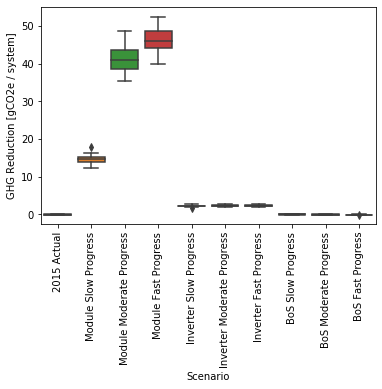
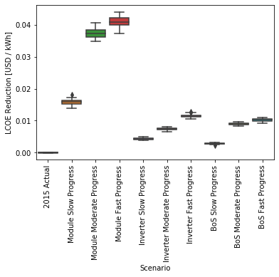
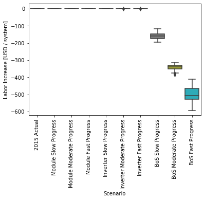
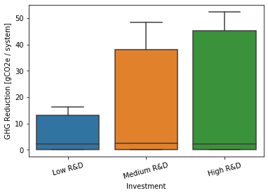
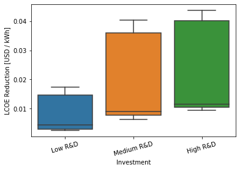
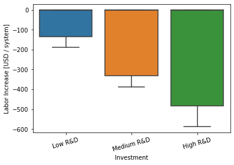
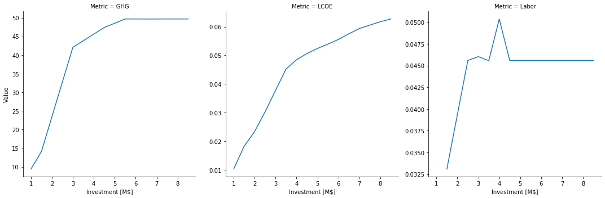
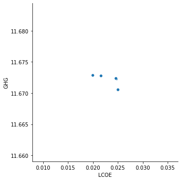
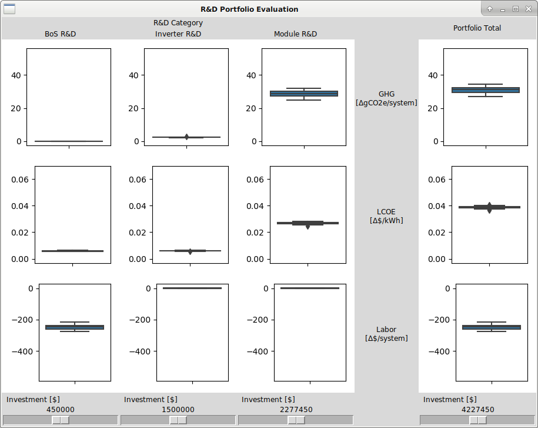

# Summary

Our production-function approach to R\&D portfolio evaluation is mathematically formulated as a stochastic multi-objective decision-optimization problem and is implemented in the Python programming language. The framework abstracts the technology-independent aspects of the problem into a generic computational schema and enables the modeler to specify the technology-dependent aspects in a set of data tables and Python functions. This approach not only minimizes the labor needed to add new technologies, but it also enforces uniformity of financial, mass-balance, and other assumptions in the analysis.

The framework is scalable, supporting rapid computation on laptops computer and large-ensemble studies on high-performance computers (HPC). The use of vectorized operations for the stochastic calculations and of response-surface fits for the portfolio evaluations minimizes the computational resources needed for complex multi-objective optimizations. The software handles parameterized studies such as tornado plots, Monte-Carlo sensitivity analyses, and a generalization of epsilon-constraint optimization.

All values in the data tables may be probability distributions, specified by Python expressions using a large library of standard distributions, or the values may be simple numbers. Expert opinion is encoded through these distributions. The opinions may be combined prior to simulator or subsequent to it.
 
Four example technologies have been implemented as examples illustrating framework's use: biorefineries, electrolysis, residential photovoltaics (PV), and utility-scale PV. A desktop user interface allows exploration of the cost-benefit trade-offs in portfolio decision problems.

Below we detail the mathematical formulation and its implementation as a Python module with user-specified data tables and technology functions. We also provide a sample analysis that exercises the framework's main features.


# Mathematical formulation

We separate the financial and conversion-efficiency aspects of a production process, which are generic across all technologies, from the physical and technical aspects, which are necessarily specific to the particular process. The motivation for this is that the financial and waste computations can be done uniformly for any technology (even for disparate ones such as PV cells and biofuels) and that different experts may be required to assess the cost, waste, and techno-physical aspects of technological progress. @tbl:sets defines the indices that are used for the variables that are defined in @tbl:variables.


| Set                  | Description         | Examples                                           |
|----------------------|---------------------|----------------------------------------------------|
| $c \in \mathcal{C}$  | capital             | equipment                                          |
| $f \in \mathcal{F}$  | fixed cost          | rent, insurance                                    |
| $i \in \mathcal{I}$  | input               | feedstock, labor                                   |
| $o \in \mathcal{O}$  | output              | product, co-product, waste                         |
| $m \in \mathcal{M}$  | metric              | cost, jobs, carbon footprint, efficiency, lifetime |
| $p \in \mathcal{P}$  | technical parameter | temperature, pressure                              |
| $\nu \in N$          | technology type     | electrolysis, PV cell                              |
| $\theta \in \Theta$  | scenario            | the result of a particular investment              |
| $\chi \in X$         | investment category | investment alternatives                            |
| $\phi \in \Phi_\chi$ | investment          | a particular investment                            |
| $\omega \in \Omega$  | portfolio           | a basket of investments                            |

: Definitions for set indices used for variable subscripts. {#tbl:sets}


| Variable                   | Type            | Description            | Units         |
|----------------------------|-----------------|------------------------|---------------|
| $K$                        | calculated      | unit cost              | USD/unit      |
| $C_c$                      | function        | capital cost           | USD           |
| $\tau_c$                   | cost            | lifetime of capital    | year          |
| $S$                        | cost            | scale of operation     | unit/year     |
| $F_f$                      | function        | fixed cost             | USD/year      |
| $I_i$                      | input           | input quantity         | input/unit    |
| $I^*_i$                    | calculated      | ideal input quantity   | input/unit    |
| $\eta_i$                   | waste           | input efficiency       | input/input   |
| $p_i$                      | cost            | input price            | USD/input     |
| $O_o$                      | calculated      | output quantity        | output/unit   |
| $O^*_o$                    | calculated      | ideal output quantity  | output/unit   |
| $\eta^\prime_o$            | waste           | output efficiency      | output/output |
| $p^\prime_o$               | cost            | output price (+/-)     | USD/output    |
| $\mu_m$                    | calculated      | metric                 | metric/unit   |
| $P_o$                      | function        | production function    | output/unit   |
| $M_m$                      | function        | metric function        | metric/unit   |
| $\alpha_p$                 | parameter       | technical parameter    | (mixed)       |
| $\xi_\theta$               | variable        | scenario inputs        | (mixed)       |
| $\zeta_\theta$             | variable        | scenario outputs       | (mixed)       |
| $\psi$                     | function        | scenario evaluation    | (mixed)       |
| $\sigma_\phi$              | function        | scenario probability   | 1             |
| $q_\phi$                   | variable        | investment cost        | USD           |
| $\mathbf{\zeta}_\phi$      | random variable | investment outcome     | (mixed)       |
| $\mathbf{Z}(\omega)$       | random variable | portfolio outcome      | (mixed)       |
| $Q(\omega)$                | calculated      | portfolio cost         | USD           |
| $Q^\mathrm{min}$           | parameter       | minimum portfolio cost | USD           |
| $Q^\mathrm{max}$           | parameter       | maximum portfolio cost | USD           |
| $q^\mathrm{min}_\phi$      | parameter       | minimum category cost  | USD           |
| $q^\mathrm{max}_\phi$      | parameter       | maximum category cost  | USD           |
| $Z^\mathrm{min}$           | parameter       | minimum output/metric  | (mixed)       |
| $Z^\mathrm{max}$           | parameter       | maximum output/metric  | (mixed)       |
| $\mathbb{F}$, $\mathbb{G}$ | operator        | evaluate probabilities | (mixed)       |

: Definitions for variables. {#tbl:variables}


## Cost

The cost characterizations (capital and fixed costs) are represented as functions of the scale of operations and of the technical parameters in the design:

*   Capital cost: $C_c(S, \alpha_p)$.
*   Fixed cost: $F_f(S, \alpha_p)$.

The per-unit cost is computed using a simple levelization formula:

$K = \left( \sum_c C_c / \tau_c + \sum_f F_f \right) / S + \sum_i p_i \cdot I_i - \sum_o p^\prime_o \cdot O_o$


## Waste

The waste relative to the idealized production process is captured by the $\eta$ parameters. Expert elicitation might estimate how the $\eta$s would change in response to R\&D investment.

*   Waste of input: $I^*_i = \eta_i I_i$.
*   Waste of output: $O_o = \eta^\prime_o O^*_o$.


## Production

The production function idealizes production by ignoring waste, but accounting for physical and technical processes (e.g., stoichiometry). This requires a technical model or a tabulation/fit of the results of technical modeling.

$O^*_o = P_o(S, C_c, \tau_c, F_f, I^*_i, \alpha_p)$


## Metrics

Metrics such as efficiency, lifetime, or carbon footprint are also compute based on the physical and technical characteristics of the process. This requires a technical model or a tabulation/fit of the results of technical modeling. We use the convention that higher values are worse and lower values are better.

$\mu_m = M_m(S, C_c, \tau_c, F_f, I_i, I^*_i, O^*_o, O_o, K, \alpha_p)$


## Scenarios

A *scenario* represents a state of affairs for a technology $\nu$. If we denote the scenario as $\theta$, we have the tuple of input variables

$\xi_\theta = \left(S, C_c, \tau_c, F_f, I_i, \eta_i, \eta^\prime_o, \alpha_p, p_i, p^\prime_o\middle) \right|_\theta$

and the tuple of output variables

$\zeta_\theta = \left(K, I^*_i, O^*_o, O_o, \mu_m\middle) \right|_\theta$

and their relationship

$\zeta_\theta = \psi_\nu\left(\xi_\theta\middle) \right|_{\nu = \nu(\theta)}$

given the tuple of functions

$\psi_\nu = \left(P_o, M_m\middle) \right|_\nu$

for the technology of the scenario.


## Investments

An *investment* $\phi$ assigns a probability distribution to scenarios:

$\sigma_\phi(\theta) = P\left(\theta \middle| \phi\right)$.

such that

$\int d\theta \sigma_\phi(\theta) = 1$ or $\sum_\theta \sigma_\phi(\theta) = 1$,

depending upon whether one is performing the computations discretely or continuously. Expectations and other measures on probability distributions can be computed from the $\sigma_\phi(\theta)$. We treat the outcome $\mathbf{\zeta}_\phi$ as a random variable for the outcomes $\zeta_\theta$ according to the distribution $\sigma_\phi(\theta)$.

Because investment options may be mutually exclusive, as is the case for investing in the same R\&D at different funding levels, we say $\Phi_\chi$ is the set of mutually exclusive investments (i.e., only one can occur simultaneously) in investment category $\chi$: investments in different categories $\chi$ can be combined arbitrarily, but just one investment from each $\Phi_\chi$ may be chosen.

Thus the universe of all portfolios is $\Omega = \prod_\chi \Phi_\chi$, so a particular portfolio $\omega \in \Omega$ has components $\phi = \omega_\chi \in \Phi_\chi$. The overall outcome of a portfolio is a random variable:

$\mathbf{Z}(\omega) = \sum_\chi \mathbf{\zeta}_\phi \mid_{\phi = \omega_\chi}$

The cost of an investment in one of the constituents $\phi$ is $q_\phi$, so the cost of a porfolio is:

$Q(\omega) = \sum_\chi q_\phi \mid_{\phi = \omega_\chi}$


## Decision problem

The multi-objective decision problem is 

$\min_{\omega \in \Omega} \  \mathbb{F} \  \mathbf{Z}(\omega)$

such that

$Q^\mathrm{min} \leq Q(\omega) \leq Q^\mathrm{max}$ ,

$q^\mathrm{min}_\phi \leq q_{\phi=\omega_\chi} \leq q^\mathrm{max}_\phi$ ,

$Z^\mathrm{min} \leq \mathbb{G} \  \mathbf{Z}(\omega) \leq Z^\mathrm{max}$ ,

where $\mathbb{F}$ and $\mathbb{G}$ are the expectation operator $\mathbb{E}$, the value-at-risk, or another operator on probability spaces. Recall that $\mathbf{Z}$ is a vector with components for cost $K$ and each metric $\mu_m$, so this is a multi-objective problem.

The two-stage decision problem is a special case of the general problem outlined here: Each scenario $\theta$ can be considers as a composite of one or more stages.


## Experts

Each expert elicitation takes the form of an assessment of the probability and range (e.g., 10th to 90th percentile) of change in the cost or waste parameters or the production or metric functions. In essence, the expert elicitation defines $\sigma_\phi(\theta)$ for each potential scenario $\theta$ of each investment $\phi$.


## Example: Idealized electrolysis of water

Here is a very simple model for electrolysis of water. We just have water, electricity, a catalyst, and some lab space. We choose the fundamental unit of operation to be moles of H~2~:

\ \ \ \ \ H~2~O → H~2~ + ½ O~2~

Experts could assess how much R\&D to increase the various efficiencies $\eta$ would cost. They could also suggest different catalysts, adding alkali, or replacing the process with PEM.


### Tracked quantities.

$\mathcal{C} = \{ \mathrm{catalyst} \}$

$\mathcal{F} = \{ \mathrm{rent} \}$

$\mathcal{I} = \{ \mathrm{water}, \mathrm{electricity} \}$

$\mathcal{O} = \{ \mathrm{oxygen}, \mathrm{hydrogen} \}$

$\mathcal{M} = \{ \mathrm{jobs} \}$


### Current design.

$I_\mathrm{water} = 19.04~\mathrm{g/mole}$

$\eta_\mathrm{water} = 0.95$ (due to mass transport loss on input)

$I_\mathrm{electricity} = 279~\mathrm{kJ/mole}$

$\eta_\mathrm{electricity} = 0.85$ (due to ohmic losses on input)

$\eta_\mathrm{oxygen} = 0.90$ (due to mass transport loss on output)

$\eta_\mathrm{hydrogen} = 0.90$ (due to mass transport loss on output)


### Current costs.

$C_\mathrm{catalyst} = \left( 0.63~\mathrm{USD} \right) \cdot \frac{S}{6650~\mathrm{mole/yr}}$ (cost of Al-Ni catalyst)

$\tau_\mathrm{catalyst} = 3~\mathrm{yr}$ (effective lifetime of Al-Ni catalyst)

$F_\mathrm{rent} = \left( 1000~\mathrm{USD/yr} \right) \cdot \frac{S}{6650~\mathrm{mole/yr}}$

$S = 6650~\mathrm{mole/yr}$ (rough estimate for a 50W setup)


### Current prices.

$p_\mathrm{water} = 4.8 \cdot 10^{-3}~\mathrm{USD/mole}$

$p_\mathrm{electricity} = 3.33 \cdot 10^{-5}~\mathrm{USD/kJ}$

$p_\mathrm{oxygen} = 3.0 \cdot 10^{-3}~\mathrm{USD/g}$

$p_\mathrm{hydrogen} = 1.0 \cdot 10^{-2}~\mathrm{USD/g}$


### Production function (à la Leontief)

$P_\mathrm{oxygen} = \left( 16.00~\mathrm{g} \right) \cdot \min \left\{ \frac{I^*_\mathrm{water}}{18.08~\mathrm{g}}, \frac{I^*_\mathrm{electricity}}{237~\mathrm{kJ}} \right\}$

$P_\mathrm{hydrogen} = \left( 2.00~\mathrm{g} \right) \cdot \min \left\{ \frac{I^*_\mathrm{water}}{18.08~\mathrm{g}}, \frac{I^*_\mathrm{electricity}}{237~\mathrm{kJ}} \right\}$


### Metric function.

$M_\mathrm{cost} = K / O_\mathrm{hydrogen}$

$M_\mathrm{GHG} = \left( \left( 0.00108~\mathrm{gCO2e/gH20} \right) I_\mathrm{water} + \left( 0.138~\mathrm{gCO2e/kJ} \right) I_\mathrm{electricity} \right) / O_\mathrm{hydrogen}$

$M_\mathrm{jobs} = \left( 0.00015~\mathrm{job/mole} \right) / O_\mathrm{hydrogen}$


### Performance of current design.

$K = 0.18~\mathrm{USD/mole}$ (i.e., not profitable since it is positive)

$O_\mathrm{oxygen} = 14~\mathrm{g/mole}$

$O_\mathrm{hydrogen} = 1.8~\mathrm{g/mole}$

$\mu_\mathrm{cost} = 0.102~\mathrm{USD/gH2}$

$\mu_\mathrm{GHG} = 21.4~\mathrm{gCO2e/gH2}$

$\mu_\mathrm{jobs} = 0.000083~\mathrm{job/gH2}$


# Implementation

Database tables (one per set) hold all of the variables and the expert assessments. These tables are augmented by concise code with mathematical representations of the production and metric functions.

The Monte-Carlo computations are amenable to fast tensor-based implementation in Python.

See \<<https://github.com/NREL/portfolio/tree/master/production-function/framework/code/tyche/>\> for the `tyche` package that computes cost, production, and metrics from a technology design.


## Database tables

Each analysis case is represented by a `Technology` and a `Scenario` within that technology. In the specifications for the individual tables, we use the simple electrolysis example to populate the table.


### Metadata about indices

The `indices` table (see @tbl:indices) simply describes the various indices available for the variables. The `Offset` column specifies the memory location in the argument for the production and metric functions.


| Technology          | Type    | Index       | Offset   | Description | Notes |
|---------------------|---------|-------------|---------:|-------------|-------|
| Simple electrolysis | Capital | Catalyst    | 0        | Catalyst    |       |
| Simple electrolysis | Fixed   | Rent        | 0        | Rent        |       |
| Simple electrolysis | Input   | Water       | 0        | Water       |       |
| Simple electrolysis | Input   | Electricity | 1        | Electricity |       |
| Simple electrolysis | Output  | Oxygen      | 0        | Oxygen      |       |
| Simple electrolysis | Output  | Hydrogen    | 1        | Hydrogen    |       |
| Simple electrolysis | Metric  | Cost        | 0        | Cost        |       |
| Simple electrolysis | Metric  | Jobs        | 1        | Jobs        |       |
| Simple electrolysis | Metric  | GHG         | 2        | GHGs        |       |

: Example of the `indices` table. {#tbl:indices}


### Design variables

The `design` table (see @tbl:designs) specifies the values of all of the variables in the mathematical formulation of the design. Note that the `Value` column can either contain numeric literals or Python expressions specifying probability distribution functions. For example, a normal distribution with mean of five and standard deviation of two would be written `st.norm(5, 2)`. All of the [Scipy probability distribution functions](https://docs.scipy.org/doc/scipy-1.4.1/reference/tutorial/stats/continuous.html#continuous-distributions-in-scipy-stats) are available for use, as are two special functions, `constant` and `mixture`. The `constant` distribution is just a single constant value; the `mixture` distribution is the mixture of a list of distributions, with specified relative weights. The `mixture` function is particularly important because it allows one to specify a first distribution in the case of an R\&D breakthrough, but a second distribution if no breakthrough occurs.


| Technology          | Scenario | Variable          | Index       | Value   | Units    | Notes                       |
|---------------------|----------|-------------------|-------------|--------:|----------|-----------------------------|
| Simple electrolysis | Base     | Input             | Water       | 19.04   | g/mole   |  $I_\mathrm{water}$         |
| Simple electrolysis | Base     | Input Efficiency  | Water       | 0.95    | 1        | $\eta_\mathrm{water}$       |
| Simple electrolysis | Base     | Input             | Electricity | 279     | kJ/mole  |  $I_\mathrm{electricity}$   |
| Simple electrolysis | Base     | Input Efficiency  | Electricity | 0.85    | 1        | $\eta_\mathrm{electricity}$ |
| Simple electrolysis | Base     | Output Efficiency | Oxygen      | 0.90    | 1        | $\eta_\mathrm{oxygen}$      |
| Simple electrolysis | Base     | Output Efficiency | Hydrogen    | 0.90    | 1        | $\eta_\mathrm{hydrogen}$    |
| Simple electrolysis | Base     | Lifetime          | Catalyst    | 3       | yr       | $\tau_\mathrm{catalyst}$    |
| Simple electrolysis | Base     | Scale             |             | 6650    | mole/yr  | $S$                         |
| Simple electrolysis | Base     | Input price       | Water       | 4.8e-3  | USD/mole | $p_\mathrm{water}$          |
| Simple electrolysis | Base     | Input price       | Electricity | 3.33e-5 | USD/kJ   | $p_\mathrm{electricity}$    |
| Simple electrolysis | Base     | Output price      | Oxygen      | 3.0e-3  | USD/g    | $p_\mathrm{oxygen}$         |
| Simple electrolysis | Base     | Output price      | Hydrogen    | 1.0e-2  | USD/g    | $p_\mathrm{hydrogen}$       |

: Example of the `designs` table. {#tbl:designs}


### Metadata for functions

The `functions` table (see @tbl:functions) simply documents which Python module and functions to use for the technology and scenario. Currently only the `numpy` style of function is supported, but later `plain` Python functions and `tensorflow` functions will be allowed.


| Technology          | Style | Module              | Capital      | Fixed      | Production | Metrics | Notes |
|---------------------|-------|---------------------|--------------|------------|------------|---------|-------|
| Simple electrolysis | numpy | simple_electrolysis | capital_cost | fixed_cost | production | metrics |       |

: Example of the `functions` table. {#tbl:functions}


### Parameters for functions

The `parameters` table (see @tbl:parameters) contains ad-hoc parameters specific to the particular production and metrics functions. The `Offset` column specifies the memory location in the argument for the production and metric functions.


| Technology          | Scenario | Parameter                           | Offset   | Value   | Units                 | Notes                                |
|---------------------|----------|-------------------------------------|---------:|--------:|-----------------------|--------------------------------------|
| Simple electrolysis | Base     | Oxygen production                   | 0        | 16.00   | g                     |                                      |
| Simple electrolysis | Base     | Hydrogen production                 | 1        | 2.00    | g                     |                                      |
| Simple electrolysis | Base     | Water consumption                   | 2        | 18.08   | g                     |                                      |
| Simple electrolysis | Base     | Electricity consumption             | 3        | 237     | kJ                    |                                      |
| Simple electrolysis | Base     | Jobs                                | 4        | 1.5e-4  | job/mole              |                                      |
| Simple electrolysis | Base     | Reference scale                     | 5        | 6650    | mole/yr               |                                      |
| Simple electrolysis | Base     | Reference capital cost for catalyst | 6        | 0.63    | USD                   |                                      |
| Simple electrolysis | Base     | Reference fixed cost for rent       | 7        | 1000    | USD/yr                |                                      |
| Simple electrolysis | Base     | GHG factor for water                | 8        | 0.00108 | gCO2e/g               | based on 244,956 gallons = 1 Mg CO2e |
| Simple electrolysis | Base     | GHG factor for electricity          | 9        | 0.138   | gCO2e/kJ              | based on 1 kWh = 0.5 kg CO2e         |

: Example of the `parameters` table. {#tbl:parameters}


### Units for results

The `results` table (see @tbl:results) simply specifies the units for the results.


| Technology          | Variable | Index    | Units     | Notes |
|---------------------|----------|----------|-----------|-------|
| Simple electrolysis | Cost     | Cost     | USD/mole  |       |
| Simple electrolysis | Output   | Oxygen   | g/mole    |       |
| Simple electrolysis | Output   | Hydrogen | g/mole    |       |
| Simple electrolysis | Metric   | Cost     | job/gH2   |       |
| Simple electrolysis | Metric   | Jobs     | job/gH2   |       |
| Simple electrolysis | Metric   | GHG      | gCO2e/gH2 |       |

: Example of the `results` table. {#tbl:results}


### Tranches of investments.

In the `tranches` table (see @tbl:tranches), each *category* of investment contains a set of mutually exclusive *tranches* that may be associated with one or more *scenarios* defined in the `designs` table. Typically, a category is associated with a technology area and each tranche corresponds to an investment strategy within that category.


| Category         | Tranche                 | Scenario                          | Amount  | Notes |
|------------------|-------------------------|-----------------------------------|--------:|-------|
| Electrolysis R\&D | No Electrolysis R\&D     | Base Electrolysis                 | 0       |       |
| Electrolysis R\&D | Low Electrolysis R\&D    | Slow Progress on Electrolysis     | 1000000 |       |
| Electrolysis R\&D | Medium Electrolysis R\&D | Moderate Progress on Electrolysis | 2500000 |       |
| Electrolysis R\&D | High Electrolysis R\&D   | Fast Progress on Electrolysis     | 5000000 |       |

: Example of the `tranches` table. {#tbl:tranches}


### Investments

In the `investments` table (see @tbl:investments), each *investment* is associated with a single *tranche* in one or more *categories*. An investment typically combines tranches from several different investment categories.


| Investment          | Category         | Tranche                 | Notes |
|---------------------|------------------|-------------------------|-------|
| No R\&D Spending     | Electrolysis R\&D | No Electrolysis R\&D     |       |
| Low R\&D Spending    | Electrolysis R\&D | Low Electrolysis R\&D    |       |
| Medium R\&D Spending | Electrolysis R\&D | Medium Electrolysis R\&D |       |
| High R\&D Spending   | Electrolysis R\&D | High Electrolysis R\&D   |       |

: Example of the `investments` table. {#tbl:investments}


## Python module and functions for a technology

Each technology design requires a Python module with a capital cost, a fixed cost, a production, and a metrics function. @lst:electrolysis shows these functions for the simple electrolysis example.

```{#lst:electrolysis .python caption="Capital-cost, fixed-cost, production, and metrics functions for the simple electrolysis example."}
# Simple electrolysis.


# All of the computations must be vectorized, so use `numpy`.
import numpy as np


# Capital-cost function.
def capital_cost(scale, parameter):

  # Scale the reference values.
  return np.stack([np.multiply(parameter[6], np.divide(scale, parameter[5]))])


# Fixed-cost function.
def fixed_cost(scale, parameter):

  # Scale the reference values.
  return np.stack([np.multiply(parameter[7], np.divide(scale, parameter[5]))])


# Production function.
def production(capital, fixed, input, parameter):

  # Moles of input.
  water       = np.divide(input[0], parameter[2])
  electricity = np.divide(input[1], parameter[3])

  # Moles of output.
  output = np.minimum(water, electricity)

  # Grams of output.
  oxygen   = np.multiply(output, parameter[0])
  hydrogen = np.multiply(output, parameter[1])

  # Package results.
  return np.stack([oxygen, hydrogen])


# Metrics function.
def metrics(capital, fixed, input_raw, input, img/output_raw, output, cost, parameter):

  # Hydrogen output.
  hydrogen = output[1]

  # Cost of hydrogen.
  cost1 = np.divide(cost, hydrogen)

  # Jobs normalized to hydrogen.
  jobs = np.divide(parameter[4], hydrogen)

  # GHGs associated with water and electricity.
  water       = np.multiply(input_raw[0], parameter[8])
  electricity = np.multiply(input_raw[1], parameter[9])
  co2e = np.divide(np.add(water, electricity), hydrogen)

  # Package results.
  return np.stack([cost1, jobs, co2e])
```


## Python API for module `tyche`

The `tyche` module is a Python package for R\&D pathways analysis and evaluation. It contains five Python classes for R\&D pathway decision support.

*   `Designs` for specifying and evaluating technology decisions in the presence of uncertainty.
*   `Investments` for specifying and evaluating R\&D portfolios consisting of multiple technology-investment options.
*   `Evaluator` for rapidly evaluating the costs and benefits for sets of portfolios.
*   `EpsilonConstraints` for multi-objective optimization using a generalization of the epsilon-constraint technique.
*   `DecisionGUI` for interactively exploring the costs and benefits of R\&D portfolios.


### DecisionWindow Objects

```python
class DecisionWindow()
```

Class for displaying an interactive interface to explore cost-benefit tradeoffs for a technology.

#### \_\_init\_\_

```python
 | __init__(evaluator)
```

*Parameters*

evaluator : Evaluator
 ~ The evaluation object for the technology.

#### reevaluate

```python
 | reevaluate(next=lambda: None, delay=200)
```

Recalculate the results after a delay.

*Parameters*

next : function
 ~ The operation to perform after completing the recalculation.

delay : int
 ~ The number of milliseconds to delay before the recalculation.

#### reevaluate\_immediate

```python
 | reevaluate_immediate(next=lambda: None)
```

Recalculate the results immediately.

*Parameters*

next : function
 ~ The operation to perform after completing the recalculation.

#### refresh

```python
 | refresh()
```

Refresh the graphics after a delay.

#### refresh\_immediate

```python
 | refresh_immediate()
```

Refresh the graphics immediately.

#### mainloop

```python
 | mainloop()
```

Run the interactive interface.

### Designs Objects

```python
class Designs()
```

Designs for a technology.

*Attributes*

indices : DataFrame
 ~ The *indices* table.

functions : DataFrame
 ~ The *functions* table.

designs : DataFrame
 ~ The *designs* table.

parameters : DataFrame
 ~ The *parameters* table.

results : DataFrame
 ~ The *results* table.

#### \_\_init\_\_

```python
 | __init__(path=None, indices="indices.tsv", functions="functions.tsv", designs="designs.tsv", parameters="parameters.tsv", results="results.tsv")
```

*Parameters*

path : str
 ~ Location of the data files.

indices : str
 ~ Filename for the *indices* table.

functions : str
 ~ Filename for the *functions* table.

designs : str
 ~ Filename for the *designs* table.

parameters : str
 ~ Filename for the *parameters* table.

results : str
 ~ Filename for the *results* table.

#### vectorize\_technologies

```python
 | vectorize_technologies()
```

Make an array of technologies.

#### vectorize\_scenarios

```python
 | vectorize_scenarios(technology)
```

Make an array of scenarios.

#### vectorize\_indices

```python
 | vectorize_indices(technology)
```

Make an array of indices.

#### vectorize\_designs

```python
 | vectorize_designs(technology, scenario_count, sample_count=1)
```

Make an array of designs.

#### vectorize\_parameters

```python
 | vectorize_parameters(technology, scenario_count, sample_count=1)
```

Make an array of parameters.

#### compile

```python
 | compile()
```

Compile the production and metrics functions.

#### evaluate

```python
 | evaluate(technology, sample_count=1)
```

Evaluate the performance of a technology.

*Parameters*

technology : str
 ~ The name of the technology.

sample_count : int
 ~ The number of random samples.

#### evaluate\_scenarios

```python
 | evaluate_scenarios(sample_count=1)
```

Evaluate scenarios.

*Parameters*

sample_count : int
 ~ The number of random samples.

### EpsilonConstraintOptimizer Objects

```python
class EpsilonConstraintOptimizer()
```

An epsilon-constration multi-objective optimizer.

*Attributes*

evaluator : tyche.Evaluator
 ~ The technology evaluator.

scale : float
 ~ The scaling factor for output.

#### \_\_init\_\_

```python
 | __init__(evaluator, scale=1e6)
```

*Parameters*

evaluator : tyche.Evaluator
 ~ The technology evaluator.

scale : float
 ~ The scaling factor for output.

#### maximize

```python
 | maximize(metric, max_amount=None, total_amount=None, min_metric=None, statistic=np.mean, initial=None, tol=1e-8, maxiter=50, verbose=0)
```

Maximize the objective function.

*Parameters*

metric : str
 ~ The metric to maximize.

max_amount : DataFrame
 ~ The maximum amounts that can be invested in each category.

total_amount : float
 ~ The maximum amount that can be invested *in toto*.

min_metric : DataFrame
 ~ The minimum constraint for each metric.

statistic : function
 ~ The statistic used on the sample evaluations.

initial : array of float
 ~ The initial value for the search.

tol : float
 ~ The search tolerance.

maxiter : int
 ~ The maximum iterations for the search.

verbose : int
 ~ Verbosity level.

#### max\_metrics

```python
 | max_metrics(max_amount=None, total_amount=None, statistic=np.mean, tol=1e-8, maxiter=50, verbose=0)
```

Maximum value of metrics.

*Parameters*

max_amount : DataFrame
 ~ The maximum amounts that can be invested in each category.

total_amount : float
 ~ The maximum amount that can be invested *in toto*.

min_metric : DataFrame
 ~ The minimum constraint for each metric.

statistic : function
 ~ The statistic used on the sample evaluations.

initial : array of float
 ~ The initial value for the search.

tol : float
 ~ The search tolerance.

maxiter : int
 ~ The maximum iterations for the search.

verbose : int
 ~ Verbosity level.

### Evaluator Objects

```python
class Evaluator()
```

Evalutate technology investments using a response surface.

*Attributes*

amounts : DataFrame
 ~ Cost of tranches.

categories : DataFrame
 ~ Categories of investment.

metrics : DataFrame
 ~ Metrics for technologies.

units : DataFrame
 ~ Units of measure for metrics.

interpolators : DataFrame
 ~ Interpolation functions for technology metrics.

#### \_\_init\_\_

```python
 | __init__(tranches, summary)
```

*Parameters*

tranches : DataFrame
 ~ The tranches of investment.

summary : DataFrame
 ~ The summary of evaluating the tranches.

#### evaluate

```python
 | evaluate(amounts)
```

Sample the distribution for an investment.

*Parameters*

amounts : DataFrame
 ~ The investment levels.

#### evaluate\_statistic

```python
 | evaluate_statistic(amounts, statistic=np.mean)
```

Evaluate a statistic for an investment.

*Parameters*

amounts : DataFrame
 ~ The investment levels.

statistics : DataFrame
 ~ The statistic to evaluate.

### Investments Objects

```python
class Investments()
```

Investments in a technology.

*Attributes*

tranches : DataFrame
 ~ The *tranches* table.

investments: DataFrame
 ~ The *investments* table.

#### \_\_init\_\_

```python
 | __init__(path=None, tranches="tranches.tsv", investments="investments.tsv")
```

*Parameters*

tranches : str
 ~ Filename for the *tranches* table.

investments: str
 ~ Filename for the *investments* table.

#### evaluate\_tranches

```python
 | evaluate_tranches(designs, sample_count=1)
```

Evaluate the tranches of investment for a design.

*Parameters*

designs : tyche.Designs
 ~ The designs.

sample_count : int
 ~ The number of random samples.

#### evaluate\_investments

```python
 | evaluate_investments(designs, sample_count=1)
```

Evaluate the investments for a design.

*Parameters*

designs : tyche.Designs
 ~ The designs.

sample_count : int
 ~ The number of random samples.


# Extended example

## Set up.

Import packages.

```python
import numpy             as np
import matplotlib.pyplot as pl
import pandas            as pd
import seaborn           as sb
import tyche             as ty

from copy            import deepcopy
from IPython.display import Image 
```

Load data.

The data are stored in a set of tab-separated value files in a folder.

```python
designs = ty.Designs("data/residential_pv_multiobjective")
investments = ty.Investments("data/residential_pv_multiobjective")
```

Compile the production and metric functions for each technology in the dataset.

```python
designs.compile()
```

## Examine the data.

The `functions` table specifies where the Python code for each technology resides.

```python
designs.functions
```

| Technology     | Style   | Module                        | Capital      | Fixed      | Production   | Metrics   | Notes   |
|:---------------|:--------|:------------------------------|:-------------|:-----------|:-------------|:----------|:--------|
| Residential PV | numpy   | residential_pv_multiobjective | capital_cost | fixed_cost | production   | metrics   |         |


The `indices` table defines the subscripts for variables.

```python
designs.indices
```

| Technology     | Type    | Index       |   Offset | Description                           | Notes   |
|:---------------|:--------|:------------|---------:|:--------------------------------------|:--------|
| Residential PV | Capital | BoS         |        2 | balance of system                     |         |
| Residential PV | Capital | Inverter    |        1 | system inverters                      |         |
| Residential PV | Capital | Module      |        0 | system module                         |         |
| Residential PV | Fixed   | System      |        0 | whole system                          |         |
| Residential PV | Input   | nan         |        0 | no inputs                             |         |
| Residential PV | Metric  | GHG         |        2 | reduction in GHGs                     |         |
| Residential PV | Metric  | LCOE        |        0 | reduction in levelized cost of energy |         |
| Residential PV | Metric  | Labor       |        1 | increase in spending on wages         |         |
| Residential PV | Output  | Electricity |        0 | electricity generated                 |         |

The `designs` table contains the cost, input, efficiency, and price data for a scenario.

```python
designs.designs
```

| Technology     | Scenario                   | Variable          | Index       |   Value | Units           | Notes                                           |
|:---------------|:---------------------------|:------------------|:------------|--------:|:----------------|:------------------------------------------------|
| Residential PV | 2015 Actual                | Input             | nan         |       0 | 1               | no inputs                                       |
| Residential PV | 2015 Actual                | Input efficiency  | nan         |       1 | 1               | no inputs                                       |
| Residential PV | 2015 Actual                | Input price       | nan         |       0 | 1               | no inputs                                       |
| Residential PV | 2015 Actual                | Lifetime          | BoS         |       1 | system-lifetime | per-lifetime computations                       |
| Residential PV | 2015 Actual                | Lifetime          | Inverter    |       1 | system-lifetime | per-lifetime computations                       |
| Residential PV | 2015 Actual                | Lifetime          | Module      |       1 | system-lifetime | per-lifetime computations                       |
| Residential PV | 2015 Actual                | Output efficiency | Electricity |       1 | W/W             | see parameter table for individual efficiencies |
| Residential PV | 2015 Actual                | Output price      | Electricity |       0 | \$/kWh           | not tracking electricity price                  |
| Residential PV | 2015 Actual                | Scale             | nan         |       1 | system/system   | no scaling                                      |
| . . .          | . . .                      | . . .             | . . .       | . . .   | . . .           | . . .                                           |
| Residential PV | Module Slow Progress       | Input             | nan         |       0 | 1               | no inputs                                       |
| Residential PV | Module Slow Progress       | Input efficiency  | nan         |       1 | 1               | no inputs                                       |
| Residential PV | Module Slow Progress       | Input price       | nan         |       0 | 1               | no inputs                                       |
| Residential PV | Module Slow Progress       | Lifetime          | BoS         |       1 | system-lifetime | per-lifetime computations                       |
| Residential PV | Module Slow Progress       | Lifetime          | Inverter    |       1 | system-lifetime | per-lifetime computations                       |
| Residential PV | Module Slow Progress       | Lifetime          | Module      |       1 | system-lifetime | per-lifetime computations                       |
| Residential PV | Module Slow Progress       | Output efficiency | Electricity |       1 | W/W             | see parameter table for individual efficiencies |
| Residential PV | Module Slow Progress       | Output price      | Electricity |       0 | \$/kWh           | not tracking electricity price                  |
| Residential PV | Module Slow Progress       | Scale             | nan         |       1 | system/system   | no scaling                                      |


The `parameters` table contains additional techno-economic parameters for each technology.

```python
designs.parameters
```

| Technology     | Scenario                   | Parameter                   |   Offset | Value                                    | Units    | Notes   |
|:---------------|:---------------------------|:----------------------------|---------:|:-----------------------------------------|:---------|:--------|
| Residential PV | 2015 Actual                | Customer Acquisition        |       19 | st.triang(0.5, loc=2000, scale=0.2)      | \$/system | BCA     |
| Residential PV | 2015 Actual                | DC-to-AC Ratio              |       15 | st.triang(0.5, loc=1.4, scale=0.00014)   | 1        | IDC     |
| Residential PV | 2015 Actual                | Direct Labor                |       17 | st.triang(0.5, loc=2000, scale=0.2)      | \$/system | BLR     |
| Residential PV | 2015 Actual                | Discount Rate               |        0 | 0.07                                     | 1/year   | DR      |
| Residential PV | 2015 Actual                | Hardware Capital            |       16 | st.triang(0.5, loc=80, scale=0.008)      | \$/m^2    | BCC     |
| Residential PV | 2015 Actual                | Insolation                  |        1 | 1000                                     | W/m^2    | INS     |
| Residential PV | 2015 Actual                | Installer Overhead & Profit |       20 | st.triang(0.5, loc=0.35, scale=3.5e-5)   | 1        | BOH     |
| Residential PV | 2015 Actual                | Inverter Capital            |       11 | st.triang(0.5, loc=0.3, scale=3e-5)      | \$/W      | ICC     |
| Residential PV | 2015 Actual                | Inverter Efficiency         |       14 | st.triang(0.5, loc=0.9, scale=9e-5)      | 1        | IEF     |
| Residential PV | 2015 Actual                | Inverter Lifetime           |       12 | st.triang(0.5, loc=16, scale=0.0016)     | yr       | ILT     |
| Residential PV | 2015 Actual                | Inverter Replacement        |       13 | st.triang(0.5, loc=0.5, scale=5e-5)      | 1        | IRC     |
| Residential PV | 2015 Actual                | Location Capacity Factor    |        9 | st.triang(0.5, loc=0.2, scale=2e-5)      | 1        | MCF     |
| Residential PV | 2015 Actual                | Module Aperture             |        6 | st.triang(0.5, loc=0.9, scale=9e-5)      | 1        | MAP     |
| Residential PV | 2015 Actual                | Module Capital              |        3 | st.triang(0.5, loc=110, scale=0.11)      | \$/m^2    | MCC     |
| Residential PV | 2015 Actual                | Module Degradation          |        8 | st.triang(0.5, loc=0.0075, scale=7.5e-7) | 1/yr     | MDR     |
| Residential PV | 2015 Actual                | Module Efficiency           |        5 | st.triang(0.5, loc=0.16, scale=1.6e-5)   | 1        | MEF     |
| Residential PV | 2015 Actual                | Module Lifetime             |        4 | st.triang(0.5, loc=25, scale=0.0025)     | yr       | MLT     |
| Residential PV | 2015 Actual                | Module O\&M Fixed            |        7 | st.triang(0.5, loc=20, scale=0.002)      | \$/kWyr   | MOM     |
| Residential PV | 2015 Actual                | Module Soiling Loss         |       10 | st.triang(0.5, loc=0.05, scale=5e-6)     | 1        | MSL     |
| Residential PV | 2015 Actual                | Permitting                  |       18 | st.triang(0.5, loc=600, scale=0.06)      | \$/system | BPR     |
| Residential PV | 2015 Actual                | System Size                 |        2 | 36                                       | m^2      | SSZ     |
| . . .          | . . .                      | . . .                       | . . .    | . . .                                    | . . .    | . . .   |


The `results` table specifies the units of measure for results of computations.


```python
designs.results
```

| Technology     | Variable   | Index       | Units         | Notes   |
|:---------------|:-----------|:------------|:--------------|:--------|
| Residential PV | Cost       | Cost        | \$/system      |         |
| Residential PV | Metric     | GHG         | ΔgCO2e/system |         |
| Residential PV | Metric     | LCOE        | Δ\$/kWh        |         |
| Residential PV | Metric     | Labor       | Δ\$/system     |         |
| Residential PV | Output     | Electricity | kWh           |         |


The `tranches` table specifies multually exclusive possibilities for investments: only one `Tranch` may be selected for each `Category`.

```python
investments.tranches
```

| Category     | Tranche             | Scenario                   |       Amount | Notes   |
|:-------------|:--------------------|:---------------------------|-------------:|:--------|
| BoS R\&D      | BoS High R\&D        | BoS Fast Progress          | 900000       |         |
| BoS R\&D      | BoS Low R\&D         | BoS Slow Progress          | 300000       |         |
| BoS R\&D      | BoS Medium R\&D      | BoS Moderate Progress      | 600000       |         |
| Inverter R\&D | Inverter High R\&D   | Inverter Fast Progress     |      3e+06   |         |
| Inverter R\&D | Inverter Low R\&D    | Inverter Slow Progress     |      1e+06   |         |
| Inverter R\&D | Inverter Medium R\&D | Inverter Moderate Progress |      2e+06   |         |
| Module R\&D   | Module High R\&D     | Module Fast Progress       |      4.5e+06 |         |
| Module R\&D   | Module Low R\&D      | Module Slow Progress       |      1.5e+06 |         |
| Module R\&D   | Module Medium R\&D   | Module Moderate Progress   |      3e+06   |         |


The `investments` table bundles a consistent set of tranches (one per category) into an overall investment.

```python
investments.investments
```

| Investment   | Category     | Tranche             | Notes   |
|:-------------|:-------------|:--------------------|:--------|
| High R\&D     | BoS R\&D      | BoS High R\&D        |         |
| High R\&D     | Inverter R\&D | Inverter High R\&D   |         |
| High R\&D     | Module R\&D   | Module High R\&D     |         |
| Low R\&D      | BoS R\&D      | BoS Low R\&D         |         |
| Low R\&D      | Inverter R\&D | Inverter Low R\&D    |         |
| Low R\&D      | Module R\&D   | Module Low R\&D      |         |
| Medium R\&D   | BoS R\&D      | BoS Medium R\&D      |         |
| Medium R\&D   | Inverter R\&D | Inverter Medium R\&D |         |
| Medium R\&D   | Module R\&D   | Module Medium R\&D   |         |


## Evaluate the scenarios in the dataset.

```python
scenario_results = designs.evaluate_scenarios(sample_count=50)
scenario_results.xs(1, level="Sample", drop_level=False)
```

| Technology     | Scenario                   |   Sample | Variable   | Index       |            Value | Units         |
|:---------------|:---------------------------|---------:|:-----------|:------------|-----------------:|:--------------|
| Residential PV | 2015 Actual                |        1 | Cost       | Cost        |  19541.3         | \$/system      |
| Residential PV | 2015 Actual                |        1 | Metric     | GHG         |     -0.00371397  | ΔgCO2e/system |
| Residential PV | 2015 Actual                |        1 | Metric     | LCOE        |     -1.85062e-05 | Δ\$/kWh        |
| Residential PV | 2015 Actual                |        1 | Metric     | Labor       |     -0.00191143  | Δ\$/system     |
| Residential PV | 2015 Actual                |        1 | Output     | Electricity | 184103           | kWh           |
| . . .          | . . .                      | . . .    | . . .      | . . .       | . . .            | . . .         |
| Residential PV | Module Slow Progress       |        1 | Cost       | Cost        |  19680.6         | \$/system      |
| Residential PV | Module Slow Progress       |        1 | Metric     | GHG         |     15.2892      | ΔgCO2e/system |
| Residential PV | Module Slow Progress       |        1 | Metric     | LCOE        |      0.0159126   | Δ\$/kWh        |
| Residential PV | Module Slow Progress       |        1 | Metric     | Labor       |      0.00873305  | Δ\$/system     |
| Residential PV | Module Slow Progress       |        1 | Output     | Electricity | 218158           | kWh           |


Plot GHG metric.

```python
g = sb.boxplot(
    x="Scenario",
    y="Value",
    data=scenario_results.xs(
        ["Metric", "GHG"],
        level=["Variable", "Index"]
    ).reset_index()[["Scenario", "Value"]],
    order=[
        "2015 Actual"              ,
        "Module Slow Progress"      ,
        "Module Moderate Progress"  ,
        "Module Fast Progress"      ,
        "Inverter Slow Progress"    ,
        "Inverter Moderate Progress",
        "Inverter Fast Progress"    ,
        "BoS Slow Progress"         ,
        "BoS Moderate Progress"     ,
        "BoS Fast Progress"         ,
    ]
)
g.set(ylabel="GHG Reduction [gCO2e / system]")
g.set_xticklabels(g.get_xticklabels(), rotation=90);
```

{#fig:ghgscenario}


Plot LCOE metric.

```python
g = sb.boxplot(
    x="Scenario",
    y="Value",
    data=scenario_results.xs(
        ["Metric", "LCOE"],
        level=["Variable", "Index"]
    ).reset_index()[["Scenario", "Value"]],
    order=[
        "2015 Actual"              ,
        "Module Slow Progress"      ,
        "Module Moderate Progress"  ,
        "Module Fast Progress"      ,
        "Inverter Slow Progress"    ,
        "Inverter Moderate Progress",
        "Inverter Fast Progress"    ,
        "BoS Slow Progress"         ,
        "BoS Moderate Progress"     ,
        "BoS Fast Progress"         ,
    ]
)
g.set(ylabel="LCOE Reduction [USD / kWh]")
g.set_xticklabels(g.get_xticklabels(), rotation=90);
```

{#fig:lcoescenario}

Plot labor metric.


```python
g = sb.boxplot(
    x="Scenario",
    y="Value",
    data=scenario_results.xs(
        ["Metric", "Labor"],
        level=["Variable", "Index"]
    ).reset_index()[["Scenario", "Value"]],
    order=[
        "2015 Actual"              ,
        "Module Slow Progress"      ,
        "Module Moderate Progress"  ,
        "Module Fast Progress"      ,
        "Inverter Slow Progress"    ,
        "Inverter Moderate Progress",
        "Inverter Fast Progress"    ,
        "BoS Slow Progress"         ,
        "BoS Moderate Progress"     ,
        "BoS Fast Progress"         ,
    ]
)
g.set(ylabel="Labor Increase [USD / system]")
g.set_xticklabels(g.get_xticklabels(), rotation=90);
```

{#fig:laborscenario}

## Evaluate the investments in the dataset.

```python
investment_results = investments.evaluate_investments(designs, sample_count=50)
investment_results.amounts
```

| Investment   |   Amount |
|:-------------|---------:|
| High R\&D     |  8.4e+06 |
| Low R\&D      |  2.8e+06 |
| Medium R\&D   |  5.6e+06 |


Benefits of investments.

```python
investment_results.metrics.xs(1, level="Sample", drop_level=False)
```

| Investment   | Category     | Tranche             | Scenario                   |   Sample | Technology     | Index   |         Value | Units         |
|:-------------|:-------------|:--------------------|:---------------------------|---------:|:---------------|:--------|--------------:|:--------------|
| High R\&D     | BoS R\&D      | BoS High R\&D        | BoS Fast Progress          |        1 | Residential PV | GHG     |   -0.00612191 | ΔgCO2e/system |
| High R\&D     | BoS R\&D      | BoS High R\&D        | BoS Fast Progress          |        1 | Residential PV | LCOE    |    0.0099879  | Δ\$/kWh        |
| High R\&D     | BoS R\&D      | BoS High R\&D        | BoS Fast Progress          |        1 | Residential PV | Labor   | -473.404      | Δ\$/system     |
| Medium R\&D   | BoS R\&D      | BoS Medium R\&D      | BoS Moderate Progress      |        1 | Residential PV | GHG     |   -0.00672276 | ΔgCO2e/system |
| Medium R\&D   | BoS R\&D      | BoS Medium R\&D      | BoS Moderate Progress      |        1 | Residential PV | LCOE    |    0.0091519  | Δ\$/kWh        |
| Medium R\&D   | BoS R\&D      | BoS Medium R\&D      | BoS Moderate Progress      |        1 | Residential PV | Labor   | -342.64       | Δ\$/system     |
| Low R\&D      | BoS R\&D      | BoS Low R\&D         | BoS Slow Progress          |        1 | Residential PV | GHG     |   -0.00246448 | ΔgCO2e/system |
| Low R\&D      | BoS R\&D      | BoS Low R\&D         | BoS Slow Progress          |        1 | Residential PV | LCOE    |    0.00257484 | Δ\$/kWh        |
| Low R\&D      | BoS R\&D      | BoS Low R\&D         | BoS Slow Progress          |        1 | Residential PV | Labor   | -125.705      | Δ\$/system     |
| High R\&D     | Inverter R\&D | Inverter High R\&D   | Inverter Fast Progress     |        1 | Residential PV | GHG     |    1.96063    | ΔgCO2e/system |
| High R\&D     | Inverter R\&D | Inverter High R\&D   | Inverter Fast Progress     |        1 | Residential PV | LCOE    |    0.0117868  | Δ\$/kWh        |
| High R\&D     | Inverter R\&D | Inverter High R\&D   | Inverter Fast Progress     |        1 | Residential PV | Labor   |    0.0208266  | Δ\$/system     |
| Medium R\&D   | Inverter R\&D | Inverter Medium R\&D | Inverter Moderate Progress |        1 | Residential PV | GHG     |    1.95647    | ΔgCO2e/system |
| Medium R\&D   | Inverter R\&D | Inverter Medium R\&D | Inverter Moderate Progress |        1 | Residential PV | LCOE    |    0.00749456 | Δ\$/kWh        |
| Medium R\&D   | Inverter R\&D | Inverter Medium R\&D | Inverter Moderate Progress |        1 | Residential PV | Labor   |    0.0321275  | Δ\$/system     |
| Low R\&D      | Inverter R\&D | Inverter Low R\&D    | Inverter Slow Progress     |        1 | Residential PV | GHG     |    2.28385    | ΔgCO2e/system |
| Low R\&D      | Inverter R\&D | Inverter Low R\&D    | Inverter Slow Progress     |        1 | Residential PV | LCOE    |    0.00425453 | Δ\$/kWh        |
| Low R\&D      | Inverter R\&D | Inverter Low R\&D    | Inverter Slow Progress     |        1 | Residential PV | Labor   |   -0.0462818  | Δ\$/system     |
| High R\&D     | Module R\&D   | Module High R\&D     | Module Fast Progress       |        1 | Residential PV | GHG     |   46.1992     | ΔgCO2e/system |
| High R\&D     | Module R\&D   | Module High R\&D     | Module Fast Progress       |        1 | Residential PV | LCOE    |    0.040478   | Δ\$/kWh        |
| High R\&D     | Module R\&D   | Module High R\&D     | Module Fast Progress       |        1 | Residential PV | Labor   |   -0.0398534  | Δ\$/system     |
| Medium R\&D   | Module R\&D   | Module Medium R\&D   | Module Moderate Progress   |        1 | Residential PV | GHG     |   47.5765     | ΔgCO2e/system |
| Medium R\&D   | Module R\&D   | Module Medium R\&D   | Module Moderate Progress   |        1 | Residential PV | LCOE    |    0.0399647  | Δ\$/kWh        |
| Medium R\&D   | Module R\&D   | Module Medium R\&D   | Module Moderate Progress   |        1 | Residential PV | Labor   |    0.024476   | Δ\$/system     |
| Low R\&D      | Module R\&D   | Module Low R\&D      | Module Slow Progress       |        1 | Residential PV | GHG     |   12.9021     | ΔgCO2e/system |
| Low R\&D      | Module R\&D   | Module Low R\&D      | Module Slow Progress       |        1 | Residential PV | LCOE    |    0.0144974  | Δ\$/kWh        |
| Low R\&D      | Module R\&D   | Module Low R\&D      | Module Slow Progress       |        1 | Residential PV | Labor   |    0.0317123  | Δ\$/system     |


```python
investment_results.summary.xs(1, level="Sample", drop_level=False)
```

| Investment   |   Sample | Index   |        Value | Units         |
|:-------------|---------:|:--------|-------------:|:--------------|
| High R\&D     |        1 | GHG     |   48.1537    | ΔgCO2e/system |
| High R\&D     |        1 | LCOE    |    0.0622528 | Δ\$/kWh        |
| High R\&D     |        1 | Labor   | -473.423     | Δ\$/system     |
| Medium R\&D   |        1 | GHG     |   49.5263    | ΔgCO2e/system |
| Medium R\&D   |        1 | LCOE    |    0.0566111 | Δ\$/kWh        |
| Medium R\&D   |        1 | Labor   | -342.583     | Δ\$/system     |
| Low R\&D      |        1 | GHG     |   15.1835    | ΔgCO2e/system |
| Low R\&D      |        1 | LCOE    |    0.0213268 | Δ\$/kWh        |
| Low R\&D      |        1 | Labor   | -125.719     | Δ\$/system     |


Plot GHG metric.

```python
g = sb.boxplot(
    x="Investment",
    y="Value",
    data=investment_results.metrics.xs(
        "GHG",
        level="Index"
    ).reset_index()[["Investment", "Value"]],
    order=[
        "Low R&D"   ,
        "Medium R&D",
        "High R&D"  ,
    ]
)
g.set(ylabel="GHG Reduction [gCO2e / system]")
g.set_xticklabels(g.get_xticklabels(), rotation=15);
```

{#fig:ghginvestment}

Plot LCOE metric.

```python
g = sb.boxplot(
    x="Investment",
    y="Value",
    data=investment_results.metrics.xs(
        "LCOE",
        level="Index"
    ).reset_index()[["Investment", "Value"]],
    order=[
        "Low R&D"   ,
        "Medium R&D",
        "High R&D"  ,
    ]
)
g.set(ylabel="LCOE Reduction [USD / kWh]")
g.set_xticklabels(g.get_xticklabels(), rotation=15);
```

{#fig:lcoeinvestment}

Plot labor metric.

```python
g = sb.boxplot(
    x="Investment",
    y="Value",
    data=investment_results.metrics.xs(
        "Labor",
        level="Index"
    ).reset_index()[["Investment", "Value"]],
    order=[
        "Low R&D"   ,
        "Medium R&D",
        "High R&D"  ,
    ]
)
g.set(ylabel="Labor Increase [USD / system]")
g.set_xticklabels(g.get_xticklabels(), rotation=15);
```

{#fig:laborinvestment}

## Multi-objective decision analysis.

Compute costs and metrics for tranches. Tranches are atomic units for building investment portfolios. Evaluate all of the tranches, so we can assemble them into investments (portfolios).

```python
tranche_results = investments.evaluate_tranches(designs, sample_count=50)
tranche_results.amounts
```

| Category     | Tranche             |       Amount |
|:-------------|:--------------------|-------------:|
| BoS R\&D      | BoS High R\&D        | 900000       |
| BoS R\&D      | BoS Low R\&D         | 300000       |
| BoS R\&D      | BoS Medium R\&D      | 600000       |
| Inverter R\&D | Inverter High R\&D   |      3e+06   |
| Inverter R\&D | Inverter Low R\&D    |      1e+06   |
| Inverter R\&D | Inverter Medium R\&D |      2e+06   |
| Module R\&D   | Module High R\&D     |      4.5e+06 |
| Module R\&D   | Module Low R\&D      |      1.5e+06 |
| Module R\&D   | Module Medium R\&D   |      3e+06   |

Display the metrics for each tranche.

```python
summary.xs(1, level="Sample", drop_level=False)
```

| Category     | Tranche             |   Sample | Index   |         Value | Units         |
|:-------------|:--------------------|---------:|:--------|--------------:|:--------------|
| BoS R\&D      | BoS High R\&D        |        1 | GHG     |   -0.00509628 | ΔgCO2e/system |
| BoS R\&D      | BoS High R\&D        |        1 | LCOE    |    0.0101198  | Δ\$/kWh        |
| BoS R\&D      | BoS High R\&D        |        1 | Labor   | -512.124      | Δ\$/system     |
| BoS R\&D      | BoS Medium R\&D      |        1 | GHG     |   -0.00347462 | ΔgCO2e/system |
| BoS R\&D      | BoS Medium R\&D      |        1 | LCOE    |    0.00871829 | Δ\$/kWh        |
| BoS R\&D      | BoS Medium R\&D      |        1 | Labor   | -326.32       | Δ\$/system     |
| BoS R\&D      | BoS Low R\&D         |        1 | GHG     |   -0.00207459 | ΔgCO2e/system |
| BoS R\&D      | BoS Low R\&D         |        1 | LCOE    |    0.00236172 | Δ\$/kWh        |
| BoS R\&D      | BoS Low R\&D         |        1 | Labor   | -106.82       | Δ\$/system     |
| Inverter R\&D | Inverter High R\&D   |        1 | GHG     |    2.23156    | ΔgCO2e/system |
| Inverter R\&D | Inverter High R\&D   |        1 | LCOE    |    0.0114439  | Δ\$/kWh        |
| Inverter R\&D | Inverter High R\&D   |        1 | Labor   |   -0.0363715  | Δ\$/system     |
| Inverter R\&D | Inverter Medium R\&D |        1 | GHG     |    2.32106    | ΔgCO2e/system |
| Inverter R\&D | Inverter Medium R\&D |        1 | LCOE    |    0.00755465 | Δ\$/kWh        |
| Inverter R\&D | Inverter Medium R\&D |        1 | Labor   |    0.0521195  | Δ\$/system     |
| Inverter R\&D | Inverter Low R\&D    |        1 | GHG     |    2.40101    | ΔgCO2e/system |
| Inverter R\&D | Inverter Low R\&D    |        1 | LCOE    |    0.00445806 | Δ\$/kWh        |
| Inverter R\&D | Inverter Low R\&D    |        1 | Labor   |    0.0482813  | Δ\$/system     |
| Module R\&D   | Module High R\&D     |        1 | GHG     |   46.2551     | ΔgCO2e/system |
| Module R\&D   | Module High R\&D     |        1 | LCOE    |    0.0410125  | Δ\$/kWh        |
| Module R\&D   | Module High R\&D     |        1 | Labor   |   -0.016474   | Δ\$/system     |
| Module R\&D   | Module Medium R\&D   |        1 | GHG     |   44.0851     | ΔgCO2e/system |
| Module R\&D   | Module Medium R\&D   |        1 | LCOE    |    0.0388401  | Δ\$/kWh        |
| Module R\&D   | Module Medium R\&D   |        1 | Labor   |    0.0607401  | Δ\$/system     |
| Module R\&D   | Module Low R\&D      |        1 | GHG     |   15.8667     | ΔgCO2e/system |
| Module R\&D   | Module Low R\&D      |        1 | LCOE    |    0.017083   | Δ\$/kWh        |
| Module R\&D   | Module Low R\&D      |        1 | Labor   |    0.00647508 | Δ\$/system     |


## Response surface.

Fit a response surface to the results. The response surface interpolates between the discrete set of cases provided in the expert elicitation. This allows us to study funding levels intermediate between those scenarios.

```python
evaluator = ty.Evaluator(investments.tranches, tranche_results.summary)
```

Here are the categories of investment and the maximum amount that could be invested in each:

```python
evaluator.max_amount
```

| Category     |       Amount |
|:-------------|-------------:|
| BoS R\&D      | 900000       |
| Inverter R\&D |      3e+06   |
| Module R\&D   |      4.5e+06 |

Here are the metrics and their units of measure:

```python
evaluator.units
```

| Index   | Units         |
|:--------|:--------------|
| GHG     | ΔgCO2e/system |
| LCOE    | Δ\$/kWh        |
| Labor   | Δ\$/system     |

### Example interpolation.

Let's evaluate the case where each category is invested in at half of its maximum amount.

```python
example_investments = evaluator.max_amount / 2
example_investments
```

| Category     |        Amount |
|:-------------|--------------:|
| BoS R\&D      | 450000        |
| Inverter R\&D |      1.5e+06  |
| Module R\&D   |      2.25e+06 |


```python
evaluator.evaluate(example_investments).xs(1, level="Sample", drop_level=False)
```

| Category     | Index   |   Sample |         Value |
|:-------------|:--------|---------:|--------------:|
| BoS R\&D      | GHG     |        1 |   -0.00277461 |
| BoS R\&D      | LCOE    |        1 |    0.00554001 |
| BoS R\&D      | Labor   |        1 | -216.57       |
| Inverter R\&D | GHG     |        1 |    2.36104    |
| Inverter R\&D | LCOE    |        1 |    0.00600635 |
| Inverter R\&D | Labor   |        1 |    0.0502004  |
| Module R\&D   | GHG     |        1 |   29.9759     |
| Module R\&D   | LCOE    |        1 |    0.0279616  |
| Module R\&D   | Labor   |        1 |    0.0336076  |

Let's evaluate the mean instead of outputing the whole distribution.

```python
evaluator.evaluate_statistic(example_investments, np.mean)
```

    Index
    GHG       30.229573
    LCOE       0.038244
    Labor   -248.531825
    Name: Value, dtype: float64

Here is the standard deviation:

```python
evaluator.evaluate_statistic(example_investments, np.std)
```

    Index
    GHG       1.626180
    LCOE      0.000927
    Labor    12.830230
    Name: Value, dtype: float64

A risk-averse decision maker might be interested in the 10% percentile:

```python
evaluator.evaluate_statistic(example_investments, lambda x: np.quantile(x, 0.1))
```

    Index
    GHG       28.254546
    LCOE       0.037052
    Labor   -259.124007
    Name: Value, dtype: float64


## ε-Constraint multiobjective optimization

```python
optimizer = ty.EpsilonConstraintOptimizer(evaluator)
```

In order to meaningfully map the decision space, we need to know the maximum values for each of the metrics.

```python
metric_max = optimizer.max_metrics()
metric_max
```

    GHG      49.671071
    LCOE      0.062720
    Labor     0.045590
    Name: Value, dtype: float64

### Example optimization.

Limit spending to \$3M.

```python
investment_max = 3e6
```

Require that the GHG reduction be at least 40 gCO2e/system and that the Labor wages not decrease.

```python
metric_min = pd.Series([40, 0], name = "Value", index = ["GHG", "Labor"])
metric_min
```

    GHG      40
    Labor     0
    Name: Value, dtype: int64

Compute the ε-constrained maximum for the LCOE.

```python
optimum = optimizer.maximize(
    "LCOE"                       ,
    total_amount = investment_max,
    min_metric   = metric_min    ,
    statistic    = np.mean       ,
)
optimum.exit_message
```

    'Optimization terminated successfully.'

Here are the optimal spending levels:

```python
np.round(optimum.amounts)
```

    Category
    BoS R&D               0.0
    Inverter R&D          0.0
    Module R&D      3000000.0
    Name: Amount, dtype: float64

Here are the three metrics at that optimum:

```python
optimum.metrics
```

    Index
    GHG      42.079306
    LCOE      0.037732
    Labor     0.023559
    Name: Value, dtype: float64

*Thus, by putting all of the investment into Module R\&D, we can expected to achieve a mean 3.75 ¢/kWh reduction in LCOE under the GHG and Labor constraints.*

It turns out that there is no solution for these constraints if we evaluate the 10th percentile of the metrics, for a risk-averse decision maker.

```python
optimum = optimizer.maximize(
    "LCOE"                       ,
    total_amount = investment_max,
    min_metric   = metric_min    ,
    statistic    = lambda x: np.quantile(x, 0.1),
)
optimum.exit_message
```

    'Positive directional derivative for linesearch'

Let's try again, but with a less stringent set of constraints, only constraining GHG somewhat  but not Labor at all.

```python
optimum = optimizer.maximize(
    "LCOE"                                                         ,
    total_amount = investment_max                                  ,
    min_metric   = pd.Series([30], name = "Value", index = ["GHG"]),
    statistic    = lambda x: np.quantile(x, 0.1)                   ,
)
optimum.exit_message
```

    'Optimization terminated successfully.'

```python
np.round(optimum.amounts)
```

    Category
    BoS R&D               0.0
    Inverter R&D          0.0
    Module R&D      3000000.0
    Name: Amount, dtype: float64

```python
optimum.metrics
```

    Index
    GHG      38.525518
    LCOE      0.036185
    Labor    -0.022495
    Name: Value, dtype: float64

### Pareto surfaces.

#### Metrics constrained by total investment.

```python
pareto_amounts = None
for investment_max in np.arange(1e6, 9e6, 0.5e6):
    metrics = optimizer.max_metrics(total_amount = investment_max)
    pareto_amounts = pd.DataFrame(
        [metrics.values]                                         ,
        columns = metrics.index.values                           ,
        index   = pd.Index([investment_max / 1e6], name = "Investment [M$]"),
    ).append(pareto_amounts)
sb.relplot(
    x         = "Investment [M$]",
    y         = "Value"          ,
    col       = "Metric"         ,
    kind      = "line"           ,
    facet_kws = {'sharey': False},
    data      = pareto_amounts.reset_index().melt(id_vars = "Investment [M$]", var_name = "Metric", value_name = "Value")
)
```

{#fig:pareto}

*We see that the LCOE metric saturates more slowly than the GHG and Labor ones.*

#### GHG vs LCOE, constrained by total investment.

```python
investment_max = 3
pareto_ghg_lcoe = None
for lcoe_min in 0.95 * np.arange(0.5, 0.9, 0.05) * pareto_amounts.loc[investment_max, "LCOE"]:
    optimum = optimizer.maximize(
        "GHG",
        max_amount   = pd.Series([0.9e6, 3.0e6, 1.0e6], name = "Amount", index = ["BoS R&D", "Inverter R&D", "Module R&D"]),
        total_amount = investment_max * 1e6                                 ,
        min_metric   = pd.Series([lcoe_min], name = "Value", index = ["LCOE"]),
    )
    pareto_ghg_lcoe = pd.DataFrame(
        [[investment_max, lcoe_min, optimum.metrics["LCOE"], optimum.metrics["GHG"], optimum.exit_message]],
        columns = ["Investment [M$]", "LCOE (min)", "LCOE", "GHG", "Result"]                               ,
    ).append(pareto_ghg_lcoe)
pareto_ghg_lcoe = pareto_ghg_lcoe.set_index(["Investment [M$]", "LCOE (min)"])
sb.relplot(
    x = "LCOE",
    y = "GHG",
    kind = "scatter",
    data = pareto_ghg_lcoe#[pareto_ghg_lcoe.Result == "Optimization terminated successfully."]
)
```

{#fig:ghglcoe}

*The three types of investment are too decoupled to make an interesting pareto frontier, and we also need a better solver if we want to push to lower right.*

## Run the interactive explorer for the decision space.

```python
w = ty.DecisionWindow(evaluator)
w.mainloop()
```

{#fig:gui}


