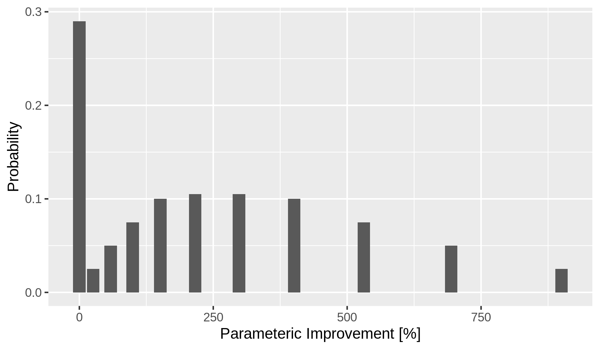
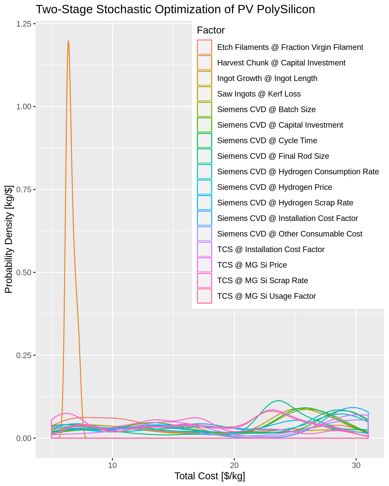
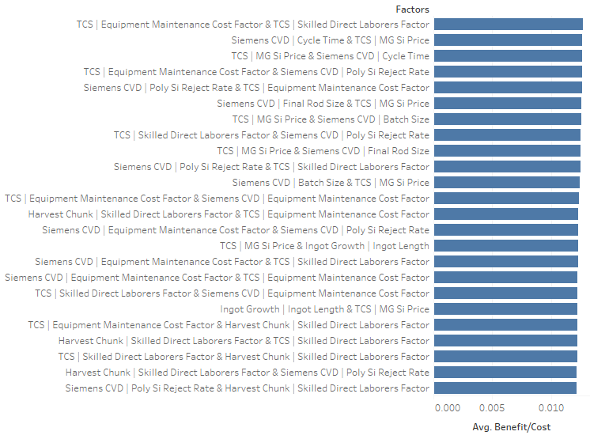
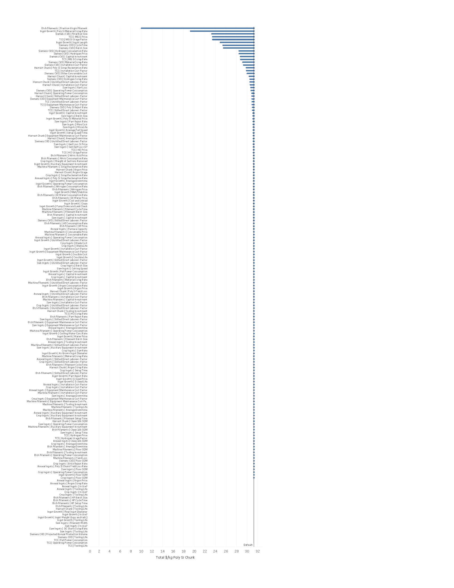

% Experiments with PV Poly Si Model
% Biweekly Journal
% 2020-01-08

2020-01-08: Two-Stage Optimization Results for PV Poly Si Model
===============================================================

Process
-------

1.  Use the two-stage cost results from the previous iterations: 30 factors considered for investment.
2.  Let the probability of improvement in each of the *input* parameters be given by the distribution in the figure below. These are identical for each of the 30 factors, but in real life they would be different for each and obtained from expert elicitation.
3.  Compute the *total cost* improvement based on the improvements of the parameters at stage one and two.
4.  In a Monte-Carlo setting of repeated draws from these probability distributions (30 draws from the first stage and 30 for the second), select the first factor that gives the best improvement after a second factor is chosen. Given that choice of first factor, simulate the outcomes for the second factors and choose the best one of those and then simulate the outcome again.

Results
-------

For this simple experiment, one factor shows the highest likelihood of being the best first-stage choice, but other factors occasionally outperform that.

Observations
------------

1.  Precomputing the two-stage model results and storing these as a database for the probabilistic computations is practical if a single strategy is chosen at each stage.
2.  The precomputation might not be practical if mixed strategies (i.e., a complex portfolio of many small investments) occurs at each stage.
3.  The probabilistic computations can be done moderately fast (minutes) using the `pandas` Python package. If the computations are reorganized as tensor operations using a Python package like `numpy`, it is likely that the computations will be very fast (1000s per minute) and suitable for interactive use.
4.  Because uncertainties from the expert elicitation and in the techno-economic model are likely to be high and the underlying probability distributions are not precisely known, there are opportunities for performing parts of the computations analytically if the problem is reformulated slightly.
    *   In particular, the mathematics relies on computing expectations of maxima of random variables: these can be computed analytically for some distributions and, in general, one might be able to use the Fisher–Tippett–Gnedenko theorem to model these expectations of maxima in terms of extreme-value distributions (Weibull, Gumbel, or Fréchet).
    *   Furthermore, because the *shape* of the underlying distributions for the expert-elicited input parameters is poorly known, fine distinctions about non-interchangeability of expectations with non-linear operators might not be relevant, and this situation may lead to possible algebraic simplifications.
    *   Finally, either discrete or continuous fits to the techno-economic results may make analytic computation tractable.
5.  The example results indicate that in some cases there could be quite a bit of overlap for the various options in the decision-support guidance.
6.  Further progress will depend on the exact form and level of detail in the expert-elicitation results.
    1.  Will experts assess each input parameter (e.g., the 30 factors here)?
    2.  Will they specify the probability of no progress and simple 10% and 90% quantiles for progress?
    3.  Do we have any information to specify the shape of distribution for interpolating between quantiles provided by experts?
    4.  Contrarily, will they instead provide low and high progress rates for a learning curve?
    5.  Will multiple R&D funding levels be assessed? Will these be discrete (no, low, medium, high) or continuous (probabilities of improvement per dollar spent, or even a function relating dollars to probabilities)?
    6.  Will information about correlations between factors be elicited?
    7.  At what stage will results of expert elicitations be pooled or reconciled?

Plan for the next sprint (~2 weeks)
-----------------------------------

1.  Document the mathematics.
2.  Rewrite the code in terms of tensor operations.
3.  Rerun the experiment with individually curated (mocking expert elicitation results) probability distributions for each of the 30 factors.
4.  Investigate the requirements for precomputation resolution and sample size on accuracy of results.
5.  Investigate the feasibility of precomputation for mixed two-stage portfolios.

2019-12-18: Two-Stage Optimization Experiment for PV Poly Si Model
==================================================================

Process
-------

1.  Selected top 30 sensitivies from previous sensitivity analysis.
2.  Ran 725,556 two-stage sensitivies using pairs of those 30 factors.
3.  Created notional investment costs (low and high "expert" estimates") for investment in the factors.
4.  Used brute-force method to compute two-stage optimization for benefit/cost ratio.
5.  Created simple "tornado" plot ranking results.

Observations
------------

1.  The results show many close ties, which result from the notional "expert" elicitation not sufficiently differentiating investments.
2.  The brute-force Monte-Carlo is too slow using Pandas DataFrames or simple iteration on data structures, but reformulating the computations as tensor operations using NumPy would allow rapid enough computations.
3.  Even faster computations would be possible with careful reformulation of the problem to exploit analytic results from stochastic optimization theory. This requires linearization of the empirical model results.
4.  We need much better visualization methods for displaying the distributional results of two-stage optimizations.
5.  A similar experiment could be done where "experts" provide learning-curve referenced estimates in stead of ones about absolute improvement.

Plan for next sprint (~2 weeks)
-------------------------------

1.  Rerun with more highly differentiated notional "expert" elicitations.
2.  Speed up computations.
3.  Hybridize stochastic-optimization methods with this empirical representation of the PV Poly Si model, whose empirical results will have to be linearized..
4.  Create a reference dataset of results for visualization experiments.
5.  Experiment with alternative methods for visualizing stochastic optimization results.

2019-12-04: Parameter-Variation Experiment for PV Poly Si Model
===============================================================

Observations
------------

1.  The Python model runs extremely fast, which makes building approximate statistical, machine-learning, or empirical models---even two-stage decision ones---of it eminently feasible.
2.  Although the model has nearly 300 input parameters, only a couple dozen of them are influential enough to warrant inclusion in expert elicitations and decision analysis.
3.  Several classes of parameters are present:
    *   technical/physical
    *   material
    *   capital
    *   operational
    *   financial
    *   economic/regional/temporal

Plan for next sprint (~2 weeks)
-------------------------------

1.  Expand simulation experiments to develop a training set supporting two-stage decisions.
2.  Mock up inputs from a hypothetical expert elicitiation.
3.  Apply stochastic optimization to a two-stage decision problem.

Some ingredients for later work
-------------------------------

*   Link to work on multiple-objective optimization.
*   Experiment with graphics and visualization.

